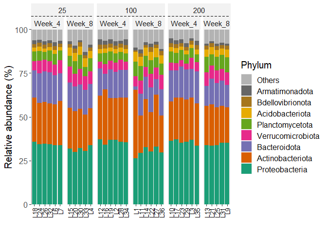
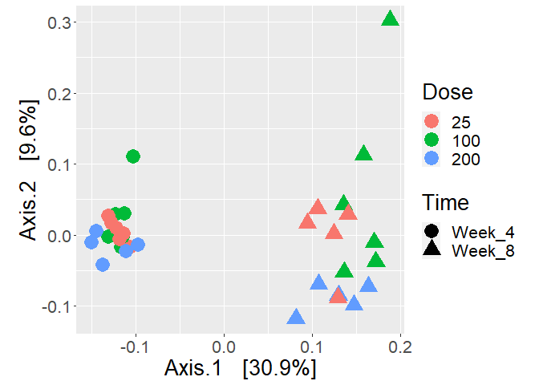
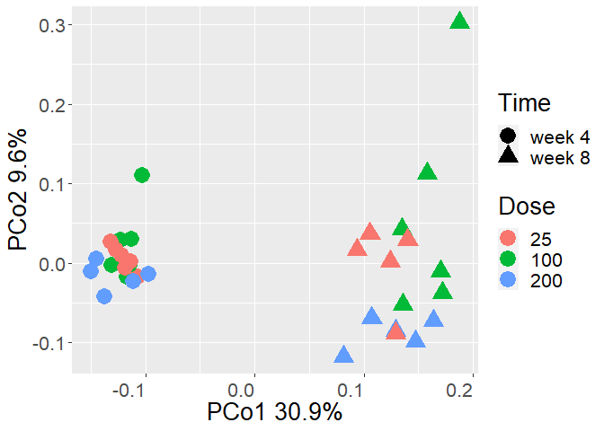
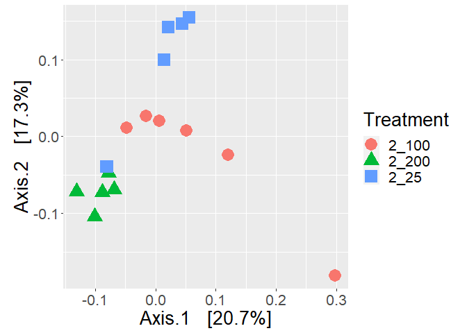
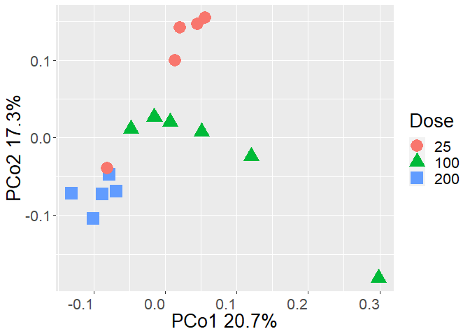
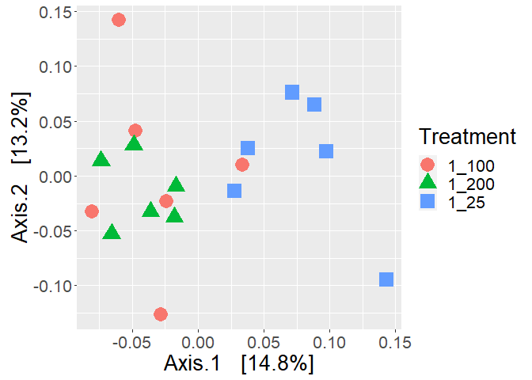
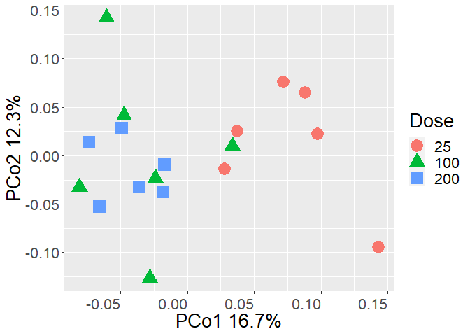

Microbiome_alpha_beta_diversity
================
Juan Quijia
2023-07-07

``` r
library(file2meco)
library(microeco)
library(writexl)
library(ggh4x)
```

    ## Loading required package: ggplot2

``` r
library(vegan)
```

    ## Loading required package: permute

    ## Loading required package: lattice

    ## This is vegan 2.6-4

``` r
library(tidyverse)
```

    ## ── Attaching core tidyverse packages ──────────────────────── tidyverse 2.0.0 ──
    ## ✔ dplyr     1.1.2     ✔ readr     2.1.4
    ## ✔ forcats   1.0.0     ✔ stringr   1.5.0
    ## ✔ lubridate 1.9.2     ✔ tibble    3.2.1
    ## ✔ purrr     1.0.1     ✔ tidyr     1.3.0

    ## ── Conflicts ────────────────────────────────────────── tidyverse_conflicts() ──
    ## ✖ dplyr::filter() masks stats::filter()
    ## ✖ dplyr::lag()    masks stats::lag()
    ## ℹ Use the conflicted package (<http://conflicted.r-lib.org/>) to force all conflicts to become errors

``` r
ps.rarefied<- readRDS('phyloseq_data_rarefy.rds')

physeq <- phyloseq2meco(ps.rarefied)
```

    ## Loading required package: phyloseq

``` r
physeq
```

    ## microtable-class object:
    ## sample_table have 34 rows and 31 columns
    ## otu_table have 2523 rows and 34 columns
    ## tax_table have 2523 rows and 7 columns
    ## rep_fasta have 2523 sequences

``` r
physeq$cal_betadiv(unifrac = F) #create beta diversity tables
```

    ## The result is stored in object$beta_diversity ...

``` r
physeq
```

    ## microtable-class object:
    ## sample_table have 34 rows and 31 columns
    ## otu_table have 2523 rows and 34 columns
    ## tax_table have 2523 rows and 7 columns
    ## rep_fasta have 2523 sequences
    ## Beta diversity: calculated for bray,jaccard

\#Community composition

``` r
compo_1 <- trans_abund$new(dataset = physeq, taxrank = "Phylum", ntaxa = 8)
```

    ## The taxa_abund in dataset is NULL. Calculate it now ...

    ## The result is stored in object$taxa_abund ...

    ## The transformed abundance data is stored in object$data_abund ...

``` r
g1 <- compo_1$plot_bar(others_color = "grey70", facet = c("Dose", "Time"), xtext_keep = T, legend_text_italic = FALSE)
g1 + theme(text = element_text(size=15,color = "black"), axis.title.y = element_text(size = 15), axis.text.x = element_text(angle = 90, vjust = 0.5, hjust=1))
```

<!-- -->

``` r
    ggsave(filename="2_bar_plot_phyla.png", 
           width = 20, height = 13,
           units = "cm",
           dpi = 600)
compo_2 <- trans_abund$new(dataset = physeq, taxrank = "Genus", ntaxa = 10)
```

    ## The transformed abundance data is stored in object$data_abund ...

``` r
g2 <- compo_2$plot_bar(others_color = "grey70", facet = c("Dose", "Time"), xtext_keep = T, legend_text_italic = TRUE)
```

    ## Input colors are not enough to use. Add more colors automatically via color interpolation ...

``` r
g2  + theme(text = element_text(size=15,color = "black"),axis.title.y = element_text(size = 15), axis.text.x = element_text(angle = 90, vjust = 0.5, hjust=1))
```

<!-- -->

``` r
 ggsave("2_bar_plot_genus.png", 
        width = 20,height = 13,
           units = "cm",
           dpi = 600)
```

\#Alpha Diversity

``` r
t1 <- trans_alpha$new(dataset = physeq, group = "Treatment")
```

    ## The alpha_diversity in dataset not found! Calculate it automatically ...

    ## The result is stored in object$alpha_diversity ...

    ## The transformed diversity data is stored in object$data_alpha ...

    ## The group statistics are stored in object$data_stat ...

``` r
# return t1$data_stat
head(t1$data_alpha)
```

    ##   Sample  Measure Value NAME Experiment           Source Treatment Dose   Time
    ## 1     L1 Observed   475   L1 Fertilizer peat based media     2_100  100 Week_8
    ## 2    L10 Observed   797  L10 Fertilizer peat based media     1_200  200 Week_4
    ## 3    L11 Observed   788  L11 Fertilizer peat based media     2_100  100 Week_8
    ## 4    L12 Observed   652  L12 Fertilizer peat based media     1_100  100 Week_4
    ## 5    L13 Observed   862  L13 Fertilizer peat based media     2_200  200 Week_8
    ## 6    L14 Observed   758  L14 Fertilizer peat based media     2_100  100 Week_8
    ##   Block    pH EC..us.cm. TOC..mg.L. TN..mg.L. Sodium..ppm. Lithium..ppm.
    ## 1     1 6.692      360.3      59.57     27.14         0.36          9.96
    ## 2     2 6.231      919.5     103.90    136.70           NA            NA
    ## 3     2 6.885      342.4      82.62     28.89         0.36         13.35
    ## 4     2 6.387     1102.0      96.80     96.31           NA          0.09
    ## 5     3 6.715      417.4      58.10     37.35         0.36         15.75
    ## 6     3 6.913      307.3      53.25     27.25         0.36         10.02
    ##   Ammonium..ppm. Potassium..ppm. Magnesium..ppm. Calcium..ppm. Flouride..ppm.
    ## 1             NA           53.03            9.69         44.49           0.69
    ## 2             NA           45.02            1.85         59.88           1.14
    ## 3             NA           46.36           11.30         52.68           0.74
    ## 4             NA           23.41              NA         42.05           1.21
    ## 5             NA           62.80           10.85         49.93           0.67
    ## 6             NA           39.11           10.49         49.34           0.58
    ##   Chloride..ppm. Nitrite..ppm. Bromide..ppm. Nitrate..ppm. Sulfate..ppm.
    ## 1           4.23            NA            NA        123.01          2.13
    ## 2           5.96            NA            NA        641.09         55.91
    ## 3           5.55            NA            NA        128.13          1.91
    ## 4           6.42            NA            NA        449.08         73.86
    ## 5           6.74            NA            NA        170.79          2.48
    ## 6           3.82            NA            NA        125.55          1.47
    ##   Phosphate..ppm. FlowerDW BudDW ShootDW RootDW TotalShoot RootTOShoot SeqDepth
    ## 1           14.66    1.587 0.600  12.221  2.306     14.408   0.1600500    31041
    ## 2           54.04       NA    NA   2.035  0.459      2.035   0.2255528    88879
    ## 3            0.38    1.748 0.929  14.072  2.097     16.749   0.1252015    71643
    ## 4           34.15       NA    NA   1.410  0.321      1.410   0.2276596    65416
    ## 5           24.00    1.575 0.640  12.342  2.381     14.557   0.1635639    84041
    ## 6            8.25    1.475 0.627  13.120  2.190     15.222   0.1438707   103989

``` r
head(t1$data_stat)
```

    ##   Treatment    Measure N        Mean           SD           SE
    ## 1     1_100   Observed 6 682.0000000 1.190512e+02 4.860247e+01
    ## 2     1_100      Chao1 6 686.0556911 1.221373e+02 4.986233e+01
    ## 3     1_100        ACE 6 685.8030330 1.217055e+02 4.968607e+01
    ## 4     1_100    Shannon 6   5.4160577 1.480848e-01 6.045538e-02
    ## 5     1_100    Simpson 6   0.9896716 1.530469e-03 6.248114e-04
    ## 6     1_100 InvSimpson 6  98.4760480 1.353617e+01 5.526117e+00

``` r
t1$cal_diff(method = "KW")
```

    ## The result is stored in object$res_diff ...

``` r
# return t1$res_diff
t1$res_diff
```

    ##                                    Comparison    Measure
    ## 1 2_100 - 1_200 - 1_100 - 2_200 - 2_25 - 1_25   Observed
    ## 2 2_100 - 1_200 - 1_100 - 2_200 - 2_25 - 1_25      Chao1
    ## 3 2_100 - 1_200 - 1_100 - 2_200 - 2_25 - 1_25        ACE
    ## 4 2_100 - 1_200 - 1_100 - 2_200 - 2_25 - 1_25    Shannon
    ## 5 2_100 - 1_200 - 1_100 - 2_200 - 2_25 - 1_25    Simpson
    ## 6 2_100 - 1_200 - 1_100 - 2_200 - 2_25 - 1_25 InvSimpson
    ## 7 2_100 - 1_200 - 1_100 - 2_200 - 2_25 - 1_25     Fisher
    ## 8 2_100 - 1_200 - 1_100 - 2_200 - 2_25 - 1_25   Coverage
    ##                    Test_method Group    P.unadj     P.adj Significance
    ## 1 Kruskal-Wallis Rank Sum Test 2_100 0.45762347 0.5455900           ns
    ## 2 Kruskal-Wallis Rank Sum Test 2_100 0.47739129 0.5455900           ns
    ## 3 Kruskal-Wallis Rank Sum Test 2_100 0.47739129 0.5455900           ns
    ## 4 Kruskal-Wallis Rank Sum Test 2_100 0.04362288 0.1666822           ns
    ## 5 Kruskal-Wallis Rank Sum Test 2_200 0.06250581 0.1666822           ns
    ## 6 Kruskal-Wallis Rank Sum Test 2_200 0.06250581 0.1666822           ns
    ## 7 Kruskal-Wallis Rank Sum Test 2_100 0.45762347 0.5455900           ns
    ## 8 Kruskal-Wallis Rank Sum Test  1_25 0.83118048 0.8311805           ns

``` r
save_alpha<-t1$res_diff
write_xlsx(save_alpha,"1.2_alpha_diversity.xlsx")
```

\##Plot Alpha diversity

``` r
ps.rarefied.fert <- ps.rarefied # Complete data set to compare among Times

#Visualize alpha-diversity:

data_richness<-estimate_richness(ps.rarefied.fert, measures=c("Observed", "Chao1", "Shannon", "InvSimpson"))
alpha_diversity<-(merge(sample_data(ps.rarefied ),data_richness,by="row.names"))
alpha_diversity_long<-pivot_longer(alpha_diversity,c("Observed", "Chao1", "Shannon", "InvSimpson"),
                                   names_to="AlphaDiversity",
                                   values_to="AlphaDiversityMeasure")

        alpha_diversity_long$Time<-factor(alpha_diversity_long$Time,levels=c("Week_4","Week_8"))
        levels(alpha_diversity_long$Time)
```

    ## [1] "Week_4" "Week_8"

``` r
        alpha_diversity_long$Treatment<-factor(alpha_diversity_long$Treatment,levels=c("1_25","1_100","1_200","2_25","2_100","2_200"))
        levels(alpha_diversity_long$Treatment)
```

    ## [1] "1_25"  "1_100" "1_200" "2_25"  "2_100" "2_200"

``` r
plot_alpha <- alpha_diversity_long %>% 
          ggplot(aes(x=Treatment, y=AlphaDiversityMeasure, color=Time)) + 
          geom_boxplot(size = 1)  + 
          facet_wrap(~AlphaDiversity, ncol = 1, scales= "free_y") + 
          xlab("Treatment (ppm)") +
          scale_color_discrete("Time\n(Week)", breaks = c("1","2"), labels=c("4","8")) +
          scale_x_discrete("Treatment (ppm)", breaks = c("1 25","1 100","1 200","2 25","2 100","2 200"), labels=c("25","100","200","25","100","200"))+
          theme(text = element_text(size=20), axis.text.x = element_text(angle = 360, vjust = 0.5, hjust=0.5)) 
        
        ggsave(filename = "2_fertilizer_alpha_time.png", plot = plot_alpha, 
               width = 6, height = 8, units = "in", dpi = 600)
plot_alpha
```

<!-- -->

``` r
###Time#################

bray_diss = phyloseq::distance(ps.rarefied, method="bray")
ordination = ordinate(ps.rarefied, method="PCoA", distance=bray_diss)
plot_ordination(ps.rarefied, ordination, color="Dose", shape = "Time") + 
  geom_point(size = 6) +
  theme(aspect.ratio=1, strip.placement = "outside",text = element_text(size = 20)) 
```

<!-- -->

``` r
  #+ stat_ellipse(geom = "polygon", type="norm", alpha=0.4, aes(fill=Treatment))
#ggsave("fertilizer_beta_time.tiff",width = 8,height = 5)

        bray_diss = phyloseq::distance(ps.rarefied.fert, method="bray")
        ordination = ordinate(ps.rarefied, method="PCoA", distance=bray_diss)
        beta_diversity<-(merge(sample_data(ps.rarefied),ordination$vectors[,1:2],by="row.names"))
        beta_diversity$Dose<-factor(beta_diversity$Dose,levels=c("25","100","200"))
        levels(beta_diversity$Dose)
```

    ## [1] "25"  "100" "200"

``` r
plot_beta <- beta_diversity %>% 
          ggplot(aes(x = Axis.1, y = Axis.2, color = Dose, shape = Time)) +
          geom_point(size=6) +
          xlab("PCo1 30.9%") +
          ylab("PCo2 9.6%") +
          scale_shape_discrete("Time",
                              labels = c("Week_4"="week 4", "Week_8"="week 8"))+
          theme(text = element_text(size=20), axis.text.x = element_text(angle = 360, vjust = 0.5, hjust=1)) 
          
ggsave(filename = "2_fertilizer_beta.png",plot=plot_beta, 
                 width = 7,height = 5)
plot_beta
```

<!-- -->
\## Plot Beta diversity at Week 8

``` r
ps.rarefied.fert.2 <- subset_samples(ps.rarefied,Time=="Week_8")

bray_diss = phyloseq::distance(ps.rarefied.fert.2, method="bray")
ordination = ordinate(ps.rarefied.fert.2, method="PCoA", distance=bray_diss)
plot_ordination(ps.rarefied.fert.2, ordination, color="Treatment", shape = "Treatment") + 
  geom_point(size = 6) +
  theme(aspect.ratio=1, strip.placement = "outside",text = element_text(size = 20)) 
```

<!-- -->

``` r
  beta_diversity_2<-(merge(sample_data(ps.rarefied.fert.2 ),ordination$vectors[,1:2],by="row.names"))
  beta_diversity_2$Treatment<-factor(beta_diversity_2$Dose,levels=c("2_25","2_100","2_200"))
  #levels(beta_diversity_2$Treatment)

plot_beta_2 <- beta_diversity_2 %>% 
  ggplot(aes(x = Axis.1, y = Axis.2, color = Dose, shape = Dose)) +
  geom_point(size=6) +
  xlab("PCo1 20.7%") +
  ylab("PCo2 17.3%") +
  theme(text = element_text(size=20), axis.text.x = element_text(angle = 360, vjust = 0.5, hjust=1)) 
#+ stat_ellipse(geom = "polygon", type="norm", alpha=0.4, aes(fill=Treatment))

ggsave(filename = "2_fertilizer_beta_week_8.png",plot=plot_beta_2, 
                 width = 6,height = 5)
plot_beta_2
```

<!-- -->

## Plot Beta diversity at Week 4

``` r
#Subset only samples from week 4
ps.rarefied.fert.1 <- subset_samples(ps.rarefied,Time=="Week_4")

bray_diss = phyloseq::distance(ps.rarefied.fert.1, method="bray")
ordination = ordinate(ps.rarefied.fert.1, method="PCoA", distance=bray_diss)
plot_ordination(ps.rarefied.fert.1, ordination, color="Treatment", shape = "Treatment") + 
  geom_point(size = 6) +
  theme(aspect.ratio=1, strip.placement = "outside",text = element_text(size = 20))
```

<!-- -->

``` r
  beta_diversity_1<-(merge(sample_data(ps.rarefied.fert.1),ordination$vectors[,1:2],by="row.names"))
  beta_diversity_1$Treatment<-factor(beta_diversity_1$Treatment,levels=c("25","100","200"))
  levels(beta_diversity_1$Treatment)
```

    ## [1] "25"  "100" "200"

``` r
plot_beta_1<- beta_diversity_1 %>% 
  ggplot(aes(x = Axis.1, y = Axis.2, color = Dose, shape = Dose)) +
  geom_point(size=6) +
  xlab("PCo1 16.7%") +
  ylab("PCo2 12.3%") +
  theme(text = element_text(size=20), axis.text.x = element_text(angle = 360, vjust = 0.5, hjust=1)) 
#+ stat_ellipse(geom = "polygon", type="norm", alpha=0.4, aes(fill=Treatment))

ggsave(filename = "2_fertilizer_beta_week_4.png",plot=plot_beta_1, 
                 width = 7,height = 5)
plot_beta_1
```

<!-- -->

``` r
# Ex #############################################
bray_diss = phyloseq::distance(ps.rarefied, method="bray")

# PERMANOVA https://peerj.com/articles/32/
permanova<-adonis2(bray_diss ~ sample_data(ps.rarefied)$Time * sample_data(ps.rarefied)$Dose,permutations=10000)
print(permanova)
```

    ## Permutation test for adonis under reduced model
    ## Terms added sequentially (first to last)
    ## Permutation: free
    ## Number of permutations: 10000
    ## 
    ## adonis2(formula = bray_diss ~ sample_data(ps.rarefied)$Time * sample_data(ps.rarefied)$Dose, permutations = 10000)
    ##                                                             Df SumOfSqs      R2
    ## sample_data(ps.rarefied)$Time                                1  0.56377 0.30111
    ## sample_data(ps.rarefied)$Dose                                2  0.18358 0.09805
    ## sample_data(ps.rarefied)$Time:sample_data(ps.rarefied)$Dose  2  0.11017 0.05884
    ## Residual                                                    28  1.01479 0.54200
    ## Total                                                       33  1.87231 1.00000
    ##                                                                   F    Pr(>F)
    ## sample_data(ps.rarefied)$Time                               15.5556 9.999e-05
    ## sample_data(ps.rarefied)$Dose                                2.5326   0.00200
    ## sample_data(ps.rarefied)$Time:sample_data(ps.rarefied)$Dose  1.5198   0.06999
    ## Residual                                                                     
    ## Total                                                                        
    ##                                                                
    ## sample_data(ps.rarefied)$Time                               ***
    ## sample_data(ps.rarefied)$Dose                               ** 
    ## sample_data(ps.rarefied)$Time:sample_data(ps.rarefied)$Dose .  
    ## Residual                                                       
    ## Total                                                          
    ## ---
    ## Signif. codes:  0 '***' 0.001 '**' 0.01 '*' 0.05 '.' 0.1 ' ' 1

``` r
#Calculates dispersion (equivalent to variation)
bd_time<-betadisper(bray_diss, sample_data(ps.rarefied)$Time)
#Test is there is difference in variation (dispersion)
#anova(bd)
dispersion_time<-permutest(bd_time) #Permutation based test

#Calculates dispersion (equivalent to variation)
bd_dose<-betadisper(bray_diss, sample_data(ps.rarefied)$Dose)
#Test is there is difference in variation (dispersion)
#anova(bd_dose)
dispersion_dose<-permutest(bd_dose) #Permutation based test
dispersion_dose_pair<-permutest(bd_dose,pairwise=TRUE)

sink(file = "2_beta_diversity_permanova.csv")
print(permanova)
```

    ## Permutation test for adonis under reduced model
    ## Terms added sequentially (first to last)
    ## Permutation: free
    ## Number of permutations: 10000
    ## 
    ## adonis2(formula = bray_diss ~ sample_data(ps.rarefied)$Time * sample_data(ps.rarefied)$Dose, permutations = 10000)
    ##                                                             Df SumOfSqs      R2
    ## sample_data(ps.rarefied)$Time                                1  0.56377 0.30111
    ## sample_data(ps.rarefied)$Dose                                2  0.18358 0.09805
    ## sample_data(ps.rarefied)$Time:sample_data(ps.rarefied)$Dose  2  0.11017 0.05884
    ## Residual                                                    28  1.01479 0.54200
    ## Total                                                       33  1.87231 1.00000
    ##                                                                   F    Pr(>F)
    ## sample_data(ps.rarefied)$Time                               15.5556 9.999e-05
    ## sample_data(ps.rarefied)$Dose                                2.5326   0.00200
    ## sample_data(ps.rarefied)$Time:sample_data(ps.rarefied)$Dose  1.5198   0.06999
    ## Residual                                                                     
    ## Total                                                                        
    ##                                                                
    ## sample_data(ps.rarefied)$Time                               ***
    ## sample_data(ps.rarefied)$Dose                               ** 
    ## sample_data(ps.rarefied)$Time:sample_data(ps.rarefied)$Dose .  
    ## Residual                                                       
    ## Total                                                          
    ## ---
    ## Signif. codes:  0 '***' 0.001 '**' 0.01 '*' 0.05 '.' 0.1 ' ' 1

``` r
print("Permutation test for homogeneity of multivariate dispersions: Time")
```

    ## [1] "Permutation test for homogeneity of multivariate dispersions: Time"

``` r
dispersion_time
```

    ## 
    ## Permutation test for homogeneity of multivariate dispersions
    ## Permutation: free
    ## Number of permutations: 999
    ## 
    ## Response: Distances
    ##           Df   Sum Sq   Mean Sq      F N.Perm Pr(>F)    
    ## Groups     1 0.024899 0.0248990 17.465    999  0.001 ***
    ## Residuals 32 0.045622 0.0014257                         
    ## ---
    ## Signif. codes:  0 '***' 0.001 '**' 0.01 '*' 0.05 '.' 0.1 ' ' 1

``` r
print("Permutation test for homogeneity of multivariate dispersions: Dose")
```

    ## [1] "Permutation test for homogeneity of multivariate dispersions: Dose"

``` r
dispersion_dose
```

    ## 
    ## Permutation test for homogeneity of multivariate dispersions
    ## Permutation: free
    ## Number of permutations: 999
    ## 
    ## Response: Distances
    ##           Df   Sum Sq   Mean Sq      F N.Perm Pr(>F)
    ## Groups     2 0.009371 0.0046854 2.3489    999  0.112
    ## Residuals 31 0.061837 0.0019948

``` r
sink(file = NULL)
```
