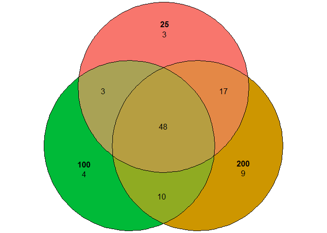
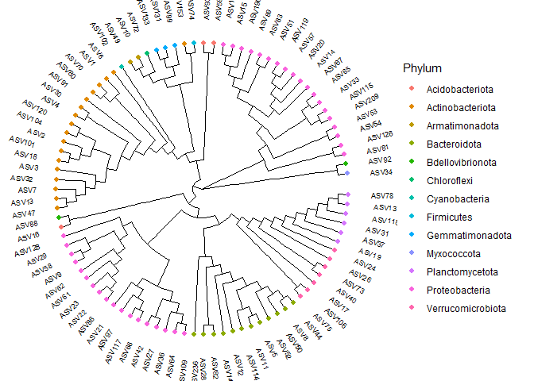
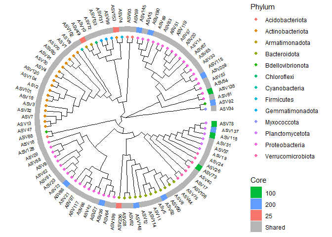

3_core_microbiome
================
Juan Quijia
2023-07-07

## R Markdown

This is an R Markdown document to work on core microbiome analysis

    ## Loading required package: BiocGenerics

    ## 
    ## Attaching package: 'BiocGenerics'

    ## The following objects are masked from 'package:stats':
    ## 
    ##     IQR, mad, sd, var, xtabs

    ## The following objects are masked from 'package:base':
    ## 
    ##     anyDuplicated, aperm, append, as.data.frame, basename, cbind,
    ##     colnames, dirname, do.call, duplicated, eval, evalq, Filter, Find,
    ##     get, grep, grepl, intersect, is.unsorted, lapply, Map, mapply,
    ##     match, mget, order, paste, pmax, pmax.int, pmin, pmin.int,
    ##     Position, rank, rbind, Reduce, rownames, sapply, setdiff, sort,
    ##     table, tapply, union, unique, unsplit, which.max, which.min

    ## Loading required package: S4Vectors

    ## Loading required package: stats4

    ## 
    ## Attaching package: 'S4Vectors'

    ## The following object is masked from 'package:utils':
    ## 
    ##     findMatches

    ## The following objects are masked from 'package:base':
    ## 
    ##     expand.grid, I, unname

    ## Loading required package: IRanges

    ## 
    ## Attaching package: 'IRanges'

    ## The following object is masked from 'package:grDevices':
    ## 
    ##     windows

    ## Loading required package: XVector

    ## Loading required package: GenomeInfoDb

    ## 
    ## Attaching package: 'Biostrings'

    ## The following object is masked from 'package:base':
    ## 
    ##     strsplit

    ## ── Attaching core tidyverse packages ──────────────────────── tidyverse 2.0.0 ──
    ## ✔ dplyr     1.1.2     ✔ readr     2.1.4
    ## ✔ forcats   1.0.0     ✔ stringr   1.5.0
    ## ✔ ggplot2   3.4.2     ✔ tibble    3.2.1
    ## ✔ lubridate 1.9.2     ✔ tidyr     1.3.0
    ## ✔ purrr     1.0.1     
    ## ── Conflicts ────────────────────────────────────────── tidyverse_conflicts() ──
    ## ✖ lubridate::%within%() masks IRanges::%within%()
    ## ✖ dplyr::collapse()     masks Biostrings::collapse(), IRanges::collapse()
    ## ✖ dplyr::combine()      masks BiocGenerics::combine()
    ## ✖ purrr::compact()      masks XVector::compact()
    ## ✖ dplyr::desc()         masks IRanges::desc()
    ## ✖ tidyr::expand()       masks S4Vectors::expand()
    ## ✖ dplyr::filter()       masks stats::filter()
    ## ✖ dplyr::first()        masks S4Vectors::first()
    ## ✖ dplyr::lag()          masks stats::lag()
    ## ✖ ggplot2::Position()   masks BiocGenerics::Position(), base::Position()
    ## ✖ purrr::reduce()       masks IRanges::reduce()
    ## ✖ dplyr::rename()       masks S4Vectors::rename()
    ## ✖ lubridate::second()   masks S4Vectors::second()
    ## ✖ lubridate::second<-() masks S4Vectors::second<-()
    ## ✖ dplyr::slice()        masks XVector::slice(), IRanges::slice()
    ## ℹ Use the conflicted package (<http://conflicted.r-lib.org/>) to force all conflicts to become errors
    ## 
    ## Attaching package: 'gridExtra'
    ## 
    ## 
    ## The following object is masked from 'package:dplyr':
    ## 
    ##     combine
    ## 
    ## 
    ## The following object is masked from 'package:BiocGenerics':
    ## 
    ##     combine
    ## 
    ## 
    ## 
    ## Attaching package: 'phyloseq'
    ## 
    ## 
    ## The following object is masked from 'package:IRanges':
    ## 
    ##     distance
    ## 
    ## 
    ## Loading required package: ape
    ## 
    ## 
    ## Attaching package: 'ape'
    ## 
    ## 
    ## The following object is masked from 'package:dplyr':
    ## 
    ##     where
    ## 
    ## 
    ## The following object is masked from 'package:Biostrings':
    ## 
    ##     complement
    ## 
    ## 
    ## Loading required package: RSQLite
    ## 
    ## Loading required package: parallel
    ## 
    ## 
    ## microbiome R package (microbiome.github.com)
    ##     
    ## 
    ## 
    ##  Copyright (C) 2011-2022 Leo Lahti, 
    ##     Sudarshan Shetty et al. <microbiome.github.io>
    ## 
    ## 
    ## 
    ## Attaching package: 'microbiome'
    ## 
    ## 
    ## The following object is masked from 'package:phangorn':
    ## 
    ##     diversity
    ## 
    ## 
    ## The following object is masked from 'package:ggplot2':
    ## 
    ##     alpha
    ## 
    ## 
    ## The following object is masked from 'package:Biostrings':
    ## 
    ##     coverage
    ## 
    ## 
    ## The following objects are masked from 'package:IRanges':
    ## 
    ##     coverage, transform
    ## 
    ## 
    ## The following object is masked from 'package:S4Vectors':
    ## 
    ##     transform
    ## 
    ## 
    ## The following object is masked from 'package:base':
    ## 
    ##     transform

\#Load pjyloseq file

``` r
ps.rarefied<- readRDS('phyloseq_data_rarefy.rds')
ps.rarefied
```

    ## phyloseq-class experiment-level object
    ## otu_table()   OTU Table:         [ 2523 taxa and 34 samples ]
    ## sample_data() Sample Data:       [ 34 samples by 31 sample variables ]
    ## tax_table()   Taxonomy Table:    [ 2523 taxa by 7 taxonomic ranks ]
    ## refseq()      DNAStringSet:      [ 2523 reference sequences ]

``` r
# Calculate compositional version of the data (relative abundances)

pseq.rel <- microbiome::transform(ps.rarefied, "compositional")
pseq.rel
```

    ## phyloseq-class experiment-level object
    ## otu_table()   OTU Table:         [ 2523 taxa and 34 samples ]
    ## sample_data() Sample Data:       [ 34 samples by 31 sample variables ]
    ## tax_table()   Taxonomy Table:    [ 2523 taxa by 7 taxonomic ranks ]
    ## refseq()      DNAStringSet:      [ 2523 reference sequences ]

``` r
  fertilizer <- unique(as.character(meta(pseq.rel)$Dose))
  print(fertilizer)
```

    ## [1] "100" "200" "25"

``` r
  #Write a for loop to go through each of the fertilizer levels one by one and combine identified core taxa into a list.
  
  list_core <- c() # an empty object to store information
  
  for (n in fertilizer){ # for each variable n in fertilizer
    print(paste0("Identifying Core Taxa for ", n))
    
    ps.sub <- subset_samples(pseq.rel, fertilizer == n) # Choose sample from DiseaseState by n
    
    core_m <- core_members(ps.sub, # ps.sub is phyloseq selected with only samples from g 
                           detection = 0.001, # 0.001% in atleast 99% samples 
                           prevalence = 0.99)
    print(paste0("No. of core taxa in ", n, " : ", length(core_m))) # print core taxa identified in each DiseaseState.
    list_core[[n]] <- core_m # add to a list core taxa for each group.
    #print(list_core)
  }  
```

    ## [1] "Identifying Core Taxa for 100"
    ## [1] "No. of core taxa in 100 : 65"
    ## [1] "Identifying Core Taxa for 200"
    ## [1] "No. of core taxa in 200 : 84"
    ## [1] "Identifying Core Taxa for 25"
    ## [1] "No. of core taxa in 25 : 71"

``` r
  ASV_core<-levels(factor(c(list_core$'25',list_core$'100',list_core$'200')))

  print(list_core)
```

    ## $`100`
    ##  [1] "ASV1"   "ASV2"   "ASV3"   "ASV4"   "ASV5"   "ASV6"   "ASV7"   "ASV8"  
    ##  [9] "ASV9"   "ASV10"  "ASV11"  "ASV12"  "ASV13"  "ASV14"  "ASV15"  "ASV16" 
    ## [17] "ASV17"  "ASV18"  "ASV19"  "ASV20"  "ASV21"  "ASV22"  "ASV24"  "ASV27" 
    ## [25] "ASV28"  "ASV29"  "ASV30"  "ASV32"  "ASV34"  "ASV37"  "ASV42"  "ASV47" 
    ## [33] "ASV51"  "ASV53"  "ASV54"  "ASV57"  "ASV58"  "ASV59"  "ASV61"  "ASV62" 
    ## [41] "ASV65"  "ASV66"  "ASV67"  "ASV70"  "ASV72"  "ASV73"  "ASV74"  "ASV75" 
    ## [49] "ASV78"  "ASV80"  "ASV83"  "ASV89"  "ASV91"  "ASV93"  "ASV97"  "ASV101"
    ## [57] "ASV104" "ASV106" "ASV114" "ASV117" "ASV118" "ASV120" "ASV126" "ASV131"
    ## [65] "ASV133"
    ## 
    ## $`200`
    ##  [1] "ASV1"   "ASV2"   "ASV3"   "ASV4"   "ASV5"   "ASV6"   "ASV7"   "ASV8"  
    ##  [9] "ASV9"   "ASV10"  "ASV11"  "ASV12"  "ASV13"  "ASV14"  "ASV15"  "ASV16" 
    ## [17] "ASV17"  "ASV18"  "ASV19"  "ASV20"  "ASV21"  "ASV22"  "ASV23"  "ASV24" 
    ## [25] "ASV26"  "ASV27"  "ASV28"  "ASV29"  "ASV30"  "ASV31"  "ASV32"  "ASV33" 
    ## [33] "ASV34"  "ASV36"  "ASV37"  "ASV40"  "ASV42"  "ASV44"  "ASV47"  "ASV50" 
    ## [41] "ASV51"  "ASV52"  "ASV53"  "ASV54"  "ASV57"  "ASV58"  "ASV59"  "ASV61" 
    ## [49] "ASV62"  "ASV64"  "ASV65"  "ASV66"  "ASV67"  "ASV70"  "ASV74"  "ASV75" 
    ## [57] "ASV80"  "ASV81"  "ASV82"  "ASV83"  "ASV86"  "ASV88"  "ASV89"  "ASV91" 
    ## [65] "ASV92"  "ASV93"  "ASV97"  "ASV99"  "ASV101" "ASV102" "ASV104" "ASV109"
    ## [73] "ASV115" "ASV117" "ASV119" "ASV120" "ASV128" "ASV131" "ASV133" "ASV137"
    ## [81] "ASV145" "ASV148" "ASV190" "ASV209"
    ## 
    ## $`25`
    ##  [1] "ASV1"   "ASV2"   "ASV3"   "ASV4"   "ASV5"   "ASV6"   "ASV7"   "ASV8"  
    ##  [9] "ASV9"   "ASV10"  "ASV11"  "ASV12"  "ASV13"  "ASV14"  "ASV15"  "ASV16" 
    ## [17] "ASV17"  "ASV18"  "ASV19"  "ASV20"  "ASV21"  "ASV22"  "ASV23"  "ASV24" 
    ## [25] "ASV26"  "ASV28"  "ASV29"  "ASV30"  "ASV31"  "ASV32"  "ASV33"  "ASV34" 
    ## [33] "ASV37"  "ASV40"  "ASV42"  "ASV44"  "ASV47"  "ASV49"  "ASV50"  "ASV51" 
    ## [41] "ASV53"  "ASV54"  "ASV57"  "ASV59"  "ASV62"  "ASV64"  "ASV65"  "ASV66" 
    ## [49] "ASV67"  "ASV70"  "ASV72"  "ASV74"  "ASV75"  "ASV80"  "ASV81"  "ASV82" 
    ## [57] "ASV83"  "ASV88"  "ASV89"  "ASV91"  "ASV99"  "ASV102" "ASV104" "ASV106"
    ## [65] "ASV109" "ASV114" "ASV115" "ASV119" "ASV128" "ASV153" "ASV236"

``` r
  core_taxa_25 <- prune_taxa(list_core$'25',ps.rarefied)
  core_taxa_100 <- prune_taxa(list_core$'100',ps.rarefied)
  core_taxa_200 <- prune_taxa(list_core$'200',ps.rarefied)
  core_taxa <-prune_taxa(ASV_core,ps.rarefied)
  
  #Retrieving the core taxa names from the phyloseq object:
  ASV_seq_core <- refseq(core_taxa)
  ASV_seq_core_taxonomy <- as.data.frame(tax_table(core_taxa))
  ASV_seq_core_taxonomy$ASV<-rownames(ASV_seq_core_taxonomy)
  
  filepath <- file.path(getwd(), "core_dna_seq_fasta.fasta")
  writeXStringSet(ASV_seq_core, filepath, append=FALSE,
                  compress=FALSE, compression_level=NA, format="fasta")
  
  write_xlsx(ASV_seq_core_taxonomy,"ASV_seq_core_taxonomy.xlsx")
```

\##Plot Venn Diagram

``` r
  library("eulerr")
  # Specify colors and plot venn
  # supplying colors in the order they appear in list_core
  mycols <- c("100"="#00BA38", "200"="#CD9600","25"="#F8766D") 
  Core_venn <- plot(venn(list_core), fills = mycols) 
  ggsave(plot = Core_venn,filename="Poster_4_Core_Venn_Diagram.png",width = 2.5,height = 2.5)
  Core_venn 
```

<!-- -->

## Construct phylogenetic tree

source:<https://www.ncbi.nlm.nih.gov/pmc/articles/PMC4955027/>
<https://fuzzyatelin.github.io/bioanth-stats/module-24/module-24.html#distance-based_methods>

``` r
#mbSet<-ReadTreeFile(mbSet, "ibd_tree.tre");
seqs <- ASV_seq_core

#Performing a multiple-alignment using the DECIPHER R package
alignment <- AlignSeqs(DNAStringSet(seqs),
                       anchor = NA)
```

    ## Determining distance matrix based on shared 8-mers:
    ## ================================================================================
    ## 
    ## Time difference of 0.04 secs
    ## 
    ## Clustering into groups by similarity:
    ## ================================================================================
    ## 
    ## Time difference of 0.01 secs
    ## 
    ## Aligning Sequences:
    ## ================================================================================
    ## 
    ## Time difference of 0.4 secs
    ## 
    ## Iteration 1 of 2:
    ## 
    ## Determining distance matrix based on alignment:
    ## ================================================================================
    ## 
    ## Time difference of 0 secs
    ## 
    ## Reclustering into groups by similarity:
    ## ================================================================================
    ## 
    ## Time difference of 0.01 secs
    ## 
    ## Realigning Sequences:
    ## ================================================================================
    ## 
    ## Time difference of 0.23 secs
    ## 
    ## Iteration 2 of 2:
    ## 
    ## Determining distance matrix based on alignment:
    ## ================================================================================
    ## 
    ## Time difference of 0 secs
    ## 
    ## Reclustering into groups by similarity:
    ## ================================================================================
    ## 
    ## Time difference of 0.01 secs
    ## 
    ## Realigning Sequences:
    ## ================================================================================
    ## 
    ## Time difference of 0.04 secs

``` r
# Construct a phylogenetic tree with The phangorn R package
# 1_construct a neighbor-joining tree,

phang.align <- phyDat(as(alignment, 'matrix'), type = 'DNA') # These function transform several DNA formats into the phyDat format.
dm <- dist.ml(phang.align) # dist.ml uses DNA / AA sequences to compute distances under different substitution models

treeNJ <- NJ(dm) # Note, tip order is not sequence order; Performs the neighbor-joining tree estimation of Saitou and Nei (1987)

# 2_fit a GTR+G+I (Generalized time-reversible with Gamma rate variation) maximum likelihood tree using the neighbor-joining tree as a starting point.

fit <- pml(treeNJ, data = phang.align) # pml computes the likelihood of a phylogenetic tree given a sequence alignment and a model

print('Fit GTR model...')
```

    ## [1] "Fit GTR model..."

``` r
fitGTR <- update(fit, k = 4, inv = 0.2)

print('Computing likelihood of tree...')
```

    ## [1] "Computing likelihood of tree..."

``` r
fitGTR <- optim.pml(fitGTR,
                    model = 'GTR',
                    optInv = TRUE,
                    optGamma = TRUE,
                    rearrangement = 'stochastic',
                    control = pml.control(trace = 0)) # optim.pml optimizes the different model parameters.

# Compare the optimized tree to the neighbor joining tree using an anova
anova(fit, fitGTR)
```

    ## Likelihood Ratio Test Table
    ##   Log lik.  Df Df change Diff log lik. Pr(>|Chi|)    
    ## 1  -8536.8 185                                       
    ## 2  -7089.9 195        10        2893.8  < 2.2e-16 ***
    ## ---
    ## Signif. codes:  0 '***' 0.001 '**' 0.01 '*' 0.05 '.' 0.1 ' ' 1

``` r
# Use AIC, which is a better model for the data (lower AIC value is better)
AIC(fit)
```

    ## [1] 17443.53

``` r
AIC(fitGTR)
```

    ## [1] 14569.73

``` r
write.tree(fitGTR$tree, file='tree_core.tree')

detach("package:phangorn", unload=TRUE)
```

Plot the phylogenetic tree: First fraft:

    ## treeio v1.24.1 For help: https://yulab-smu.top/treedata-book/
    ## 
    ## If you use the ggtree package suite in published research, please cite
    ## the appropriate paper(s):
    ## 
    ## LG Wang, TTY Lam, S Xu, Z Dai, L Zhou, T Feng, P Guo, CW Dunn, BR
    ## Jones, T Bradley, H Zhu, Y Guan, Y Jiang, G Yu. treeio: an R package
    ## for phylogenetic tree input and output with richly annotated and
    ## associated data. Molecular Biology and Evolution. 2020, 37(2):599-603.
    ## doi: 10.1093/molbev/msz240
    ## 
    ## Shuangbin Xu, Lin Li, Xiao Luo, Meijun Chen, Wenli Tang, Li Zhan, Zehan
    ## Dai, Tommy T. Lam, Yi Guan, Guangchuang Yu. Ggtree: A serialized data
    ## object for visualization of a phylogenetic tree and annotation data.
    ## iMeta 2022, 1(4):e56. doi:10.1002/imt2.56
    ## 
    ## Guangchuang Yu.  Data Integration, Manipulation and Visualization of
    ## Phylogenetic Trees (1st edition). Chapman and Hall/CRC. 2022,
    ## doi:10.1201/9781003279242

    ## 
    ## Attaching package: 'treeio'

    ## The following object is masked from 'package:ape':
    ## 
    ##     drop.tip

    ## The following object is masked from 'package:Biostrings':
    ## 
    ##     mask

    ## ggtree v3.8.0 For help: https://yulab-smu.top/treedata-book/
    ## 
    ## If you use the ggtree package suite in published research, please cite
    ## the appropriate paper(s):
    ## 
    ## Guangchuang Yu, David Smith, Huachen Zhu, Yi Guan, Tommy Tsan-Yuk Lam.
    ## ggtree: an R package for visualization and annotation of phylogenetic
    ## trees with their covariates and other associated data. Methods in
    ## Ecology and Evolution. 2017, 8(1):28-36. doi:10.1111/2041-210X.12628
    ## 
    ## S Xu, Z Dai, P Guo, X Fu, S Liu, L Zhou, W Tang, T Feng, M Chen, L
    ## Zhan, T Wu, E Hu, Y Jiang, X Bo, G Yu. ggtreeExtra: Compact
    ## visualization of richly annotated phylogenetic data. Molecular Biology
    ## and Evolution. 2021, 38(9):4039-4042. doi: 10.1093/molbev/msab166
    ## 
    ## Shuangbin Xu, Lin Li, Xiao Luo, Meijun Chen, Wenli Tang, Li Zhan, Zehan
    ## Dai, Tommy T. Lam, Yi Guan, Guangchuang Yu. Ggtree: A serialized data
    ## object for visualization of a phylogenetic tree and annotation data.
    ## iMeta 2022, 1(4):e56. doi:10.1002/imt2.56

    ## 
    ## Attaching package: 'ggtree'

    ## The following object is masked from 'package:ape':
    ## 
    ##     rotate

    ## The following object is masked from 'package:tidyr':
    ## 
    ##     expand

    ## The following object is masked from 'package:Biostrings':
    ## 
    ##     collapse

    ## The following object is masked from 'package:IRanges':
    ## 
    ##     collapse

    ## The following object is masked from 'package:S4Vectors':
    ## 
    ##     expand

    ## If you use the ggtree package suite in published research, please cite
    ## the appropriate paper(s):
    ## 
    ## Guangchuang Yu, David Smith, Huachen Zhu, Yi Guan, Tommy Tsan-Yuk Lam.
    ## ggtree: an R package for visualization and annotation of phylogenetic
    ## trees with their covariates and other associated data. Methods in
    ## Ecology and Evolution. 2017, 8(1):28-36. doi:10.1111/2041-210X.12628
    ## 
    ## G Yu. Data Integration, Manipulation and Visualization of Phylogenetic
    ## Trees (1st ed.). Chapman and Hall/CRC. 2022. ISBN: 9781032233574

    ## 
    ## Attaching package: 'tidytree'

    ## The following object is masked from 'package:S4Vectors':
    ## 
    ##     rename

    ## The following object is masked from 'package:stats':
    ## 
    ##     filter

    ## ggtreeExtra v1.10.0 For help: https://yulab-smu.top/treedata-book/
    ## 
    ## If you use the ggtree package suite in published research, please cite
    ## the appropriate paper(s):
    ## 
    ## S Xu, Z Dai, P Guo, X Fu, S Liu, L Zhou, W Tang, T Feng, M Chen, L
    ## Zhan, T Wu, E Hu, Y Jiang, X Bo, G Yu. ggtreeExtra: Compact
    ## visualization of richly annotated phylogenetic data. Molecular Biology
    ## and Evolution. 2021, 38(9):4039-4042. doi: 10.1093/molbev/msab166

    ## Warning in FUN(X[[i]], ...): sequence length not a multiple of 3: 2 nucleotides
    ## dropped

    ## Warning in FUN(X[[i]], ...): sequence length not a multiple of 3: 2 nucleotides
    ## dropped

    ## Warning in FUN(X[[i]], ...): sequence length not a multiple of 3: 2 nucleotides
    ## dropped

    ## Warning in FUN(X[[i]], ...): sequence length not a multiple of 3: 2 nucleotides
    ## dropped

    ## Warning in FUN(X[[i]], ...): sequence length not a multiple of 3: 2 nucleotides
    ## dropped

    ## Warning in FUN(X[[i]], ...): sequence length not a multiple of 3: 2 nucleotides
    ## dropped

    ## Warning in FUN(X[[i]], ...): sequence length not a multiple of 3: 2 nucleotides
    ## dropped

    ## Warning in FUN(X[[i]], ...): sequence length not a multiple of 3: 2 nucleotides
    ## dropped

    ## Warning in FUN(X[[i]], ...): sequence length not a multiple of 3: 2 nucleotides
    ## dropped

    ## Warning in FUN(X[[i]], ...): sequence length not a multiple of 3: 2 nucleotides
    ## dropped

    ## Warning in FUN(X[[i]], ...): sequence length not a multiple of 3: 2 nucleotides
    ## dropped

    ## Warning in FUN(X[[i]], ...): sequence length not a multiple of 3: 2 nucleotides
    ## dropped

    ## Warning in FUN(X[[i]], ...): sequence length not a multiple of 3: 2 nucleotides
    ## dropped

    ## Warning in FUN(X[[i]], ...): sequence length not a multiple of 3: 2 nucleotides
    ## dropped

    ## Warning in FUN(X[[i]], ...): sequence length not a multiple of 3: 2 nucleotides
    ## dropped

    ## Warning in FUN(X[[i]], ...): sequence length not a multiple of 3: 2 nucleotides
    ## dropped

    ## Warning in FUN(X[[i]], ...): sequence length not a multiple of 3: 2 nucleotides
    ## dropped

    ## Warning in FUN(X[[i]], ...): sequence length not a multiple of 3: 2 nucleotides
    ## dropped

    ## Warning in FUN(X[[i]], ...): sequence length not a multiple of 3: 2 nucleotides
    ## dropped

    ## Warning in FUN(X[[i]], ...): sequence length not a multiple of 3: 2 nucleotides
    ## dropped

    ## Warning in FUN(X[[i]], ...): sequence length not a multiple of 3: 2 nucleotides
    ## dropped

    ## Warning in FUN(X[[i]], ...): sequence length not a multiple of 3: 2 nucleotides
    ## dropped

    ## Warning in FUN(X[[i]], ...): sequence length not a multiple of 3: 2 nucleotides
    ## dropped

    ## Warning in FUN(X[[i]], ...): sequence length not a multiple of 3: 2 nucleotides
    ## dropped

    ## Warning in FUN(X[[i]], ...): sequence length not a multiple of 3: 2 nucleotides
    ## dropped

    ## Warning in FUN(X[[i]], ...): sequence length not a multiple of 3: 2 nucleotides
    ## dropped

    ## Warning in FUN(X[[i]], ...): sequence length not a multiple of 3: 2 nucleotides
    ## dropped

    ## Warning in FUN(X[[i]], ...): sequence length not a multiple of 3: 2 nucleotides
    ## dropped

    ## Warning in FUN(X[[i]], ...): sequence length not a multiple of 3: 2 nucleotides
    ## dropped

    ## Warning in FUN(X[[i]], ...): sequence length not a multiple of 3: 2 nucleotides
    ## dropped

    ## Warning in FUN(X[[i]], ...): sequence length not a multiple of 3: 2 nucleotides
    ## dropped

    ## Warning in FUN(X[[i]], ...): sequence length not a multiple of 3: 2 nucleotides
    ## dropped

    ## Warning in FUN(X[[i]], ...): sequence length not a multiple of 3: 2 nucleotides
    ## dropped

    ## Warning in FUN(X[[i]], ...): sequence length not a multiple of 3: 2 nucleotides
    ## dropped

    ## Warning in FUN(X[[i]], ...): sequence length not a multiple of 3: 2 nucleotides
    ## dropped

    ## Warning in FUN(X[[i]], ...): sequence length not a multiple of 3: 2 nucleotides
    ## dropped

    ## Warning in FUN(X[[i]], ...): sequence length not a multiple of 3: 2 nucleotides
    ## dropped

    ## Warning in FUN(X[[i]], ...): sequence length not a multiple of 3: 2 nucleotides
    ## dropped

    ## Warning in FUN(X[[i]], ...): sequence length not a multiple of 3: 2 nucleotides
    ## dropped

    ## Warning in FUN(X[[i]], ...): sequence length not a multiple of 3: 2 nucleotides
    ## dropped

    ## Warning in FUN(X[[i]], ...): sequence length not a multiple of 3: 2 nucleotides
    ## dropped

    ## Warning in FUN(X[[i]], ...): sequence length not a multiple of 3: 2 nucleotides
    ## dropped

    ## Warning in FUN(X[[i]], ...): sequence length not a multiple of 3: 2 nucleotides
    ## dropped

    ## Warning in FUN(X[[i]], ...): sequence length not a multiple of 3: 2 nucleotides
    ## dropped

    ## Warning in FUN(X[[i]], ...): sequence length not a multiple of 3: 2 nucleotides
    ## dropped

    ## Warning in FUN(X[[i]], ...): sequence length not a multiple of 3: 2 nucleotides
    ## dropped

    ## Warning in FUN(X[[i]], ...): sequence length not a multiple of 3: 2 nucleotides
    ## dropped

    ## Warning in FUN(X[[i]], ...): sequence length not a multiple of 3: 2 nucleotides
    ## dropped

    ## Warning in FUN(X[[i]], ...): sequence length not a multiple of 3: 2 nucleotides
    ## dropped

    ## Warning in FUN(X[[i]], ...): sequence length not a multiple of 3: 2 nucleotides
    ## dropped

    ## Warning in FUN(X[[i]], ...): sequence length not a multiple of 3: 2 nucleotides
    ## dropped

    ## Warning in FUN(X[[i]], ...): sequence length not a multiple of 3: 2 nucleotides
    ## dropped

    ## Warning in FUN(X[[i]], ...): sequence length not a multiple of 3: 2 nucleotides
    ## dropped

    ## Warning in FUN(X[[i]], ...): sequence length not a multiple of 3: 2 nucleotides
    ## dropped

    ## Warning in FUN(X[[i]], ...): sequence length not a multiple of 3: 2 nucleotides
    ## dropped

    ## Warning in FUN(X[[i]], ...): sequence length not a multiple of 3: 2 nucleotides
    ## dropped

    ## Warning in FUN(X[[i]], ...): sequence length not a multiple of 3: 2 nucleotides
    ## dropped

    ## Warning in FUN(X[[i]], ...): sequence length not a multiple of 3: 2 nucleotides
    ## dropped

    ## Warning in FUN(X[[i]], ...): sequence length not a multiple of 3: 2 nucleotides
    ## dropped

    ## Warning in FUN(X[[i]], ...): sequence length not a multiple of 3: 2 nucleotides
    ## dropped

    ## Warning in FUN(X[[i]], ...): sequence length not a multiple of 3: 2 nucleotides
    ## dropped

    ## Warning in FUN(X[[i]], ...): sequence length not a multiple of 3: 2 nucleotides
    ## dropped

    ## Warning in FUN(X[[i]], ...): sequence length not a multiple of 3: 2 nucleotides
    ## dropped

    ## Warning in FUN(X[[i]], ...): sequence length not a multiple of 3: 2 nucleotides
    ## dropped

    ## Warning in FUN(X[[i]], ...): sequence length not a multiple of 3: 2 nucleotides
    ## dropped

    ## Warning in FUN(X[[i]], ...): sequence length not a multiple of 3: 2 nucleotides
    ## dropped

    ## Warning in FUN(X[[i]], ...): sequence length not a multiple of 3: 2 nucleotides
    ## dropped

    ## Warning in FUN(X[[i]], ...): sequence length not a multiple of 3: 2 nucleotides
    ## dropped

    ## Warning in FUN(X[[i]], ...): sequence length not a multiple of 3: 2 nucleotides
    ## dropped

    ## Warning in FUN(X[[i]], ...): sequence length not a multiple of 3: 2 nucleotides
    ## dropped

    ## Warning in FUN(X[[i]], ...): sequence length not a multiple of 3: 2 nucleotides
    ## dropped

    ## Warning in FUN(X[[i]], ...): sequence length not a multiple of 3: 2 nucleotides
    ## dropped

    ## Warning in FUN(X[[i]], ...): sequence length not a multiple of 3: 2 nucleotides
    ## dropped

    ## Warning in FUN(X[[i]], ...): sequence length not a multiple of 3: 2 nucleotides
    ## dropped

    ## Warning in FUN(X[[i]], ...): sequence length not a multiple of 3: 2 nucleotides
    ## dropped

    ## Warning in FUN(X[[i]], ...): sequence length not a multiple of 3: 2 nucleotides
    ## dropped

    ## Warning in FUN(X[[i]], ...): sequence length not a multiple of 3: 2 nucleotides
    ## dropped

    ## Warning in FUN(X[[i]], ...): sequence length not a multiple of 3: 2 nucleotides
    ## dropped

    ## Warning in FUN(X[[i]], ...): sequence length not a multiple of 3: 2 nucleotides
    ## dropped

    ## Warning in FUN(X[[i]], ...): sequence length not a multiple of 3: 2 nucleotides
    ## dropped

    ## Warning in FUN(X[[i]], ...): sequence length not a multiple of 3: 2 nucleotides
    ## dropped

    ## Warning in FUN(X[[i]], ...): sequence length not a multiple of 3: 2 nucleotides
    ## dropped

    ## Warning in FUN(X[[i]], ...): sequence length not a multiple of 3: 2 nucleotides
    ## dropped

    ## Warning in FUN(X[[i]], ...): sequence length not a multiple of 3: 2 nucleotides
    ## dropped

    ## Warning in FUN(X[[i]], ...): sequence length not a multiple of 3: 2 nucleotides
    ## dropped

    ## Warning in FUN(X[[i]], ...): sequence length not a multiple of 3: 2 nucleotides
    ## dropped

    ## Warning in FUN(X[[i]], ...): sequence length not a multiple of 3: 2 nucleotides
    ## dropped

    ## Warning in FUN(X[[i]], ...): sequence length not a multiple of 3: 2 nucleotides
    ## dropped

    ## Warning in FUN(X[[i]], ...): sequence length not a multiple of 3: 2 nucleotides
    ## dropped

    ## Warning in FUN(X[[i]], ...): sequence length not a multiple of 3: 2 nucleotides
    ## dropped

    ## Warning in FUN(X[[i]], ...): sequence length not a multiple of 3: 2 nucleotides
    ## dropped

    ## Warning in FUN(X[[i]], ...): sequence length not a multiple of 3: 2 nucleotides
    ## dropped

    ## Warning in FUN(X[[i]], ...): sequence length not a multiple of 3: 2 nucleotides
    ## dropped

    ## Warning in FUN(X[[i]], ...): sequence length not a multiple of 3: 2 nucleotides
    ## dropped

    ## Warning in FUN(X[[i]], ...): sequence length not a multiple of 3: 2 nucleotides
    ## dropped

    ## Warning in FUN(X[[i]], ...): sequence length not a multiple of 3: 2 nucleotides
    ## dropped

    ## Warning in FUN(X[[i]], ...): sequence length not a multiple of 3: 2 nucleotides
    ## dropped

    ## Warning in FUN(X[[i]], ...): sequence length not a multiple of 3: 2 nucleotides
    ## dropped

    ## Warning in FUN(X[[i]], ...): sequence length not a multiple of 3: 2 nucleotides
    ## dropped

    ## Warning in FUN(X[[i]], ...): sequence length not a multiple of 3: 2 nucleotides
    ## dropped

    ## Warning in FUN(X[[i]], ...): sequence length not a multiple of 3: 2 nucleotides
    ## dropped

    ## Warning in FUN(X[[i]], ...): sequence length not a multiple of 3: 2 nucleotides
    ## dropped

    ## Warning in FUN(X[[i]], ...): sequence length not a multiple of 3: 2 nucleotides
    ## dropped

    ## Warning in FUN(X[[i]], ...): sequence length not a multiple of 3: 2 nucleotides
    ## dropped

    ## Warning in FUN(X[[i]], ...): sequence length not a multiple of 3: 2 nucleotides
    ## dropped

    ## Warning in FUN(X[[i]], ...): sequence length not a multiple of 3: 2 nucleotides
    ## dropped

    ## Warning in FUN(X[[i]], ...): sequence length not a multiple of 3: 2 nucleotides
    ## dropped

    ## Warning in FUN(X[[i]], ...): sequence length not a multiple of 3: 2 nucleotides
    ## dropped

    ## Warning in FUN(X[[i]], ...): sequence length not a multiple of 3: 2 nucleotides
    ## dropped

    ## Warning in FUN(X[[i]], ...): sequence length not a multiple of 3: 2 nucleotides
    ## dropped

    ## Warning in FUN(X[[i]], ...): sequence length not a multiple of 3: 2 nucleotides
    ## dropped

    ## Warning in FUN(X[[i]], ...): sequence length not a multiple of 3: 2 nucleotides
    ## dropped

    ## Warning in FUN(X[[i]], ...): sequence length not a multiple of 3: 2 nucleotides
    ## dropped

    ## Warning in FUN(X[[i]], ...): sequence length not a multiple of 3: 2 nucleotides
    ## dropped

    ## Warning in FUN(X[[i]], ...): sequence length not a multiple of 3: 2 nucleotides
    ## dropped

    ## Warning in FUN(X[[i]], ...): sequence length not a multiple of 3: 2 nucleotides
    ## dropped

    ## Warning in FUN(X[[i]], ...): sequence length not a multiple of 3: 2 nucleotides
    ## dropped

    ## Warning in FUN(X[[i]], ...): sequence length not a multiple of 3: 2 nucleotides
    ## dropped

    ## Warning in FUN(X[[i]], ...): sequence length not a multiple of 3: 2 nucleotides
    ## dropped

    ## Warning in FUN(X[[i]], ...): sequence length not a multiple of 3: 2 nucleotides
    ## dropped

    ## Warning in FUN(X[[i]], ...): sequence length not a multiple of 3: 2 nucleotides
    ## dropped

    ## Warning in FUN(X[[i]], ...): sequence length not a multiple of 3: 2 nucleotides
    ## dropped

    ## Warning in FUN(X[[i]], ...): sequence length not a multiple of 3: 2 nucleotides
    ## dropped

    ## Warning in FUN(X[[i]], ...): sequence length not a multiple of 3: 2 nucleotides
    ## dropped

    ## Warning in FUN(X[[i]], ...): sequence length not a multiple of 3: 2 nucleotides
    ## dropped

    ## Warning in FUN(X[[i]], ...): sequence length not a multiple of 3: 2 nucleotides
    ## dropped

    ## Warning in FUN(X[[i]], ...): sequence length not a multiple of 3: 2 nucleotides
    ## dropped

    ## Warning in FUN(X[[i]], ...): sequence length not a multiple of 3: 2 nucleotides
    ## dropped

    ## Warning in FUN(X[[i]], ...): sequence length not a multiple of 3: 2 nucleotides
    ## dropped

    ## Warning in FUN(X[[i]], ...): sequence length not a multiple of 3: 2 nucleotides
    ## dropped

    ## Warning in FUN(X[[i]], ...): sequence length not a multiple of 3: 2 nucleotides
    ## dropped

    ## Warning in FUN(X[[i]], ...): sequence length not a multiple of 3: 2 nucleotides
    ## dropped

    ## Warning in FUN(X[[i]], ...): sequence length not a multiple of 3: 2 nucleotides
    ## dropped

    ## Warning in FUN(X[[i]], ...): sequence length not a multiple of 3: 2 nucleotides
    ## dropped

    ## Warning in FUN(X[[i]], ...): sequence length not a multiple of 3: 2 nucleotides
    ## dropped

    ## Warning in FUN(X[[i]], ...): sequence length not a multiple of 3: 2 nucleotides
    ## dropped

    ## Warning in FUN(X[[i]], ...): sequence length not a multiple of 3: 2 nucleotides
    ## dropped

    ## Warning in FUN(X[[i]], ...): sequence length not a multiple of 3: 2 nucleotides
    ## dropped

    ## Warning in FUN(X[[i]], ...): sequence length not a multiple of 3: 2 nucleotides
    ## dropped

    ## Warning in FUN(X[[i]], ...): sequence length not a multiple of 3: 2 nucleotides
    ## dropped

    ## Warning in FUN(X[[i]], ...): sequence length not a multiple of 3: 2 nucleotides
    ## dropped

    ## Warning in FUN(X[[i]], ...): sequence length not a multiple of 3: 2 nucleotides
    ## dropped

    ## Warning in FUN(X[[i]], ...): sequence length not a multiple of 3: 2 nucleotides
    ## dropped

    ## Warning in FUN(X[[i]], ...): sequence length not a multiple of 3: 2 nucleotides
    ## dropped

    ## Warning in FUN(X[[i]], ...): sequence length not a multiple of 3: 2 nucleotides
    ## dropped

    ## Warning in FUN(X[[i]], ...): sequence length not a multiple of 3: 2 nucleotides
    ## dropped

    ## Warning in FUN(X[[i]], ...): sequence length not a multiple of 3: 2 nucleotides
    ## dropped

    ## Warning in FUN(X[[i]], ...): sequence length not a multiple of 3: 2 nucleotides
    ## dropped

    ## Warning in FUN(X[[i]], ...): sequence length not a multiple of 3: 2 nucleotides
    ## dropped

    ## Warning in FUN(X[[i]], ...): sequence length not a multiple of 3: 2 nucleotides
    ## dropped

    ## Warning in FUN(X[[i]], ...): sequence length not a multiple of 3: 2 nucleotides
    ## dropped

    ## Warning in FUN(X[[i]], ...): sequence length not a multiple of 3: 2 nucleotides
    ## dropped

    ## Warning in FUN(X[[i]], ...): sequence length not a multiple of 3: 2 nucleotides
    ## dropped

    ## Warning in FUN(X[[i]], ...): sequence length not a multiple of 3: 2 nucleotides
    ## dropped

    ## Warning in FUN(X[[i]], ...): sequence length not a multiple of 3: 2 nucleotides
    ## dropped

    ## Warning in FUN(X[[i]], ...): sequence length not a multiple of 3: 2 nucleotides
    ## dropped

    ## Warning in FUN(X[[i]], ...): sequence length not a multiple of 3: 2 nucleotides
    ## dropped

    ## Warning in FUN(X[[i]], ...): sequence length not a multiple of 3: 2 nucleotides
    ## dropped

    ## Warning in FUN(X[[i]], ...): sequence length not a multiple of 3: 2 nucleotides
    ## dropped

    ## Warning in FUN(X[[i]], ...): sequence length not a multiple of 3: 2 nucleotides
    ## dropped

    ## Warning in FUN(X[[i]], ...): sequence length not a multiple of 3: 2 nucleotides
    ## dropped

    ## Warning in FUN(X[[i]], ...): sequence length not a multiple of 3: 2 nucleotides
    ## dropped

    ## Warning in FUN(X[[i]], ...): sequence length not a multiple of 3: 2 nucleotides
    ## dropped

    ## Warning in FUN(X[[i]], ...): sequence length not a multiple of 3: 2 nucleotides
    ## dropped

    ## Warning in FUN(X[[i]], ...): sequence length not a multiple of 3: 2 nucleotides
    ## dropped

    ## Warning in FUN(X[[i]], ...): sequence length not a multiple of 3: 2 nucleotides
    ## dropped

    ## Warning in FUN(X[[i]], ...): sequence length not a multiple of 3: 2 nucleotides
    ## dropped

    ## Warning in FUN(X[[i]], ...): sequence length not a multiple of 3: 2 nucleotides
    ## dropped

    ## Warning in FUN(X[[i]], ...): sequence length not a multiple of 3: 2 nucleotides
    ## dropped

    ## Warning in FUN(X[[i]], ...): sequence length not a multiple of 3: 2 nucleotides
    ## dropped

    ## Warning in FUN(X[[i]], ...): sequence length not a multiple of 3: 2 nucleotides
    ## dropped

    ## Warning in FUN(X[[i]], ...): sequence length not a multiple of 3: 2 nucleotides
    ## dropped

    ## Warning in FUN(X[[i]], ...): sequence length not a multiple of 3: 2 nucleotides
    ## dropped

    ## Warning in FUN(X[[i]], ...): sequence length not a multiple of 3: 2 nucleotides
    ## dropped

    ## Warning in FUN(X[[i]], ...): sequence length not a multiple of 3: 2 nucleotides
    ## dropped

    ## Warning in FUN(X[[i]], ...): sequence length not a multiple of 3: 2 nucleotides
    ## dropped

    ## Warning in FUN(X[[i]], ...): sequence length not a multiple of 3: 2 nucleotides
    ## dropped

    ## Warning in FUN(X[[i]], ...): sequence length not a multiple of 3: 2 nucleotides
    ## dropped

    ## Warning in FUN(X[[i]], ...): sequence length not a multiple of 3: 2 nucleotides
    ## dropped

    ## Warning in FUN(X[[i]], ...): sequence length not a multiple of 3: 2 nucleotides
    ## dropped

    ## Warning in FUN(X[[i]], ...): sequence length not a multiple of 3: 2 nucleotides
    ## dropped

    ## Warning in FUN(X[[i]], ...): sequence length not a multiple of 3: 2 nucleotides
    ## dropped

    ## Warning in FUN(X[[i]], ...): sequence length not a multiple of 3: 2 nucleotides
    ## dropped

    ## Warning in FUN(X[[i]], ...): sequence length not a multiple of 3: 2 nucleotides
    ## dropped

    ## Warning in FUN(X[[i]], ...): sequence length not a multiple of 3: 2 nucleotides
    ## dropped

    ## Warning in FUN(X[[i]], ...): sequence length not a multiple of 3: 2 nucleotides
    ## dropped

    ## Warning in FUN(X[[i]], ...): sequence length not a multiple of 3: 2 nucleotides
    ## dropped

    ## Warning in FUN(X[[i]], ...): sequence length not a multiple of 3: 2 nucleotides
    ## dropped

    ## Warning in FUN(X[[i]], ...): sequence length not a multiple of 3: 2 nucleotides
    ## dropped

    ## Warning in FUN(X[[i]], ...): sequence length not a multiple of 3: 2 nucleotides
    ## dropped

    ## Warning in FUN(X[[i]], ...): sequence length not a multiple of 3: 2 nucleotides
    ## dropped

    ## Warning in FUN(X[[i]], ...): sequence length not a multiple of 3: 2 nucleotides
    ## dropped

    ## Warning in FUN(X[[i]], ...): sequence length not a multiple of 3: 2 nucleotides
    ## dropped

    ## Warning in FUN(X[[i]], ...): sequence length not a multiple of 3: 2 nucleotides
    ## dropped

    ## Warning in FUN(X[[i]], ...): sequence length not a multiple of 3: 2 nucleotides
    ## dropped

    ## Warning in FUN(X[[i]], ...): sequence length not a multiple of 3: 2 nucleotides
    ## dropped

    ## Warning in FUN(X[[i]], ...): sequence length not a multiple of 3: 2 nucleotides
    ## dropped

    ## Warning in FUN(X[[i]], ...): sequence length not a multiple of 3: 2 nucleotides
    ## dropped

    ## Warning in FUN(X[[i]], ...): sequence length not a multiple of 3: 2 nucleotides
    ## dropped

    ## Warning in FUN(X[[i]], ...): sequence length not a multiple of 3: 2 nucleotides
    ## dropped

    ## Warning in FUN(X[[i]], ...): sequence length not a multiple of 3: 2 nucleotides
    ## dropped

    ## Warning in FUN(X[[i]], ...): sequence length not a multiple of 3: 2 nucleotides
    ## dropped

    ## Warning in FUN(X[[i]], ...): sequence length not a multiple of 3: 2 nucleotides
    ## dropped

    ## Warning in FUN(X[[i]], ...): sequence length not a multiple of 3: 2 nucleotides
    ## dropped

    ## Warning in FUN(X[[i]], ...): sequence length not a multiple of 3: 2 nucleotides
    ## dropped

    ## Warning in FUN(X[[i]], ...): sequence length not a multiple of 3: 2 nucleotides
    ## dropped

    ## Warning in FUN(X[[i]], ...): sequence length not a multiple of 3: 2 nucleotides
    ## dropped

    ## Warning in FUN(X[[i]], ...): sequence length not a multiple of 3: 2 nucleotides
    ## dropped

    ## Warning in FUN(X[[i]], ...): sequence length not a multiple of 3: 2 nucleotides
    ## dropped

    ## Warning in FUN(X[[i]], ...): sequence length not a multiple of 3: 2 nucleotides
    ## dropped

    ## Warning in FUN(X[[i]], ...): sequence length not a multiple of 3: 2 nucleotides
    ## dropped

    ## Warning in FUN(X[[i]], ...): sequence length not a multiple of 3: 2 nucleotides
    ## dropped

    ## Warning in FUN(X[[i]], ...): sequence length not a multiple of 3: 2 nucleotides
    ## dropped

    ## Warning in FUN(X[[i]], ...): sequence length not a multiple of 3: 2 nucleotides
    ## dropped

    ## Warning in FUN(X[[i]], ...): sequence length not a multiple of 3: 2 nucleotides
    ## dropped

    ## Warning in FUN(X[[i]], ...): sequence length not a multiple of 3: 2 nucleotides
    ## dropped

    ## Warning in FUN(X[[i]], ...): sequence length not a multiple of 3: 2 nucleotides
    ## dropped

    ## Warning in FUN(X[[i]], ...): sequence length not a multiple of 3: 2 nucleotides
    ## dropped

    ## Warning in FUN(X[[i]], ...): sequence length not a multiple of 3: 2 nucleotides
    ## dropped

    ## Warning in FUN(X[[i]], ...): sequence length not a multiple of 3: 2 nucleotides
    ## dropped

    ## Warning in FUN(X[[i]], ...): sequence length not a multiple of 3: 2 nucleotides
    ## dropped

    ## Warning in FUN(X[[i]], ...): sequence length not a multiple of 3: 2 nucleotides
    ## dropped

    ## Warning in FUN(X[[i]], ...): sequence length not a multiple of 3: 2 nucleotides
    ## dropped

    ## Warning in FUN(X[[i]], ...): sequence length not a multiple of 3: 2 nucleotides
    ## dropped

    ## Warning in FUN(X[[i]], ...): sequence length not a multiple of 3: 2 nucleotides
    ## dropped

    ## Warning in FUN(X[[i]], ...): sequence length not a multiple of 3: 2 nucleotides
    ## dropped

    ## Warning in FUN(X[[i]], ...): sequence length not a multiple of 3: 2 nucleotides
    ## dropped

    ## Warning in FUN(X[[i]], ...): sequence length not a multiple of 3: 2 nucleotides
    ## dropped

    ## Warning in FUN(X[[i]], ...): sequence length not a multiple of 3: 2 nucleotides
    ## dropped

    ## Warning in FUN(X[[i]], ...): sequence length not a multiple of 3: 2 nucleotides
    ## dropped

    ## Warning in FUN(X[[i]], ...): sequence length not a multiple of 3: 2 nucleotides
    ## dropped

    ## Warning in FUN(X[[i]], ...): sequence length not a multiple of 3: 2 nucleotides
    ## dropped

    ## Warning in FUN(X[[i]], ...): sequence length not a multiple of 3: 2 nucleotides
    ## dropped

    ## Warning in FUN(X[[i]], ...): sequence length not a multiple of 3: 2 nucleotides
    ## dropped

    ## Warning in FUN(X[[i]], ...): sequence length not a multiple of 3: 2 nucleotides
    ## dropped

    ## Warning in FUN(X[[i]], ...): sequence length not a multiple of 3: 2 nucleotides
    ## dropped

    ## Warning in FUN(X[[i]], ...): sequence length not a multiple of 3: 2 nucleotides
    ## dropped

    ## Warning in FUN(X[[i]], ...): sequence length not a multiple of 3: 2 nucleotides
    ## dropped

    ## Warning in FUN(X[[i]], ...): sequence length not a multiple of 3: 2 nucleotides
    ## dropped

    ## Warning in FUN(X[[i]], ...): sequence length not a multiple of 3: 2 nucleotides
    ## dropped

    ## Warning in FUN(X[[i]], ...): sequence length not a multiple of 3: 2 nucleotides
    ## dropped

    ## Warning in FUN(X[[i]], ...): sequence length not a multiple of 3: 2 nucleotides
    ## dropped

    ## Warning in FUN(X[[i]], ...): sequence length not a multiple of 3: 2 nucleotides
    ## dropped

    ## Warning in FUN(X[[i]], ...): sequence length not a multiple of 3: 2 nucleotides
    ## dropped

    ## Warning in FUN(X[[i]], ...): sequence length not a multiple of 3: 2 nucleotides
    ## dropped

    ## Warning in FUN(X[[i]], ...): sequence length not a multiple of 3: 2 nucleotides
    ## dropped

    ## Warning in FUN(X[[i]], ...): sequence length not a multiple of 3: 2 nucleotides
    ## dropped

    ## Warning in FUN(X[[i]], ...): sequence length not a multiple of 3: 2 nucleotides
    ## dropped

    ## Warning in FUN(X[[i]], ...): sequence length not a multiple of 3: 2 nucleotides
    ## dropped

    ## Warning in FUN(X[[i]], ...): sequence length not a multiple of 3: 2 nucleotides
    ## dropped

    ## Warning in FUN(X[[i]], ...): sequence length not a multiple of 3: 2 nucleotides
    ## dropped

    ## Warning in FUN(X[[i]], ...): sequence length not a multiple of 3: 2 nucleotides
    ## dropped

    ## Warning in FUN(X[[i]], ...): sequence length not a multiple of 3: 2 nucleotides
    ## dropped

    ## Warning in FUN(X[[i]], ...): sequence length not a multiple of 3: 2 nucleotides
    ## dropped

    ## Warning in FUN(X[[i]], ...): sequence length not a multiple of 3: 2 nucleotides
    ## dropped

    ## Warning in FUN(X[[i]], ...): sequence length not a multiple of 3: 2 nucleotides
    ## dropped

    ## Warning in FUN(X[[i]], ...): sequence length not a multiple of 3: 2 nucleotides
    ## dropped

    ## Warning in FUN(X[[i]], ...): sequence length not a multiple of 3: 2 nucleotides
    ## dropped

    ## Warning in FUN(X[[i]], ...): sequence length not a multiple of 3: 2 nucleotides
    ## dropped

    ## Warning in FUN(X[[i]], ...): sequence length not a multiple of 3: 2 nucleotides
    ## dropped

    ## Warning in FUN(X[[i]], ...): sequence length not a multiple of 3: 2 nucleotides
    ## dropped

    ## Warning in FUN(X[[i]], ...): sequence length not a multiple of 3: 2 nucleotides
    ## dropped

    ## Warning in FUN(X[[i]], ...): sequence length not a multiple of 3: 2 nucleotides
    ## dropped

    ## Warning in FUN(X[[i]], ...): sequence length not a multiple of 3: 2 nucleotides
    ## dropped

    ## Warning in FUN(X[[i]], ...): sequence length not a multiple of 3: 2 nucleotides
    ## dropped

    ## Warning in FUN(X[[i]], ...): sequence length not a multiple of 3: 2 nucleotides
    ## dropped

    ## Warning in FUN(X[[i]], ...): sequence length not a multiple of 3: 2 nucleotides
    ## dropped

    ## Warning in FUN(X[[i]], ...): sequence length not a multiple of 3: 2 nucleotides
    ## dropped

    ## Warning in FUN(X[[i]], ...): sequence length not a multiple of 3: 2 nucleotides
    ## dropped

    ## Warning in FUN(X[[i]], ...): sequence length not a multiple of 3: 2 nucleotides
    ## dropped

    ## Warning in FUN(X[[i]], ...): sequence length not a multiple of 3: 2 nucleotides
    ## dropped

    ## Warning in FUN(X[[i]], ...): sequence length not a multiple of 3: 2 nucleotides
    ## dropped

    ## Warning in FUN(X[[i]], ...): sequence length not a multiple of 3: 2 nucleotides
    ## dropped

    ## Warning in FUN(X[[i]], ...): sequence length not a multiple of 3: 2 nucleotides
    ## dropped

    ## Warning in FUN(X[[i]], ...): sequence length not a multiple of 3: 2 nucleotides
    ## dropped

    ## Warning in FUN(X[[i]], ...): sequence length not a multiple of 3: 2 nucleotides
    ## dropped

    ## Warning in FUN(X[[i]], ...): sequence length not a multiple of 3: 2 nucleotides
    ## dropped

    ## Warning in FUN(X[[i]], ...): sequence length not a multiple of 3: 2 nucleotides
    ## dropped

    ## Warning in FUN(X[[i]], ...): sequence length not a multiple of 3: 2 nucleotides
    ## dropped

    ## Warning in FUN(X[[i]], ...): sequence length not a multiple of 3: 2 nucleotides
    ## dropped

    ## Warning in FUN(X[[i]], ...): sequence length not a multiple of 3: 2 nucleotides
    ## dropped

    ## Warning in FUN(X[[i]], ...): sequence length not a multiple of 3: 2 nucleotides
    ## dropped

    ## Warning in FUN(X[[i]], ...): sequence length not a multiple of 3: 2 nucleotides
    ## dropped

    ## Warning in FUN(X[[i]], ...): sequence length not a multiple of 3: 2 nucleotides
    ## dropped

    ## Warning in FUN(X[[i]], ...): sequence length not a multiple of 3: 2 nucleotides
    ## dropped

    ## Warning in FUN(X[[i]], ...): sequence length not a multiple of 3: 2 nucleotides
    ## dropped

    ## Warning in FUN(X[[i]], ...): sequence length not a multiple of 3: 2 nucleotides
    ## dropped

    ## Warning in FUN(X[[i]], ...): sequence length not a multiple of 3: 2 nucleotides
    ## dropped

    ## Warning in FUN(X[[i]], ...): sequence length not a multiple of 3: 2 nucleotides
    ## dropped

    ## Warning in FUN(X[[i]], ...): sequence length not a multiple of 3: 2 nucleotides
    ## dropped

    ## Warning in FUN(X[[i]], ...): sequence length not a multiple of 3: 2 nucleotides
    ## dropped

    ## Warning in FUN(X[[i]], ...): sequence length not a multiple of 3: 2 nucleotides
    ## dropped

    ## Warning in FUN(X[[i]], ...): sequence length not a multiple of 3: 2 nucleotides
    ## dropped

    ## Warning in FUN(X[[i]], ...): sequence length not a multiple of 3: 2 nucleotides
    ## dropped

    ## Warning in FUN(X[[i]], ...): sequence length not a multiple of 3: 2 nucleotides
    ## dropped

    ## Warning in FUN(X[[i]], ...): sequence length not a multiple of 3: 2 nucleotides
    ## dropped

    ## Warning in FUN(X[[i]], ...): sequence length not a multiple of 3: 2 nucleotides
    ## dropped

    ## Warning in FUN(X[[i]], ...): sequence length not a multiple of 3: 2 nucleotides
    ## dropped

    ## Warning in FUN(X[[i]], ...): sequence length not a multiple of 3: 2 nucleotides
    ## dropped

    ## Warning in FUN(X[[i]], ...): sequence length not a multiple of 3: 2 nucleotides
    ## dropped

    ## Warning in FUN(X[[i]], ...): sequence length not a multiple of 3: 2 nucleotides
    ## dropped

    ## Warning in FUN(X[[i]], ...): sequence length not a multiple of 3: 2 nucleotides
    ## dropped

    ## Warning in FUN(X[[i]], ...): sequence length not a multiple of 3: 2 nucleotides
    ## dropped

    ## Warning in FUN(X[[i]], ...): sequence length not a multiple of 3: 2 nucleotides
    ## dropped

    ## Warning in FUN(X[[i]], ...): sequence length not a multiple of 3: 2 nucleotides
    ## dropped

    ## Warning in FUN(X[[i]], ...): sequence length not a multiple of 3: 2 nucleotides
    ## dropped

    ## Warning in FUN(X[[i]], ...): sequence length not a multiple of 3: 2 nucleotides
    ## dropped

    ## Warning in FUN(X[[i]], ...): sequence length not a multiple of 3: 2 nucleotides
    ## dropped

    ## Warning in FUN(X[[i]], ...): sequence length not a multiple of 3: 2 nucleotides
    ## dropped

    ## Warning in FUN(X[[i]], ...): sequence length not a multiple of 3: 2 nucleotides
    ## dropped

    ## Warning in FUN(X[[i]], ...): sequence length not a multiple of 3: 2 nucleotides
    ## dropped

    ## Warning in FUN(X[[i]], ...): sequence length not a multiple of 3: 2 nucleotides
    ## dropped

    ## Warning in FUN(X[[i]], ...): sequence length not a multiple of 3: 2 nucleotides
    ## dropped

    ## Warning in FUN(X[[i]], ...): sequence length not a multiple of 3: 2 nucleotides
    ## dropped

    ## Warning in FUN(X[[i]], ...): sequence length not a multiple of 3: 2 nucleotides
    ## dropped

    ## Warning in FUN(X[[i]], ...): sequence length not a multiple of 3: 2 nucleotides
    ## dropped

    ## Warning in FUN(X[[i]], ...): sequence length not a multiple of 3: 2 nucleotides
    ## dropped

    ## Warning in FUN(X[[i]], ...): sequence length not a multiple of 3: 2 nucleotides
    ## dropped

    ## Warning in FUN(X[[i]], ...): sequence length not a multiple of 3: 2 nucleotides
    ## dropped

    ## Warning in FUN(X[[i]], ...): sequence length not a multiple of 3: 2 nucleotides
    ## dropped

    ## Warning in FUN(X[[i]], ...): sequence length not a multiple of 3: 2 nucleotides
    ## dropped

    ## Warning in FUN(X[[i]], ...): sequence length not a multiple of 3: 2 nucleotides
    ## dropped

    ## Warning in FUN(X[[i]], ...): sequence length not a multiple of 3: 2 nucleotides
    ## dropped

    ## Warning in FUN(X[[i]], ...): sequence length not a multiple of 3: 2 nucleotides
    ## dropped

    ## Warning in FUN(X[[i]], ...): sequence length not a multiple of 3: 2 nucleotides
    ## dropped

    ## Warning in FUN(X[[i]], ...): sequence length not a multiple of 3: 2 nucleotides
    ## dropped

    ## Warning in FUN(X[[i]], ...): sequence length not a multiple of 3: 2 nucleotides
    ## dropped

    ## Warning in FUN(X[[i]], ...): sequence length not a multiple of 3: 2 nucleotides
    ## dropped

    ## Warning in FUN(X[[i]], ...): sequence length not a multiple of 3: 2 nucleotides
    ## dropped

    ## Warning in FUN(X[[i]], ...): sequence length not a multiple of 3: 2 nucleotides
    ## dropped

    ## Warning in FUN(X[[i]], ...): sequence length not a multiple of 3: 2 nucleotides
    ## dropped

    ## Warning in FUN(X[[i]], ...): sequence length not a multiple of 3: 2 nucleotides
    ## dropped

    ## Warning in FUN(X[[i]], ...): sequence length not a multiple of 3: 2 nucleotides
    ## dropped

    ## Warning in FUN(X[[i]], ...): sequence length not a multiple of 3: 2 nucleotides
    ## dropped

    ## Warning in FUN(X[[i]], ...): sequence length not a multiple of 3: 2 nucleotides
    ## dropped

    ## Warning in FUN(X[[i]], ...): sequence length not a multiple of 3: 2 nucleotides
    ## dropped

    ## Warning in FUN(X[[i]], ...): sequence length not a multiple of 3: 2 nucleotides
    ## dropped

    ## Warning in FUN(X[[i]], ...): sequence length not a multiple of 3: 2 nucleotides
    ## dropped

    ## Warning in FUN(X[[i]], ...): sequence length not a multiple of 3: 2 nucleotides
    ## dropped

    ## Warning in FUN(X[[i]], ...): sequence length not a multiple of 3: 2 nucleotides
    ## dropped

    ## Warning in FUN(X[[i]], ...): sequence length not a multiple of 3: 2 nucleotides
    ## dropped

    ## Warning in FUN(X[[i]], ...): sequence length not a multiple of 3: 2 nucleotides
    ## dropped

    ## Warning in FUN(X[[i]], ...): sequence length not a multiple of 3: 2 nucleotides
    ## dropped

    ## Warning in FUN(X[[i]], ...): sequence length not a multiple of 3: 2 nucleotides
    ## dropped

    ## Warning in FUN(X[[i]], ...): sequence length not a multiple of 3: 2 nucleotides
    ## dropped

    ## Warning in FUN(X[[i]], ...): sequence length not a multiple of 3: 2 nucleotides
    ## dropped

    ## Warning in FUN(X[[i]], ...): sequence length not a multiple of 3: 2 nucleotides
    ## dropped

    ## Warning in FUN(X[[i]], ...): sequence length not a multiple of 3: 2 nucleotides
    ## dropped

    ## Warning in FUN(X[[i]], ...): sequence length not a multiple of 3: 2 nucleotides
    ## dropped

    ## Warning in FUN(X[[i]], ...): sequence length not a multiple of 3: 2 nucleotides
    ## dropped

    ## Warning in FUN(X[[i]], ...): sequence length not a multiple of 3: 2 nucleotides
    ## dropped

    ## Warning in FUN(X[[i]], ...): sequence length not a multiple of 3: 2 nucleotides
    ## dropped

    ## Warning in FUN(X[[i]], ...): sequence length not a multiple of 3: 2 nucleotides
    ## dropped

    ## Warning in FUN(X[[i]], ...): sequence length not a multiple of 3: 2 nucleotides
    ## dropped

    ## Warning in FUN(X[[i]], ...): sequence length not a multiple of 3: 2 nucleotides
    ## dropped

    ## Warning in FUN(X[[i]], ...): sequence length not a multiple of 3: 2 nucleotides
    ## dropped

    ## Warning in FUN(X[[i]], ...): sequence length not a multiple of 3: 2 nucleotides
    ## dropped

    ## Warning in FUN(X[[i]], ...): sequence length not a multiple of 3: 2 nucleotides
    ## dropped

    ## Warning in FUN(X[[i]], ...): sequence length not a multiple of 3: 2 nucleotides
    ## dropped

    ## Warning in FUN(X[[i]], ...): sequence length not a multiple of 3: 2 nucleotides
    ## dropped

    ## Warning in FUN(X[[i]], ...): sequence length not a multiple of 3: 2 nucleotides
    ## dropped

    ## Warning in FUN(X[[i]], ...): sequence length not a multiple of 3: 2 nucleotides
    ## dropped

    ## Warning in FUN(X[[i]], ...): sequence length not a multiple of 3: 2 nucleotides
    ## dropped

    ## Warning in FUN(X[[i]], ...): sequence length not a multiple of 3: 2 nucleotides
    ## dropped

    ## Warning in FUN(X[[i]], ...): sequence length not a multiple of 3: 2 nucleotides
    ## dropped

    ## Warning in FUN(X[[i]], ...): sequence length not a multiple of 3: 2 nucleotides
    ## dropped

    ## Warning in FUN(X[[i]], ...): sequence length not a multiple of 3: 2 nucleotides
    ## dropped

    ## Warning in FUN(X[[i]], ...): sequence length not a multiple of 3: 2 nucleotides
    ## dropped

    ## Warning in FUN(X[[i]], ...): sequence length not a multiple of 3: 2 nucleotides
    ## dropped

    ## Warning in FUN(X[[i]], ...): sequence length not a multiple of 3: 2 nucleotides
    ## dropped

Prepare medatata

``` r
ASV_core_all<-levels(factor(c(list_core$'25',list_core$'100',list_core$'200')))
ASV_core_25<-as.data.frame(levels(factor(list_core$'25')))
ASV_core_100<-as.data.frame(levels(factor(list_core$'100')))
ASV_core_200<-as.data.frame(levels(factor(list_core$'200')))

ASV_core_25$ppm_1<-25
colnames(ASV_core_25)<-c("ASV","ppm_1")
ASV_core_100$ppm_2<-100
colnames(ASV_core_100)<-c("ASV","ppm_2")
ASV_core_200$ppm_3<-200
colnames(ASV_core_200)<-c("ASV","ppm_3")

ASV_core_all<-full_join(ASV_core_25,ASV_core_100,ASV_core_200,by="ASV")
ASV_core_all<-full_join(ASV_core_all,ASV_core_200,by="ASV")
ASV_core_all$sum_ppm<-rowSums(ASV_core_all[,2:4],na.rm=TRUE)

ASV_core_all <- ASV_core_all %>%
  mutate(Status = case_when(
          sum_ppm == 25 ~ "25",
          sum_ppm == 100 ~ "100",
          sum_ppm == 200 ~ "200",
         .default = "Shared"
    ))
  
ASV_core_all$label<-ASV_core_all$ASV
write_xlsx(ASV_core_all,"ASV_core_all_taxonomy.xlsx")
ASV_core_all
```

    ##       ASV ppm_1 ppm_2 ppm_3 sum_ppm Status  label
    ## 1    ASV1    25   100   200     325 Shared   ASV1
    ## 2   ASV10    25   100   200     325 Shared  ASV10
    ## 3  ASV102    25    NA   200     225 Shared ASV102
    ## 4  ASV104    25   100   200     325 Shared ASV104
    ## 5  ASV106    25   100    NA     125 Shared ASV106
    ## 6  ASV109    25    NA   200     225 Shared ASV109
    ## 7   ASV11    25   100   200     325 Shared  ASV11
    ## 8  ASV114    25   100    NA     125 Shared ASV114
    ## 9  ASV115    25    NA   200     225 Shared ASV115
    ## 10 ASV119    25    NA   200     225 Shared ASV119
    ## 11  ASV12    25   100   200     325 Shared  ASV12
    ## 12 ASV128    25    NA   200     225 Shared ASV128
    ## 13  ASV13    25   100   200     325 Shared  ASV13
    ## 14  ASV14    25   100   200     325 Shared  ASV14
    ## 15  ASV15    25   100   200     325 Shared  ASV15
    ## 16 ASV153    25    NA    NA      25     25 ASV153
    ## 17  ASV16    25   100   200     325 Shared  ASV16
    ## 18  ASV17    25   100   200     325 Shared  ASV17
    ## 19  ASV18    25   100   200     325 Shared  ASV18
    ## 20  ASV19    25   100   200     325 Shared  ASV19
    ## 21   ASV2    25   100   200     325 Shared   ASV2
    ## 22  ASV20    25   100   200     325 Shared  ASV20
    ## 23  ASV21    25   100   200     325 Shared  ASV21
    ## 24  ASV22    25   100   200     325 Shared  ASV22
    ## 25  ASV23    25    NA   200     225 Shared  ASV23
    ## 26 ASV236    25    NA    NA      25     25 ASV236
    ## 27  ASV24    25   100   200     325 Shared  ASV24
    ## 28  ASV26    25    NA   200     225 Shared  ASV26
    ## 29  ASV28    25   100   200     325 Shared  ASV28
    ## 30  ASV29    25   100   200     325 Shared  ASV29
    ## 31   ASV3    25   100   200     325 Shared   ASV3
    ## 32  ASV30    25   100   200     325 Shared  ASV30
    ## 33  ASV31    25    NA   200     225 Shared  ASV31
    ## 34  ASV32    25   100   200     325 Shared  ASV32
    ## 35  ASV33    25    NA   200     225 Shared  ASV33
    ## 36  ASV34    25   100   200     325 Shared  ASV34
    ## 37  ASV37    25   100   200     325 Shared  ASV37
    ## 38   ASV4    25   100   200     325 Shared   ASV4
    ## 39  ASV40    25    NA   200     225 Shared  ASV40
    ## 40  ASV42    25   100   200     325 Shared  ASV42
    ## 41  ASV44    25    NA   200     225 Shared  ASV44
    ## 42  ASV47    25   100   200     325 Shared  ASV47
    ## 43  ASV49    25    NA    NA      25     25  ASV49
    ## 44   ASV5    25   100   200     325 Shared   ASV5
    ## 45  ASV50    25    NA   200     225 Shared  ASV50
    ## 46  ASV51    25   100   200     325 Shared  ASV51
    ## 47  ASV53    25   100   200     325 Shared  ASV53
    ## 48  ASV54    25   100   200     325 Shared  ASV54
    ## 49  ASV57    25   100   200     325 Shared  ASV57
    ## 50  ASV59    25   100   200     325 Shared  ASV59
    ## 51   ASV6    25   100   200     325 Shared   ASV6
    ## 52  ASV62    25   100   200     325 Shared  ASV62
    ## 53  ASV64    25    NA   200     225 Shared  ASV64
    ## 54  ASV65    25   100   200     325 Shared  ASV65
    ## 55  ASV66    25   100   200     325 Shared  ASV66
    ## 56  ASV67    25   100   200     325 Shared  ASV67
    ## 57   ASV7    25   100   200     325 Shared   ASV7
    ## 58  ASV70    25   100   200     325 Shared  ASV70
    ## 59  ASV72    25   100    NA     125 Shared  ASV72
    ## 60  ASV74    25   100   200     325 Shared  ASV74
    ## 61  ASV75    25   100   200     325 Shared  ASV75
    ## 62   ASV8    25   100   200     325 Shared   ASV8
    ## 63  ASV80    25   100   200     325 Shared  ASV80
    ## 64  ASV81    25    NA   200     225 Shared  ASV81
    ## 65  ASV82    25    NA   200     225 Shared  ASV82
    ## 66  ASV83    25   100   200     325 Shared  ASV83
    ## 67  ASV88    25    NA   200     225 Shared  ASV88
    ## 68  ASV89    25   100   200     325 Shared  ASV89
    ## 69   ASV9    25   100   200     325 Shared   ASV9
    ## 70  ASV91    25   100   200     325 Shared  ASV91
    ## 71  ASV99    25    NA   200     225 Shared  ASV99
    ## 72 ASV101    NA   100   200     300 Shared ASV101
    ## 73 ASV117    NA   100   200     300 Shared ASV117
    ## 74 ASV118    NA   100    NA     100    100 ASV118
    ## 75 ASV120    NA   100   200     300 Shared ASV120
    ## 76 ASV126    NA   100    NA     100    100 ASV126
    ## 77 ASV131    NA   100   200     300 Shared ASV131
    ## 78 ASV133    NA   100   200     300 Shared ASV133
    ## 79  ASV27    NA   100   200     300 Shared  ASV27
    ## 80  ASV58    NA   100   200     300 Shared  ASV58
    ## 81  ASV61    NA   100   200     300 Shared  ASV61
    ## 82  ASV73    NA   100    NA     100    100  ASV73
    ## 83  ASV78    NA   100    NA     100    100  ASV78
    ## 84  ASV93    NA   100   200     300 Shared  ASV93
    ## 85  ASV97    NA   100   200     300 Shared  ASV97
    ## 86 ASV137    NA    NA   200     200    200 ASV137
    ## 87 ASV145    NA    NA   200     200    200 ASV145
    ## 88 ASV148    NA    NA   200     200    200 ASV148
    ## 89 ASV190    NA    NA   200     200    200 ASV190
    ## 90 ASV209    NA    NA   200     200    200 ASV209
    ## 91  ASV36    NA    NA   200     200    200  ASV36
    ## 92  ASV52    NA    NA   200     200    200  ASV52
    ## 93  ASV86    NA    NA   200     200    200  ASV86
    ## 94  ASV92    NA    NA   200     200    200  ASV92

``` r
set.seed(2020)
x <- pmltree
d <-  data.frame(tax_table(core_taxa))#data.frame(label=x$tip.label, var1=abs(rnorm(30)), var2=abs(rnorm(30)))
d$label<-row.names(d)

tree <- full_join(x, d, by='label')
tree <- full_join(tree, ASV_core_all, by='label')
circ <-ggtree(tree, branch.length='none', layout='circular') +
      geom_tiplab(size=2.5, color="black",hjust=-1, geom='text') +
    #geom_nodepoint(color="#b5e521", alpha=1/4, size=10) +
    geom_tippoint(aes(colour=Phylum), shape=20, size=3) 
circ   
```

<!-- -->

``` r
core_plot<- circ + geom_fruit( geom=geom_tile,
         mapping=aes(fill=Status),
         width=1,
         offset=0.1 ) + scale_fill_manual(name="Core",
         values=c("#00BA38","#619CFF","#F8766D","#b5b5b5")) #more colors here https://www.statology.org/ggplot-default-colors/
core_plot
```

<!-- -->

``` r
#ggsave("4_Core_Microbiome.png",width = 8,height = 6)
ggsave("Poster_4_Core_Microbiome.png",width = 6,height = 6)
```
