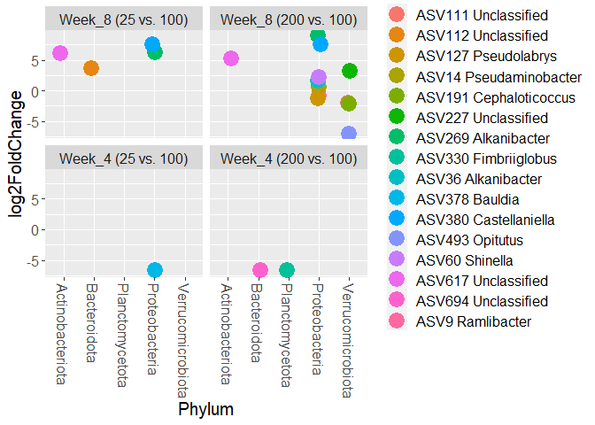

4_Deseq2
================
Daniel Quiroz - Juan Quijia
2023-07-10

``` r
library(phyloseq)
library(tidyverse)
```

    ## ── Attaching core tidyverse packages ──────────────────────── tidyverse 2.0.0 ──
    ## ✔ dplyr     1.1.2     ✔ readr     2.1.4
    ## ✔ forcats   1.0.0     ✔ stringr   1.5.0
    ## ✔ ggplot2   3.4.2     ✔ tibble    3.2.1
    ## ✔ lubridate 1.9.2     ✔ tidyr     1.3.0
    ## ✔ purrr     1.0.1     
    ## ── Conflicts ────────────────────────────────────────── tidyverse_conflicts() ──
    ## ✖ dplyr::filter() masks stats::filter()
    ## ✖ dplyr::lag()    masks stats::lag()
    ## ℹ Use the conflicted package (<http://conflicted.r-lib.org/>) to force all conflicts to become errors

``` r
library(microbiome)
```

    ## 
    ## microbiome R package (microbiome.github.com)
    ##     
    ## 
    ## 
    ##  Copyright (C) 2011-2022 Leo Lahti, 
    ##     Sudarshan Shetty et al. <microbiome.github.io>
    ## 
    ## 
    ## Attaching package: 'microbiome'
    ## 
    ## The following object is masked from 'package:ggplot2':
    ## 
    ##     alpha
    ## 
    ## The following object is masked from 'package:base':
    ## 
    ##     transform

``` r
library(ggpubr)
library(ggsci)
library(DESeq2)
```

    ## Loading required package: S4Vectors
    ## Loading required package: stats4
    ## Loading required package: BiocGenerics
    ## 
    ## Attaching package: 'BiocGenerics'
    ## 
    ## The following objects are masked from 'package:lubridate':
    ## 
    ##     intersect, setdiff, union
    ## 
    ## The following objects are masked from 'package:dplyr':
    ## 
    ##     combine, intersect, setdiff, union
    ## 
    ## The following objects are masked from 'package:stats':
    ## 
    ##     IQR, mad, sd, var, xtabs
    ## 
    ## The following objects are masked from 'package:base':
    ## 
    ##     anyDuplicated, aperm, append, as.data.frame, basename, cbind,
    ##     colnames, dirname, do.call, duplicated, eval, evalq, Filter, Find,
    ##     get, grep, grepl, intersect, is.unsorted, lapply, Map, mapply,
    ##     match, mget, order, paste, pmax, pmax.int, pmin, pmin.int,
    ##     Position, rank, rbind, Reduce, rownames, sapply, setdiff, sort,
    ##     table, tapply, union, unique, unsplit, which.max, which.min
    ## 
    ## 
    ## Attaching package: 'S4Vectors'
    ## 
    ## The following objects are masked from 'package:lubridate':
    ## 
    ##     second, second<-
    ## 
    ## The following objects are masked from 'package:dplyr':
    ## 
    ##     first, rename
    ## 
    ## The following object is masked from 'package:tidyr':
    ## 
    ##     expand
    ## 
    ## The following object is masked from 'package:utils':
    ## 
    ##     findMatches
    ## 
    ## The following objects are masked from 'package:base':
    ## 
    ##     expand.grid, I, unname
    ## 
    ## Loading required package: IRanges
    ## 
    ## Attaching package: 'IRanges'
    ## 
    ## The following object is masked from 'package:microbiome':
    ## 
    ##     coverage
    ## 
    ## The following object is masked from 'package:lubridate':
    ## 
    ##     %within%
    ## 
    ## The following objects are masked from 'package:dplyr':
    ## 
    ##     collapse, desc, slice
    ## 
    ## The following object is masked from 'package:purrr':
    ## 
    ##     reduce
    ## 
    ## The following object is masked from 'package:phyloseq':
    ## 
    ##     distance
    ## 
    ## The following object is masked from 'package:grDevices':
    ## 
    ##     windows
    ## 
    ## Loading required package: GenomicRanges
    ## Loading required package: GenomeInfoDb
    ## Loading required package: SummarizedExperiment
    ## Loading required package: MatrixGenerics
    ## Loading required package: matrixStats
    ## 
    ## Attaching package: 'matrixStats'
    ## 
    ## The following object is masked from 'package:dplyr':
    ## 
    ##     count
    ## 
    ## 
    ## Attaching package: 'MatrixGenerics'
    ## 
    ## The following objects are masked from 'package:matrixStats':
    ## 
    ##     colAlls, colAnyNAs, colAnys, colAvgsPerRowSet, colCollapse,
    ##     colCounts, colCummaxs, colCummins, colCumprods, colCumsums,
    ##     colDiffs, colIQRDiffs, colIQRs, colLogSumExps, colMadDiffs,
    ##     colMads, colMaxs, colMeans2, colMedians, colMins, colOrderStats,
    ##     colProds, colQuantiles, colRanges, colRanks, colSdDiffs, colSds,
    ##     colSums2, colTabulates, colVarDiffs, colVars, colWeightedMads,
    ##     colWeightedMeans, colWeightedMedians, colWeightedSds,
    ##     colWeightedVars, rowAlls, rowAnyNAs, rowAnys, rowAvgsPerColSet,
    ##     rowCollapse, rowCounts, rowCummaxs, rowCummins, rowCumprods,
    ##     rowCumsums, rowDiffs, rowIQRDiffs, rowIQRs, rowLogSumExps,
    ##     rowMadDiffs, rowMads, rowMaxs, rowMeans2, rowMedians, rowMins,
    ##     rowOrderStats, rowProds, rowQuantiles, rowRanges, rowRanks,
    ##     rowSdDiffs, rowSds, rowSums2, rowTabulates, rowVarDiffs, rowVars,
    ##     rowWeightedMads, rowWeightedMeans, rowWeightedMedians,
    ##     rowWeightedSds, rowWeightedVars
    ## 
    ## Loading required package: Biobase
    ## Welcome to Bioconductor
    ## 
    ##     Vignettes contain introductory material; view with
    ##     'browseVignettes()'. To cite Bioconductor, see
    ##     'citation("Biobase")', and for packages 'citation("pkgname")'.
    ## 
    ## 
    ## Attaching package: 'Biobase'
    ## 
    ## The following object is masked from 'package:MatrixGenerics':
    ## 
    ##     rowMedians
    ## 
    ## The following objects are masked from 'package:matrixStats':
    ## 
    ##     anyMissing, rowMedians
    ## 
    ## The following object is masked from 'package:phyloseq':
    ## 
    ##     sampleNames

``` r
library("knitr")
library(writexl)
#https://rstudio-pubs-static.s3.amazonaws.com/329027_593046fb6d7a427da6b2c538caf601e1.html#example-1-two-group-comparison
```

## Remove poor represented ASV

In this case, since we are going to conduct comparative analysis, we
need to remove ASV with less that 5 counts as well as to be detected in
at least 50% of the samples. This yields to a total of 527 taxa that
meet this two criteria.

``` r
floral_micro_filter<- readRDS('phyloseq_data.rds')
floral_micro_filter 
```

    ## phyloseq-class experiment-level object
    ## otu_table()   OTU Table:         [ 2535 taxa and 35 samples ]
    ## sample_data() Sample Data:       [ 35 samples by 31 sample variables ]
    ## tax_table()   Taxonomy Table:    [ 2535 taxa by 7 taxonomic ranks ]
    ## refseq()      DNAStringSet:      [ 2535 reference sequences ]

``` r
#Find ASV with at least 5 counts and detected in at least 50% 
floral_micro_filter_5C <- genefilter_sample(floral_micro_filter,
                                            filterfun_sample(function(x) x > 5),
                                            A=0.5*nsamples(floral_micro_filter)
           )
floral_micro_deseq <- prune_taxa(floral_micro_filter_5C, floral_micro_filter)
floral_micro_deseq
```

    ## phyloseq-class experiment-level object
    ## otu_table()   OTU Table:         [ 527 taxa and 35 samples ]
    ## sample_data() Sample Data:       [ 35 samples by 31 sample variables ]
    ## tax_table()   Taxonomy Table:    [ 527 taxa by 7 taxonomic ranks ]
    ## refseq()      DNAStringSet:      [ 527 reference sequences ]

## Transform counts to a even depth

As we can see, 68846.09 is an intermediate sequencing depth for
treatment. We are going to transform the count table from absolute
counts to an homogeneous depth.

``` r
meta(floral_micro_deseq) %>%
  group_by(Dose) %>% 
  summarise(Depth_mean = mean(SeqDepth))
```

    ## # A tibble: 3 × 2
    ##   Dose  Depth_mean
    ##   <fct>      <dbl>
    ## 1 25        61624.
    ## 2 100       69141.
    ## 3 200       68846.

``` r
floral_micro_relat <- transform_sample_counts(floral_micro_deseq,
                                              function(x) 68846 * x/(sum(x)))
```

## Keeping the 6 most abundant phyla

``` r
phylum_sum <- tapply(taxa_sums(floral_micro_relat),
                     tax_table(floral_micro_relat)[, "Phylum"], sum, na.rm = TRUE)
print("Only the six most abundant phyla are preserved for downstream analysis to remove low represented ASV")
```

    ## [1] "Only the six most abundant phyla are preserved for downstream analysis to remove low represented ASV"

``` r
top5phyla <- names(sort(phylum_sum, decreasing = TRUE))[seq(6)]
top5phyla
```

    ## [1] "Proteobacteria"    "Actinobacteriota"  "Bacteroidota"     
    ## [4] "Verrucomicrobiota" "Planctomycetota"   "Acidobacteriota"

``` r
floral_micro_relat <- prune_taxa((tax_table(floral_micro_relat)[, "Phylum"] %in% top5phyla),
                                 floral_micro_relat)
floral_micro_relat
```

    ## phyloseq-class experiment-level object
    ## otu_table()   OTU Table:         [ 449 taxa and 35 samples ]
    ## sample_data() Sample Data:       [ 35 samples by 31 sample variables ]
    ## tax_table()   Taxonomy Table:    [ 449 taxa by 7 taxonomic ranks ]
    ## refseq()      DNAStringSet:      [ 449 reference sequences ]

``` r
saveRDS(floral_micro_relat, file = file.path('phyloseq_data_top5.rds'))
```

The final result yield us to a total of 449 ASV for downstream analysis.

## Transforming to Deseq2 object

``` r
 phyloseq::sample_data(floral_micro_relat) <- meta(floral_micro_relat) %>% 
   mutate(Block = factor(Block),
          Time = factor(Time, levels=c("Week_4","Week_8")), 
          Dose = factor(Dose,levels=c("25","100","200")))

  
diagdds_floral <- phyloseq_to_deseq2(floral_micro_relat, 
                                     design =  ~ Dose + Time + Dose*Time)
```

    ## converting counts to integer mode

``` r
diagdds_floral$Time = relevel( diagdds_floral$Time, "Week_4")
diagdds_floral$Time
```

    ##  [1] Week_8 Week_4 Week_8 Week_4 Week_8 Week_8 Week_8 Week_4 Week_4 Week_4
    ## [11] Week_4 Week_4 Week_8 Week_8 Week_8 Week_4 Week_4 Week_8 Week_4 Week_8
    ## [21] Week_4 Week_4 Week_4 Week_8 Week_8 Week_4 Week_8 Week_4 Week_4 Week_8
    ## [31] Week_8 Week_4 Week_4 Week_8 Week_8
    ## Levels: Week_4 Week_8

``` r
diagdds_floral$Dose = relevel( diagdds_floral$Dose, "100")
diagdds_floral$Dose
```

    ##  [1] 100 200 100 100 200 100 25  100 200 25  100 100 25  200 100 200 25  200 25 
    ## [20] 100 100 200 200 25  200 25  25  100 200 100 25  25  25  25  200
    ## Levels: 100 25 200

``` r
gm_mean = function(x, na.rm=TRUE){
  exp(sum(log(x[x > 0]), na.rm=na.rm) / length(x))
}
geoMeans = apply(counts(diagdds_floral), 1, gm_mean)

# Variance estimation
diagdds_floral = estimateSizeFactors(diagdds_floral, geoMeans = geoMeans)
diagdds_floral = estimateDispersions(diagdds_floral, fitType='local')
```

    ## gene-wise dispersion estimates

    ## mean-dispersion relationship

    ## final dispersion estimates

Extraction of the normalized matrix

``` r
diagvst_floral = getVarianceStabilizedData(diagdds_floral)
dim(diagvst_floral)
```

    ## [1] 449  35

Now, we can replace the normalized matrix for the absolute counts in the
phyloseq object

``` r
floral_micro_deseq_final <- floral_micro_relat
otu_table(floral_micro_deseq_final) <- otu_table(diagvst_floral, taxa_are_rows = TRUE)
```

## Differential ASV

Let’s check first the design to make sure we have the right formula

``` r
design(diagdds_floral)
```

    ## ~Dose + Time + Dose * Time

``` r
#Defining alpha level
alpha = 0.05

#Differential analysis
diagdds_floral <- DESeq(diagdds_floral, fitType = "local")
```

    ## using pre-existing size factors

    ## estimating dispersions

    ## found already estimated dispersions, replacing these

    ## gene-wise dispersion estimates

    ## mean-dispersion relationship

    ## final dispersion estimates

    ## fitting model and testing

``` r
resultsNames(diagdds_floral)
```

    ## [1] "Intercept"             "Dose_25_vs_100"        "Dose_200_vs_100"      
    ## [4] "Time_Week_8_vs_Week_4" "Dose25.TimeWeek_8"     "Dose200.TimeWeek_8"

``` r
#results_deseq <- results(diagdds_floral,contrast=c("Time","Week_8","Week_4")) #At 25 8_vs_4
#results_deseq <- results(diagdds_floral,contrast=list(c("Time_Week_8_vs_Week_4","Dose100.TimeWeek_8"))) #At 100 8_vs_4
#results_deseq <- results(diagdds_floral,contrast=list(c("Time_Week_8_vs_Week_4","Dose200.TimeWeek_8"))) #At 200 8_vs_4
results_deseq_8_25 <- results(diagdds_floral,contrast=list(c("Dose_25_vs_100","Dose25.TimeWeek_8"))) #At 8 25_vs_100
results_deseq_8_200 <- results(diagdds_floral,contrast=list(c("Dose_200_vs_100","Dose200.TimeWeek_8"))) #At 8 200_vs_100
results_deseq_4_25 <- results(diagdds_floral,contrast=c("Dose","25","100")) #At 4 25_vs_100
results_deseq_4_200 <- results(diagdds_floral,contrast=c("Dose","200","100")) #At 4 200_vs_100

#results_deseq_3_25 <- results_deseq[order(results_deseq$padj, na.last = NA), ]
```

``` r
sig_dif_asv_8_25 <- results_deseq_8_25[which(results_deseq_8_25$padj < alpha), ]
sig_dif_asv_8_25 <- cbind(as(sig_dif_asv_8_25,"data.frame"),
                      as(tax_table(floral_micro_deseq_final)[rownames(sig_dif_asv_8_25), ],
                         "matrix"))

sig_dif_asv_8_200 <- results_deseq_8_200[which(results_deseq_8_200$padj < alpha), ]
sig_dif_asv_8_200 <- cbind(as(sig_dif_asv_8_200,"data.frame"),
                      as(tax_table(floral_micro_deseq_final)[rownames(sig_dif_asv_8_200), ],
                         "matrix"))

sig_dif_asv_4_25 <- results_deseq_4_25[which(results_deseq_4_25$padj < alpha), ]
sig_dif_asv_4_25 <- cbind(as(sig_dif_asv_4_25,"data.frame"),
                      as(tax_table(floral_micro_deseq_final)[rownames(sig_dif_asv_4_25), ],
                         "matrix"))

sig_dif_asv_4_200 <- results_deseq_4_200[which(results_deseq_4_200$padj < alpha), ]
sig_dif_asv_4_200 <- cbind(as(sig_dif_asv_4_200,"data.frame"),
                      as(tax_table(floral_micro_deseq_final)[rownames(sig_dif_asv_4_200), ],
                         "matrix"))
```

Plot factorial DEseq2

``` r
sig_dif_asv_8_25$Time = "Week_8"
sig_dif_asv_8_200$Time = "Week_8"
sig_dif_asv_4_25$Time = "Week_4"
sig_dif_asv_4_200$Time = "Week_4"

sig_dif_asv_8_25$test = "Week_8 (25 vs. 100)"
sig_dif_asv_8_200$test = "Week_8 (200 vs. 100)"
sig_dif_asv_4_25$test = "Week_4 (25 vs. 100)"
sig_dif_asv_4_200$test = "Week_4 (200 vs. 100)"

sig_dif_asv_8_25$ASV = row.names(sig_dif_asv_8_25)
sig_dif_asv_8_200$ASV = row.names(sig_dif_asv_8_200)
sig_dif_asv_4_25$ASV =row.names(sig_dif_asv_4_25)
sig_dif_asv_4_200$ASV <- row.names(sig_dif_asv_4_200)

merged_sig <- rbind(sig_dif_asv_8_25,sig_dif_asv_8_200,sig_dif_asv_4_25,sig_dif_asv_4_200)
merged_sig$test <- factor(merged_sig$test,levels = c("Week_8 (25 vs. 100)","Week_8 (200 vs. 100)","Week_4 (25 vs. 100)","Week_4 (200 vs. 100)")) 
merged_sig$Species2 <- sub("Unclassified", "", merged_sig$Species)
merged_sig$ASV_Genus<-paste(merged_sig$ASV,merged_sig$Genus)

deseq2plot <- ggplot(merged_sig, aes(x=Phylum, y=log2FoldChange, color=ASV_Genus))+ 
  geom_jitter(size=6, width = 0.1) + 
  facet_wrap( ~ test, ncol = 2) +
  theme(text = element_text(size=15), axis.text.x = element_text(angle = -90, hjust = 0, vjust=0.5)) 
  #scale_fill_discrete("Phylum",
#                      breaks = c("ASV114 Unclassified","ASV115 Unclassified","ASV213 Unclassified","ASV315 Unclassified","ASV320 Unclassified","ASV478 Unclassified","ASV693 Unclassified"),
 #                     labels = c("Unclassified","Unclassified","*Spirosoma aerophilum *","Unclassified","Unclassified","Noviherbaspirillum","Unclassified"))+
  #theme(aspect.ratio=1, strip.placement = "outside",text = element_text(size = 15)) #+
  #scale_x_discrete("Phylum", labels=expression(italic(Bacteriodota),italic(Elusimicrobiota),italic(Proteobacteria),italic(Verrucomicrobiota)))
write_xlsx(merged_sig,"1.4_DeSEq2_table.xlsx")
ggsave("1.4_fertilizer_deseq_week.png",width = 8,height = 6)
deseq2plot
```

<!-- -->

\#Diferential analysis by Week Normalizing data

``` r
ps_w8 <- subset_samples(floral_micro_relat,Time=="Week_8")
ps_w4 <- subset_samples(floral_micro_relat,Time=="Week_4")

dds_w8 <- phyloseq_to_deseq2(ps_w8,design =  ~ Dose)
```

    ## converting counts to integer mode

``` r
dds_w4 <- phyloseq_to_deseq2(ps_w4,design =  ~ Dose)
```

    ## converting counts to integer mode

``` r
dds_w8$Dose = relevel( dds_w8$Dose, "100")
dds_w8$Dose
```

    ##  [1] 100 100 200 100 25  25  200 100 200 100 25  200 25  100 25  25  200
    ## Levels: 100 25 200

``` r
dds_w4$Dose = relevel( dds_w4$Dose, "100")
dds_w4$Dose
```

    ##  [1] 200 100 100 200 25  100 100 200 25  25  100 200 200 25  100 200 25  25 
    ## Levels: 100 25 200

``` r
gm_mean = function(x, na.rm=TRUE){
  exp(sum(log(x[x > 0]), na.rm=na.rm) / length(x))
}
geoMeans_w8 = apply(counts(dds_w8), 1, gm_mean)
geoMeans_w4 = apply(counts(dds_w4), 1, gm_mean)

# Variance estimation week 8
dds_w8 = estimateSizeFactors(dds_w8, geoMeans = geoMeans_w8)
dds_w8 = estimateDispersions(dds_w8, fitType='local')
```

    ## gene-wise dispersion estimates

    ## mean-dispersion relationship

    ## final dispersion estimates

``` r
# Variance estimation week 4 
dds_w4 = estimateSizeFactors(dds_w4, geoMeans = geoMeans_w4)
dds_w4 = estimateDispersions(dds_w4, fitType='local')
```

    ## gene-wise dispersion estimates

    ## mean-dispersion relationship

    ## final dispersion estimates

``` r
#Defining alpha level
alpha = 0.05

#Differential analysis week 8
dds_w8 <- DESeq(dds_w8, fitType = "local")
```

    ## using pre-existing size factors

    ## estimating dispersions

    ## found already estimated dispersions, replacing these

    ## gene-wise dispersion estimates

    ## mean-dispersion relationship

    ## final dispersion estimates

    ## fitting model and testing

``` r
resultsNames(dds_w8)
```

    ## [1] "Intercept"       "Dose_25_vs_100"  "Dose_200_vs_100"

``` r
res = results(dds_w8, contrast=c("Dose", "200", "100"), alpha=alpha)
res = res[order(res$padj, na.last=NA), ]
res_sig = res[(res$padj < alpha), ]
res_sig
```

    ## log2 fold change (MLE): Dose 200 vs 100 
    ## Wald test p-value: Dose 200 vs 100 
    ## DataFrame with 5 rows and 6 columns
    ##         baseMean log2FoldChange     lfcSE      stat      pvalue        padj
    ##        <numeric>      <numeric> <numeric> <numeric>   <numeric>   <numeric>
    ## ASV269   32.4215        8.97683  1.825654   4.91705 8.78589e-07 0.000393608
    ## ASV191   95.4404       -2.07398  0.561943  -3.69073 2.23611e-04 0.027304826
    ## ASV227  179.3513        3.19380  0.870554   3.66869 2.43793e-04 0.027304826
    ## ASV380   21.8405        7.51845  2.019998   3.72201 1.97646e-04 0.027304826
    ## ASV173  135.8129       -1.47645  0.417821  -3.53369 4.09808e-04 0.036718804

``` r
#Differential analysis week 4
dds_w4 <- DESeq(dds_w4, fitType = "local")
```

    ## using pre-existing size factors

    ## estimating dispersions

    ## found already estimated dispersions, replacing these

    ## gene-wise dispersion estimates

    ## mean-dispersion relationship

    ## final dispersion estimates

    ## fitting model and testing

``` r
resultsNames(dds_w4)
```

    ## [1] "Intercept"       "Dose_25_vs_100"  "Dose_200_vs_100"

``` r
res_2 = results(dds_w4, contrast=c("Dose", "200", "100"), alpha=alpha)
res_2 = res_2[order(res_2$padj, na.last=NA), ]
res_sig_2 = res_2[(res_2$padj < alpha), ]
res_sig_2
```

    ## log2 fold change (MLE): Dose 200 vs 100 
    ## Wald test p-value: Dose 200 vs 100 
    ## DataFrame with 1 row and 6 columns
    ##         baseMean log2FoldChange     lfcSE      stat      pvalue        padj
    ##        <numeric>      <numeric> <numeric> <numeric>   <numeric>   <numeric>
    ## ASV330   9.15576       -6.55386   1.36284  -4.80899 1.51696e-06 0.000679598

\##This is only using samples from week_8

\###Final_Plot_week_8

\######DESeq############# \##This is only using samples from week_4
