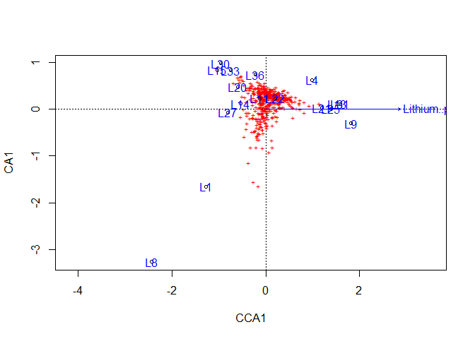
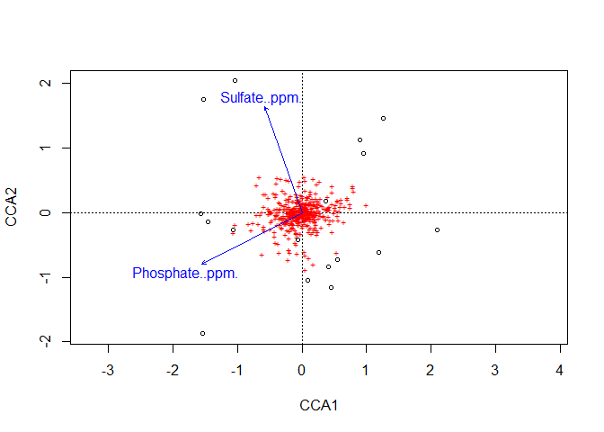
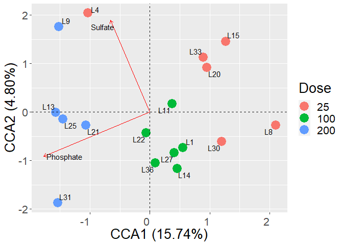

8_CCA_Week_8
================
Juan Quijia
2023-07-14

# Loading packages

``` r
library("phyloseq")
library("ggplot2")
library("dplyr")
```

    ## 
    ## Attaching package: 'dplyr'

    ## The following objects are masked from 'package:stats':
    ## 
    ##     filter, lag

    ## The following objects are masked from 'package:base':
    ## 
    ##     intersect, setdiff, setequal, union

``` r
library("ape")
```

    ## 
    ## Attaching package: 'ape'

    ## The following object is masked from 'package:dplyr':
    ## 
    ##     where

``` r
library("DESeq2")
```

    ## Loading required package: S4Vectors

    ## Loading required package: stats4

    ## Loading required package: BiocGenerics

    ## 
    ## Attaching package: 'BiocGenerics'

    ## The following objects are masked from 'package:dplyr':
    ## 
    ##     combine, intersect, setdiff, union

    ## The following objects are masked from 'package:stats':
    ## 
    ##     IQR, mad, sd, var, xtabs

    ## The following objects are masked from 'package:base':
    ## 
    ##     anyDuplicated, aperm, append, as.data.frame, basename, cbind,
    ##     colnames, dirname, do.call, duplicated, eval, evalq, Filter, Find,
    ##     get, grep, grepl, intersect, is.unsorted, lapply, Map, mapply,
    ##     match, mget, order, paste, pmax, pmax.int, pmin, pmin.int,
    ##     Position, rank, rbind, Reduce, rownames, sapply, setdiff, sort,
    ##     table, tapply, union, unique, unsplit, which.max, which.min

    ## 
    ## Attaching package: 'S4Vectors'

    ## The following objects are masked from 'package:dplyr':
    ## 
    ##     first, rename

    ## The following object is masked from 'package:utils':
    ## 
    ##     findMatches

    ## The following objects are masked from 'package:base':
    ## 
    ##     expand.grid, I, unname

    ## Loading required package: IRanges

    ## 
    ## Attaching package: 'IRanges'

    ## The following objects are masked from 'package:dplyr':
    ## 
    ##     collapse, desc, slice

    ## The following object is masked from 'package:phyloseq':
    ## 
    ##     distance

    ## The following object is masked from 'package:grDevices':
    ## 
    ##     windows

    ## Loading required package: GenomicRanges

    ## Loading required package: GenomeInfoDb

    ## Loading required package: SummarizedExperiment

    ## Loading required package: MatrixGenerics

    ## Loading required package: matrixStats

    ## 
    ## Attaching package: 'matrixStats'

    ## The following object is masked from 'package:dplyr':
    ## 
    ##     count

    ## 
    ## Attaching package: 'MatrixGenerics'

    ## The following objects are masked from 'package:matrixStats':
    ## 
    ##     colAlls, colAnyNAs, colAnys, colAvgsPerRowSet, colCollapse,
    ##     colCounts, colCummaxs, colCummins, colCumprods, colCumsums,
    ##     colDiffs, colIQRDiffs, colIQRs, colLogSumExps, colMadDiffs,
    ##     colMads, colMaxs, colMeans2, colMedians, colMins, colOrderStats,
    ##     colProds, colQuantiles, colRanges, colRanks, colSdDiffs, colSds,
    ##     colSums2, colTabulates, colVarDiffs, colVars, colWeightedMads,
    ##     colWeightedMeans, colWeightedMedians, colWeightedSds,
    ##     colWeightedVars, rowAlls, rowAnyNAs, rowAnys, rowAvgsPerColSet,
    ##     rowCollapse, rowCounts, rowCummaxs, rowCummins, rowCumprods,
    ##     rowCumsums, rowDiffs, rowIQRDiffs, rowIQRs, rowLogSumExps,
    ##     rowMadDiffs, rowMads, rowMaxs, rowMeans2, rowMedians, rowMins,
    ##     rowOrderStats, rowProds, rowQuantiles, rowRanges, rowRanks,
    ##     rowSdDiffs, rowSds, rowSums2, rowTabulates, rowVarDiffs, rowVars,
    ##     rowWeightedMads, rowWeightedMeans, rowWeightedMedians,
    ##     rowWeightedSds, rowWeightedVars

    ## Loading required package: Biobase

    ## Welcome to Bioconductor
    ## 
    ##     Vignettes contain introductory material; view with
    ##     'browseVignettes()'. To cite Bioconductor, see
    ##     'citation("Biobase")', and for packages 'citation("pkgname")'.

    ## 
    ## Attaching package: 'Biobase'

    ## The following object is masked from 'package:MatrixGenerics':
    ## 
    ##     rowMedians

    ## The following objects are masked from 'package:matrixStats':
    ## 
    ##     anyMissing, rowMedians

    ## The following object is masked from 'package:phyloseq':
    ## 
    ##     sampleNames

``` r
library("vegan")
```

    ## Loading required package: permute

    ## Loading required package: lattice

    ## This is vegan 2.6-4

``` r
#library("ggtext") # Needed to italize letter in plot
library("tidyverse")
```

    ## ── Attaching core tidyverse packages ──────────────────────── tidyverse 2.0.0 ──
    ## ✔ forcats   1.0.0     ✔ stringr   1.5.0
    ## ✔ lubridate 1.9.2     ✔ tibble    3.2.1
    ## ✔ purrr     1.0.1     ✔ tidyr     1.3.0
    ## ✔ readr     2.1.4

    ## ── Conflicts ────────────────────────────────────────── tidyverse_conflicts() ──
    ## ✖ lubridate::%within%()    masks IRanges::%within%()
    ## ✖ IRanges::collapse()      masks dplyr::collapse()
    ## ✖ Biobase::combine()       masks BiocGenerics::combine(), dplyr::combine()
    ## ✖ matrixStats::count()     masks dplyr::count()
    ## ✖ IRanges::desc()          masks dplyr::desc()
    ## ✖ tidyr::expand()          masks S4Vectors::expand()
    ## ✖ dplyr::filter()          masks stats::filter()
    ## ✖ S4Vectors::first()       masks dplyr::first()
    ## ✖ dplyr::lag()             masks stats::lag()
    ## ✖ BiocGenerics::Position() masks ggplot2::Position(), base::Position()
    ## ✖ purrr::reduce()          masks GenomicRanges::reduce(), IRanges::reduce()
    ## ✖ S4Vectors::rename()      masks dplyr::rename()
    ## ✖ lubridate::second()      masks S4Vectors::second()
    ## ✖ lubridate::second<-()    masks S4Vectors::second<-()
    ## ✖ IRanges::slice()         masks dplyr::slice()
    ## ✖ ape::where()             masks dplyr::where()
    ## ℹ Use the conflicted package (<http://conflicted.r-lib.org/>) to force all conflicts to become errors

``` r
library("microbiome")
```

    ## 
    ## microbiome R package (microbiome.github.com)
    ##     
    ## 
    ## 
    ##  Copyright (C) 2011-2022 Leo Lahti, 
    ##     Sudarshan Shetty et al. <microbiome.github.io>
    ## 
    ## 
    ## Attaching package: 'microbiome'
    ## 
    ## The following object is masked from 'package:vegan':
    ## 
    ##     diversity
    ## 
    ## The following object is masked from 'package:SummarizedExperiment':
    ## 
    ##     coverage
    ## 
    ## The following object is masked from 'package:GenomicRanges':
    ## 
    ##     coverage
    ## 
    ## The following objects are masked from 'package:IRanges':
    ## 
    ##     coverage, transform
    ## 
    ## The following object is masked from 'package:S4Vectors':
    ## 
    ##     transform
    ## 
    ## The following object is masked from 'package:ggplot2':
    ## 
    ##     alpha
    ## 
    ## The following object is masked from 'package:base':
    ## 
    ##     transform

# CCA analysis

## Preparing data

In this step, we are going to use the top 6 phyla

``` r
## Extracting the community mattrix
floral_micro_relat_full<- readRDS('phyloseq_data_top5.rds')
floral_micro_relat_full
```

    ## phyloseq-class experiment-level object
    ## otu_table()   OTU Table:         [ 449 taxa and 35 samples ]
    ## sample_data() Sample Data:       [ 35 samples by 31 sample variables ]
    ## tax_table()   Taxonomy Table:    [ 449 taxa by 7 taxonomic ranks ]
    ## refseq()      DNAStringSet:      [ 449 reference sequences ]

``` r
floral_micro_relat<-subset_samples(floral_micro_relat_full,Time=="Week_8")
floral_micro_relat
```

    ## phyloseq-class experiment-level object
    ## otu_table()   OTU Table:         [ 449 taxa and 17 samples ]
    ## sample_data() Sample Data:       [ 17 samples by 31 sample variables ]
    ## tax_table()   Taxonomy Table:    [ 449 taxa by 7 taxonomic ranks ]
    ## refseq()      DNAStringSet:      [ 449 reference sequences ]

``` r
micro_metadata<-as(sample_data(floral_micro_relat),"data.frame")

comm_matrix =  as(otu_table(floral_micro_relat), "matrix")
comm_matrix = t(comm_matrix)
comm_matrix = as.data.frame(comm_matrix)

##Extracting the taxonomic matrix from the Phyloseq object
Taxonomy_id = as(tax_table(floral_micro_relat), "matrix")
Taxonomy_id = as.data.frame(Taxonomy_id)

## Preparing environmental data
env_data <- micro_metadata %>% 
  select(pH, EC..us.cm., TOC..mg.L., TN..mg.L., Sodium..ppm., Lithium..ppm., Potassium..ppm.,
         Magnesium..ppm., Calcium..ppm., Flouride..ppm., Chloride..ppm., Nitrate..ppm.,
         Sulfate..ppm., Phosphate..ppm., ShootDW, TotalShoot, RootTOShoot, RootDW) %>% 
  mutate_all(~replace_na(., 0))

# Assigning names to the genera
names(comm_matrix) <- Taxonomy_id$Genus
```

### Running CCA analysis

According to \`?vegan::vif.cca\`, variables produce variance inflation,
which will decrease the sifnificance

of the analysis. As a rule of thumb, values over 10 indicate redundant
constraints. Therefore,

Variables over 11, will be removed from the analysis.

``` r
CCA_analysis_raw <- cca(comm_matrix ~ pH + TOC..mg.L.+ 
                          TN..mg.L.+ Phosphate..ppm. + Potassium..ppm.+ 
                          Magnesium..ppm.+Calcium..ppm.+ Sulfate..ppm. +
                          Sodium..ppm.+ Lithium..ppm. + Flouride..ppm. +
                          Chloride..ppm. + Nitrate..ppm., data = env_data)
```

``` r
data.frame(Values = vif.cca(CCA_analysis_raw)) %>% filter(Values < 11)
```

    ##                  Values
    ## Sulfate..ppm.  4.672775
    ## Flouride..ppm. 4.851559

## Selecting environmental variables

The previous section pointed out three variables with low colinearity
what we can include in a cleaner CCA analysis.

``` r
# Creating a null model
mod0 <- cca(comm_matrix ~ 1, data = env_data)
mod <- ordistep(mod0, scope = formula(CCA_analysis_raw), direction = "both", trace = 1 )
```

    ## 
    ## Start: comm_matrix ~ 1 
    ## 
    ##                   Df    AIC      F Pr(>F)   
    ## + Phosphate..ppm.  1 170.59 2.3264  0.005 **
    ## + Nitrate..ppm.    1 170.75 2.1673  0.015 * 
    ## + TN..mg.L.        1 170.70 2.2167  0.020 * 
    ## + Potassium..ppm.  1 170.72 2.1955  0.020 * 
    ## + Magnesium..ppm.  1 170.78 2.1401  0.025 * 
    ## + Lithium..ppm.    1 170.38 2.5493  0.030 * 
    ## + pH               1 171.07 1.8484  0.040 * 
    ## + Chloride..ppm.   1 170.92 1.9990  0.045 * 
    ## + Calcium..ppm.    1 171.24 1.6844  0.050 * 
    ## + Sulfate..ppm.    1 172.00 0.9538  0.455   
    ## + TOC..mg.L.       1 172.10 0.8548  0.560   
    ## + Flouride..ppm.   1 172.14 0.8231  0.620   
    ## + Sodium..ppm.     0 171.04                 
    ## ---
    ## Signif. codes:  0 '***' 0.001 '**' 0.01 '*' 0.05 '.' 0.1 ' ' 1
    ## 
    ## Step: comm_matrix ~ Phosphate..ppm. 
    ## 
    ##                   Df    AIC      F Pr(>F)   
    ## - Phosphate..ppm.  1 171.04 2.3264  0.005 **
    ## ---
    ## Signif. codes:  0 '***' 0.001 '**' 0.01 '*' 0.05 '.' 0.1 ' ' 1
    ## 
    ##                   Df    AIC      F Pr(>F)
    ## + Lithium..ppm.    1 171.02 1.3583  0.135
    ## + TOC..mg.L.       1 171.13 1.2556  0.165
    ## + Sulfate..ppm.    1 171.14 1.2527  0.195
    ## + Chloride..ppm.   1 171.32 1.0893  0.195
    ## + Calcium..ppm.    1 171.35 1.0665  0.290
    ## + Flouride..ppm.   1 171.48 0.9497  0.455
    ## + pH               1 171.51 0.9213  0.465
    ## + Magnesium..ppm.  1 171.65 0.7969  0.645
    ## + Potassium..ppm.  1 171.61 0.8355  0.680
    ## + TN..mg.L.        1 171.74 0.7214  0.735
    ## + Nitrate..ppm.    1 171.72 0.7366  0.755
    ## + Sodium..ppm.     0 170.59

``` r
plot(mod)
text(mod, "sites", col = "blue")
```

<!-- -->

Here, we can see that only TOC, has a low p-val. However, this model do
not accounts for any experimental design.

### Adding experimental design

PERMANOVA with the square root of dissimilarities (Bray-Curtis
distances). Tests for the significance of the different terms of the
model (the environmental variables).

First, we test all the variables to have an starting point for
comparison with a p-value of 0.159

``` r
adonis2(comm_matrix ~ pH + TOC..mg.L.+ TN..mg.L.+ 
                    Phosphate..ppm. + Potassium..ppm.+ Magnesium..ppm.+
                    Calcium..ppm.+ Sulfate..ppm. +
                          Sodium..ppm.+ Lithium..ppm. + Flouride..ppm. +
                          Chloride..ppm. + Nitrate..ppm., data = env_data, method = 'bray', by = NULL, sqrt.dist = TRUE)
```

    ## Permutation test for adonis under reduced model
    ## Permutation: free
    ## Number of permutations: 999
    ## 
    ## adonis2(formula = comm_matrix ~ pH + TOC..mg.L. + TN..mg.L. + Phosphate..ppm. + Potassium..ppm. + Magnesium..ppm. + Calcium..ppm. + Sulfate..ppm. + Sodium..ppm. + Lithium..ppm. + Flouride..ppm. + Chloride..ppm. + Nitrate..ppm., data = env_data, method = "bray", sqrt.dist = TRUE, by = NULL)
    ##          Df SumOfSqs      R2      F Pr(>F)
    ## Model    12  1.76639 0.78401 1.2099  0.122
    ## Residual  4  0.48664 0.21599              
    ## Total    16  2.25303 1.00000

Now, in the previous section, 3 variables showed low collinearity (EC,
TOC, ROOT2SHOOT) and TOC showedhad a low p-value. Therefore, the best
variables to create a new robust model are these three.

``` r
adonis2(comm_matrix ~ Sulfate..ppm.+ Flouride..ppm. + Phosphate..ppm., 
        data = env_data, method = 'bray', by = NULL, sqrt.dist = TRUE)
```

    ## Permutation test for adonis under reduced model
    ## Permutation: free
    ## Number of permutations: 999
    ## 
    ## adonis2(formula = comm_matrix ~ Sulfate..ppm. + Flouride..ppm. + Phosphate..ppm., data = env_data, method = "bray", sqrt.dist = TRUE, by = NULL)
    ##          Df SumOfSqs      R2      F Pr(>F)  
    ## Model     3  0.50024 0.22203 1.2367  0.093 .
    ## Residual 13  1.75280 0.77797                
    ## Total    16  2.25303 1.00000                
    ## ---
    ## Signif. codes:  0 '***' 0.001 '**' 0.01 '*' 0.05 '.' 0.1 ' ' 1

Surprisingly, the p-value increases which tell us the new model does not
outperforms the initial model.

After some testing, these are the three best escenarios

``` r
adonis2(comm_matrix ~ Sulfate..ppm.+ Flouride..ppm., 
        data = env_data, method = 'bray', by = NULL, sqrt.dist = TRUE)
```

    ## Permutation test for adonis under reduced model
    ## Permutation: free
    ## Number of permutations: 999
    ## 
    ## adonis2(formula = comm_matrix ~ Sulfate..ppm. + Flouride..ppm., data = env_data, method = "bray", sqrt.dist = TRUE, by = NULL)
    ##          Df SumOfSqs      R2      F Pr(>F)
    ## Model     2  0.25393 0.11271 0.8892  0.681
    ## Residual 14  1.99910 0.88729              
    ## Total    16  2.25303 1.00000

``` r
adonis2(comm_matrix ~ Phosphate..ppm., 
        data = env_data, method = 'bray', by = NULL, sqrt.dist = TRUE)
```

    ## Permutation test for adonis under reduced model
    ## Permutation: free
    ## Number of permutations: 999
    ## 
    ## adonis2(formula = comm_matrix ~ Phosphate..ppm., data = env_data, method = "bray", sqrt.dist = TRUE, by = NULL)
    ##          Df SumOfSqs      R2      F Pr(>F)  
    ## Model     1  0.22856 0.10145 1.6935  0.019 *
    ## Residual 15  2.02447 0.89855                
    ## Total    16  2.25303 1.00000                
    ## ---
    ## Signif. codes:  0 '***' 0.001 '**' 0.01 '*' 0.05 '.' 0.1 ' ' 1

``` r
adonis2(comm_matrix ~ Phosphate..ppm.+ Sulfate..ppm., 
        data = env_data, method = 'bray', by = NULL, sqrt.dist = TRUE)
```

    ## Permutation test for adonis under reduced model
    ## Permutation: free
    ## Number of permutations: 999
    ## 
    ## adonis2(formula = comm_matrix ~ Phosphate..ppm. + Sulfate..ppm., data = env_data, method = "bray", sqrt.dist = TRUE, by = NULL)
    ##          Df SumOfSqs      R2      F Pr(>F)  
    ## Model     2  0.37879 0.16812 1.4147  0.038 *
    ## Residual 14  1.87425 0.83188                
    ## Total    16  2.25303 1.00000                
    ## ---
    ## Signif. codes:  0 '***' 0.001 '**' 0.01 '*' 0.05 '.' 0.1 ' ' 1

As we can see, the model with the lowest p-value is TOC. Unfortunately,
we do not have environmental variables that are significantly driven
differences in the data.

### Final CCA

From the last part, we did find any significant variables. However, for
the final CCA analysis, we can include variables that although do not
drive significant differences in the data (p-value \<0.05), can help us
explain some diferencess between the samples. Therefore, we are
heuristically including all variables that presented a p-value \> 0.2.

``` r
CCA_analysis_final <- cca(comm_matrix ~ Phosphate..ppm.+ Sulfate..ppm., data = env_data)
CCA_analysis_final
```

    ## Call: cca(formula = comm_matrix ~ Phosphate..ppm. + Sulfate..ppm., data
    ## = env_data)
    ## 
    ##               Inertia Proportion Rank
    ## Total         0.33926    1.00000     
    ## Constrained   0.06967    0.20537    2
    ## Unconstrained 0.26958    0.79463   14
    ## Inertia is scaled Chi-square 
    ## 
    ## Eigenvalues for constrained axes:
    ##    CCA1    CCA2 
    ## 0.05339 0.01629 
    ## 
    ## Eigenvalues for unconstrained axes:
    ##     CA1     CA2     CA3     CA4     CA5     CA6     CA7     CA8     CA9    CA10 
    ## 0.08707 0.02839 0.02520 0.01983 0.01637 0.01556 0.01520 0.01172 0.01091 0.00969 
    ##    CA11    CA12    CA13    CA14 
    ## 0.00905 0.00793 0.00665 0.00601

### CCA diagnostics

Here, we will diagnose the goodnees of the fit of the environmental
variables on the CCA. The previous analysis did not accounted for teh
ASV distribution on a CCA space. Therefore, in this section, we will
evaluate the the goodness of the env variables on the CCA.

``` r
anova(CCA_analysis_final)
```

    ## Permutation test for cca under reduced model
    ## Permutation: free
    ## Number of permutations: 999
    ## 
    ## Model: cca(formula = comm_matrix ~ Phosphate..ppm. + Sulfate..ppm., data = env_data)
    ##          Df ChiSquare      F Pr(>F)  
    ## Model     2  0.069674 1.8092  0.024 *
    ## Residual 14  0.269582                
    ## ---
    ## Signif. codes:  0 '***' 0.001 '**' 0.01 '*' 0.05 '.' 0.1 ' ' 1

Here, we can see that our cca model is statistical significant, which
means that are environmental variables that drive diferences.

``` r
anova(CCA_analysis_final, by='term', permutations = 9000)
```

    ## Permutation test for cca under reduced model
    ## Terms added sequentially (first to last)
    ## Permutation: free
    ## Number of permutations: 9000
    ## 
    ## Model: cca(formula = comm_matrix ~ Phosphate..ppm. + Sulfate..ppm., data = env_data)
    ##                 Df ChiSquare      F   Pr(>F)   
    ## Phosphate..ppm.  1  0.045552 2.3656 0.004222 **
    ## Sulfate..ppm.    1  0.024122 1.2527 0.210977   
    ## Residual        14  0.269582                   
    ## ---
    ## Signif. codes:  0 '***' 0.001 '**' 0.01 '*' 0.05 '.' 0.1 ' ' 1

Here, we can sEe that Calcium is the variables that causes the
differentiation.

``` r
anova(CCA_analysis_final, by='axis', permutations = 9000)
```

    ## Permutation test for cca under reduced model
    ## Forward tests for axes
    ## Permutation: free
    ## Number of permutations: 9000
    ## 
    ## Model: cca(formula = comm_matrix ~ Phosphate..ppm. + Sulfate..ppm., data = env_data)
    ##          Df ChiSquare      F  Pr(>F)  
    ## CCA1      1  0.053387 2.7725 0.01644 *
    ## CCA2      1  0.016288 0.8459 0.57260  
    ## Residual 14  0.269582                 
    ## ---
    ## Signif. codes:  0 '***' 0.001 '**' 0.01 '*' 0.05 '.' 0.1 ' ' 1

According to this model, the CCA dimensions do not explain the
diferences according the env variables. However, we will see later that
CCA dimensions accounts for `Time`

``` r
ordiplot(CCA_analysis_final)
```

<!-- -->

``` r
cca_coordinates <- scores(CCA_analysis_final)
# Sample table
cca_samples <- cca_coordinates$sites %>% # Extracting the samples CCA coordinates
  as.data.frame %>% mutate(Samples = rownames(.))
# Adding metadata
sample_metadt <- micro_metadata %>% 
  select(Samples = NAME, Treatment, Time, Block) %>% 
  mutate(Treatment = factor(Treatment), Block = factor(Block), Time = factor(Time))

# Joining tables
cca_samples <- left_join(cca_samples, sample_metadt)
```

    ## Joining with `by = join_by(Samples)`

``` r
cca_samples$Treatment <- factor(cca_samples$Treatment,
                                levels=c("2_25","2_100","2_200"),
                                labels = c("25","100","200"))
cca_samples$Dose <- cca_samples$Treatment


# ASV table
#cca_asv <- cca_coordinates$species %>% as.data.frame %>% 
 # mutate(Genus = rownames(.))
#cca_asv_deseq2 <- left_join(sig_dif_asv, cca_asv)

# Env data
cca_env <- cca_coordinates$biplot %>% as.data.frame() %>% 
  mutate(Variable = rownames(.)) %>%
  mutate(Label = c("Phosphate", "Sulfate"))
```

``` r
# Base plot
cca_plot <- ggplot(cca_samples, aes(CCA1,CCA2)) +
  #lims(x = c(-5, 5), y = c(-7, 5)) +
  geom_point( aes(color = Dose), size = 6) +
  ggrepel::geom_text_repel(aes(label = Samples)) +
  #ggsci::scale_color_startrek() +
  #theme_void() +
  #theme(legend.position = c(0.1, 0.75), 
       # legend.background = element_rect(fill = "white", color = "white")) +
  #theme(panel.grid = element_blank(), 
        #panel.border = element_rect(fill= "transparent")) +
  geom_hline(yintercept = 0, lty = 2, color = "black", alpha = 0.9) +
  geom_vline(xintercept = 0, lty = 2, color = "black", alpha = 0.9) +
  # Adding env variables
  geom_segment(data = cca_env, aes(x = 0, y = 0,
                                   xend = 2*CCA1, yend = 2*CCA2),
               arrow = arrow(length =  unit(0.2, "cm")), 
               color = "red", linetype = 1) +
  ggrepel::geom_text_repel(data = cca_env,# box.padding = 0.5,
                           aes( 2*CCA1, 2*CCA2, label = Label),
                           color = "black")# +
  # Adding all ASV and sig different ASV
  #geom_point(data = cca_asv, aes(CCA1, CCA2), shape = 3, alpha = 0.2) +
  #geom_point(data = cca_asv_deseq2, aes(CCA1, CCA2), shape = 3, color = "red") +
  #ggrepel::geom_text_repel(data = cca_asv_deseq2, box.padding = 0.45,
                       #    aes(CCA1, CCA2, label = Genus))
cca1_proportion = 0.05339/0.33926 * 100
cca2_proportion = 0.01629/0.33926 * 100

cca_plot <- cca_plot +   xlab(paste("CCA1 (15.74%)")) +  
          ylab(paste("CCA2 (4.80%)")) +
          theme(text = element_text(size=20), axis.text.x = element_text(angle = 360, vjust = 0.5, hjust=1)) 
cca_plot 
```

<!-- -->

## Session info

``` r
sessionInfo()
```

    ## R version 4.3.1 (2023-06-16 ucrt)
    ## Platform: x86_64-w64-mingw32/x64 (64-bit)
    ## Running under: Windows 10 x64 (build 19044)
    ## 
    ## Matrix products: default
    ## 
    ## 
    ## locale:
    ## [1] LC_COLLATE=English_United States.utf8 
    ## [2] LC_CTYPE=English_United States.utf8   
    ## [3] LC_MONETARY=English_United States.utf8
    ## [4] LC_NUMERIC=C                          
    ## [5] LC_TIME=English_United States.utf8    
    ## 
    ## time zone: America/New_York
    ## tzcode source: internal
    ## 
    ## attached base packages:
    ## [1] stats4    stats     graphics  grDevices utils     datasets  methods  
    ## [8] base     
    ## 
    ## other attached packages:
    ##  [1] microbiome_1.22.0           lubridate_1.9.2            
    ##  [3] forcats_1.0.0               stringr_1.5.0              
    ##  [5] purrr_1.0.1                 readr_2.1.4                
    ##  [7] tidyr_1.3.0                 tibble_3.2.1               
    ##  [9] tidyverse_2.0.0             vegan_2.6-4                
    ## [11] lattice_0.21-8              permute_0.9-7              
    ## [13] DESeq2_1.40.2               SummarizedExperiment_1.30.2
    ## [15] Biobase_2.60.0              MatrixGenerics_1.12.2      
    ## [17] matrixStats_1.0.0           GenomicRanges_1.52.0       
    ## [19] GenomeInfoDb_1.36.1         IRanges_2.34.1             
    ## [21] S4Vectors_0.38.1            BiocGenerics_0.46.0        
    ## [23] ape_5.7-1                   dplyr_1.1.2                
    ## [25] ggplot2_3.4.2               phyloseq_1.44.0            
    ## 
    ## loaded via a namespace (and not attached):
    ##  [1] ade4_1.7-22             tidyselect_1.2.0        farver_2.1.1           
    ##  [4] Biostrings_2.68.1       bitops_1.0-7            fastmap_1.1.1          
    ##  [7] RCurl_1.98-1.12         digest_0.6.32           timechange_0.2.0       
    ## [10] lifecycle_1.0.3         cluster_2.1.4           survival_3.5-5         
    ## [13] magrittr_2.0.3          compiler_4.3.1          rlang_1.1.1            
    ## [16] tools_4.3.1             igraph_1.5.0            utf8_1.2.3             
    ## [19] yaml_2.3.7              data.table_1.14.8       knitr_1.43             
    ## [22] labeling_0.4.2          S4Arrays_1.0.4          DelayedArray_0.26.6    
    ## [25] plyr_1.8.8              BiocParallel_1.34.2     Rtsne_0.16             
    ## [28] withr_2.5.0             grid_4.3.1              fansi_1.0.4            
    ## [31] multtest_2.56.0         biomformat_1.28.0       colorspace_2.1-0       
    ## [34] Rhdf5lib_1.22.0         scales_1.2.1            iterators_1.0.14       
    ## [37] MASS_7.3-60             cli_3.6.1               rmarkdown_2.23         
    ## [40] crayon_1.5.2            generics_0.1.3          rstudioapi_0.15.0      
    ## [43] tzdb_0.4.0              reshape2_1.4.4          rhdf5_2.44.0           
    ## [46] zlibbioc_1.46.0         splines_4.3.1           parallel_4.3.1         
    ## [49] XVector_0.40.0          vctrs_0.6.3             Matrix_1.5-4.1         
    ## [52] jsonlite_1.8.5          hms_1.1.3               ggrepel_0.9.3          
    ## [55] locfit_1.5-9.8          foreach_1.5.2           glue_1.6.2             
    ## [58] codetools_0.2-19        stringi_1.7.12          gtable_0.3.3           
    ## [61] munsell_0.5.0           pillar_1.9.0            htmltools_0.5.5        
    ## [64] rhdf5filters_1.12.1     GenomeInfoDbData_1.2.10 R6_2.5.1               
    ## [67] evaluate_0.21           highr_0.10              Rcpp_1.0.10            
    ## [70] nlme_3.1-162            mgcv_1.8-42             xfun_0.39              
    ## [73] pkgconfig_2.0.3
