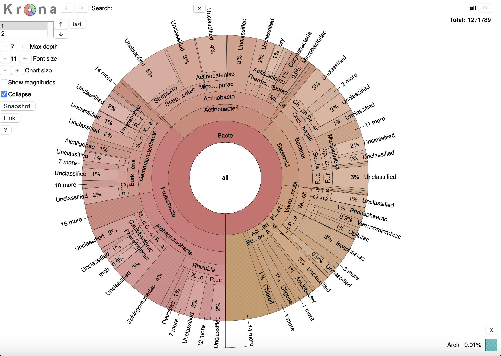
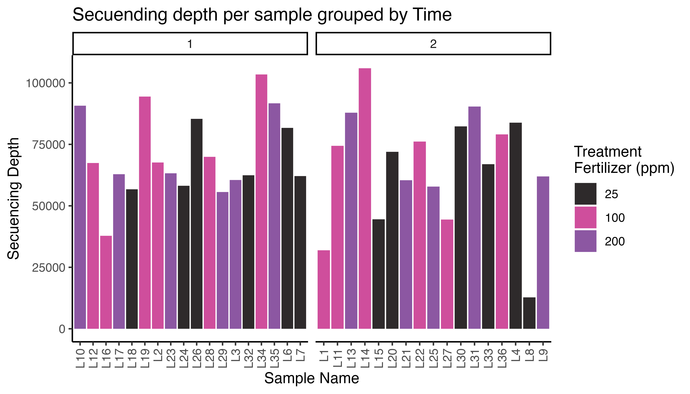
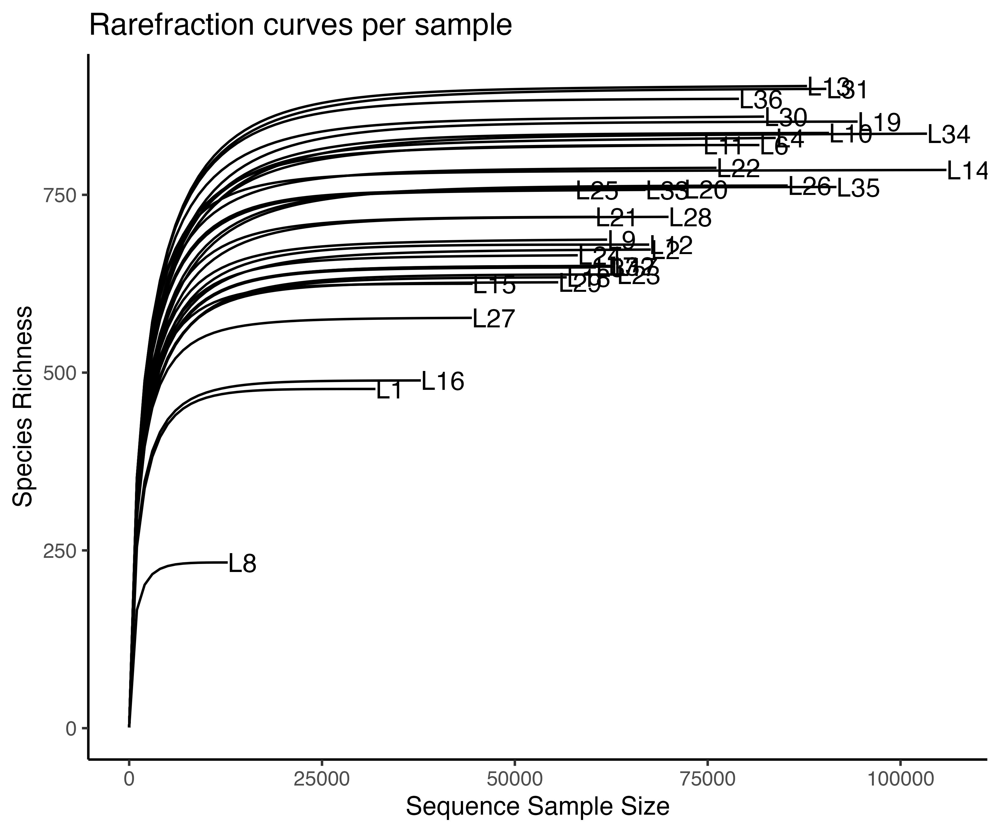
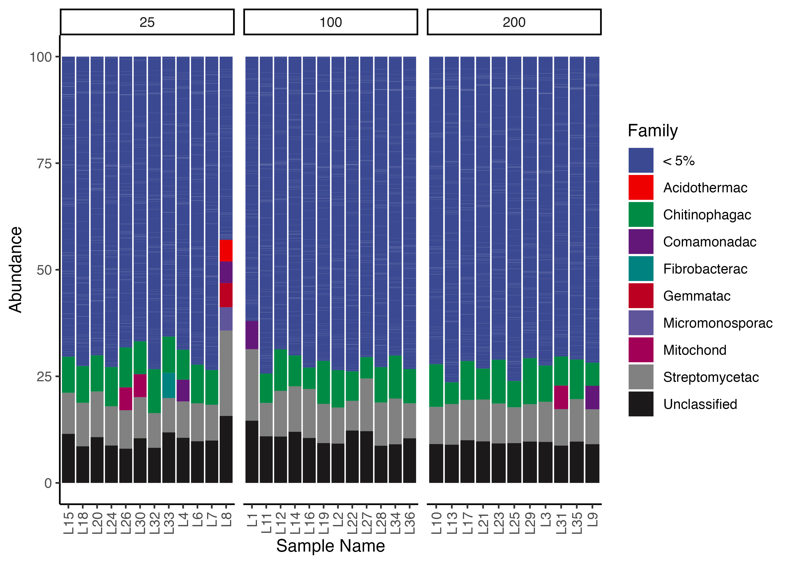
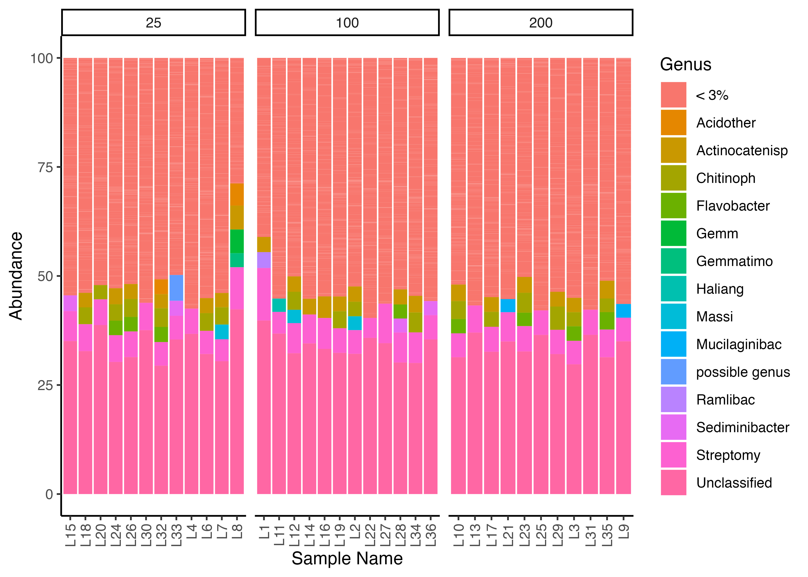
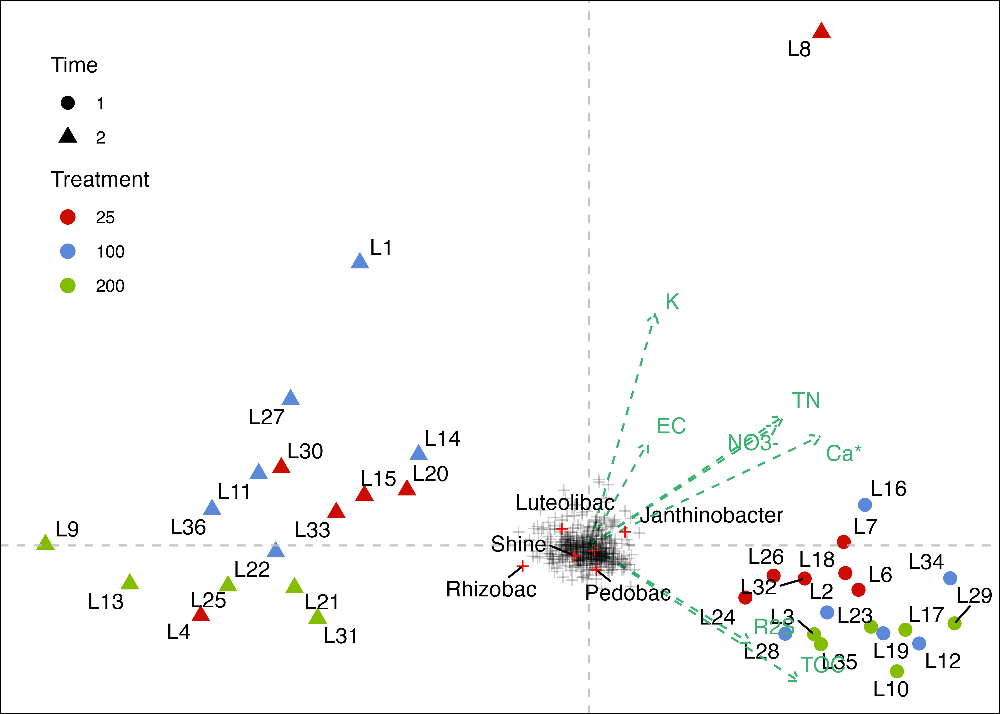

<!-- README.md is generated from README.Rmd. Please edit that file -->

```{r, include = FALSE}
knitr::opts_chunk$set(
  collapse = TRUE,
  comment = "#>"
)
```

# Floral_Microbiome

<!-- badges: start -->

<!-- badges: end -->

The goal of Floral_Microbiome is to document the analysis conducted for the floral microbiome project lead by the Best *Juanito*.

In this repository, you will find all the raw data, the code, and the final results of the project.

# Useful figures

## Kronas plot

Please, go to the [kronas](https://github.com/DanielQuiroz97/Floral_Microbiome/tree/main/Figures/Kronas) folder to check all the kronas plot created

The list of kronas created includes the following:

-   Per sample,
-   Per treatment, and
-   Per time.

[](https://github.com/DanielQuiroz97/Floral_Microbiome/tree/main/Figures/Kronas)

## Sequencing depth per sample grouped by Time



## Rarefraction curves



## Relative abundance plot

### By family



### By Genus



## CCA analysis


