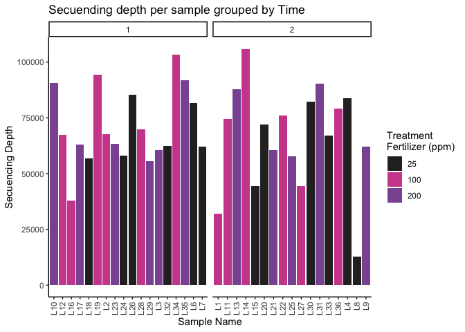
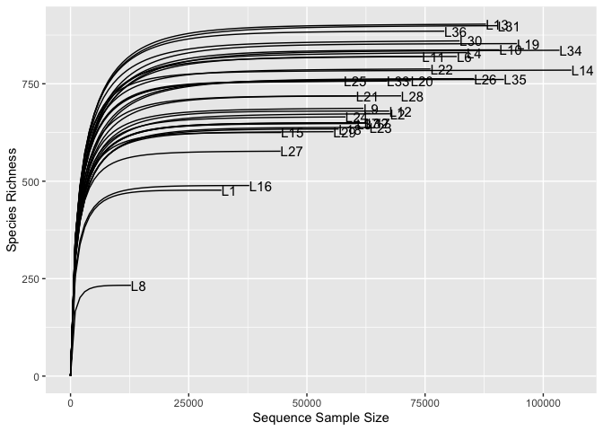
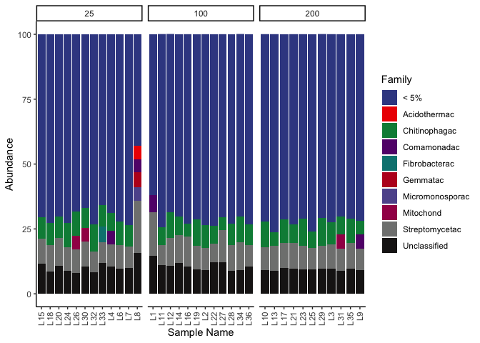
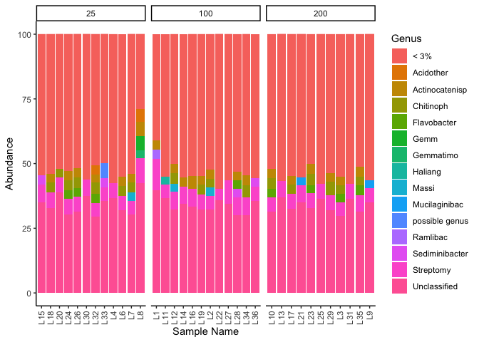
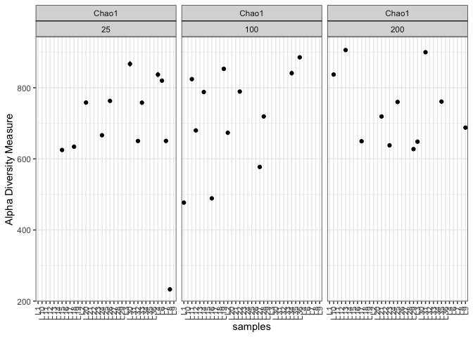
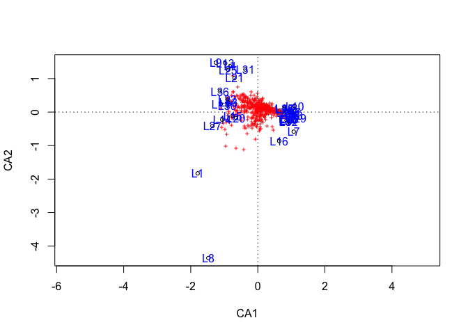
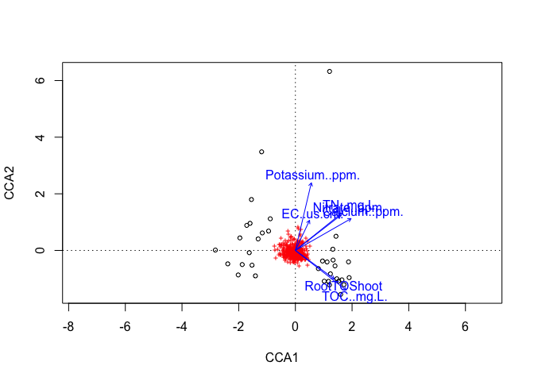
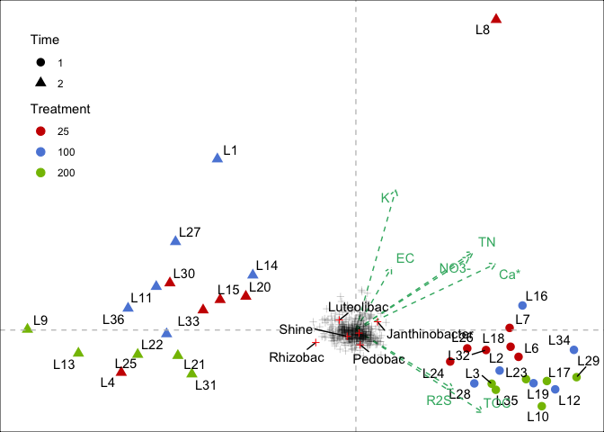

# Microbiome Data Analysis
Daniel Quiroz

Analysis pipeline base on this repository: [Bacteria
Ark](https://gitlab.com/DanielQuiroz97/bacteria_ark/-/blob/master/CAYAMBE/Year%201/Analisis_final.Rmd)

# Importing Libraries

``` r
library(phyloseq)
library(tidyverse)
library(microbiome)
library(ggpubr)
library(ggsci)
library(ranacapa)
library(psadd)
library(DESeq2)
library(vegan)
```

# Importing data

## Importing raw data

``` r
# Tax table
tax_file <- read_tsv("Data/asv-taxonomy-mapping.tsv")

# ASV table
asv_count <- read_tsv("Data/asvtable-processed-absolute.tsv")

# Metadata
micro_metadata <- read.csv("Data/sample-metadata.csv", stringsAsFactors = T)
```

## Modifying tables fro phyloseq

``` r
#ASV table
asv_names <- asv_count$asv
asv_count <- asv_count %>% select(-asv) 
rownames(asv_count) <- asv_names 
```

    Warning: Setting row names on a tibble is deprecated.

``` r
ASV <- otu_table(as.matrix(asv_count), taxa_are_rows = T)

# Metadata
micro_metadata <- as.data.frame(micro_metadata)
rownames(micro_metadata) <- micro_metadata$NAME

SAMPLE <- sample_data(micro_metadata)
```

## Separating Tax single column into multiple column

``` r
# tax cleaning
# https://www.yanh.org/2021/01/01/microbiome-r/

# clean the taxonomy, Greengenes format
tax <- tax_file %>%
  select(tax) %>% 
  separate(tax, c("Kingdom", "Phylum", "Class", "Order",
                  "Family", "Genus", "Species"), ";") %>% 
  mutate_all(str_sub, start = 4, end = -4) 

tax <- replace(tax, tax == "", "Unclassified")
rownames(tax) <- tax_file$asv
```

    Warning: Setting row names on a tibble is deprecated.

``` r
TAX <- tax_table(as.matrix(tax))
```

## Creating a phyloseq object

``` r
floral_microbiome_raw <- phyloseq(ASV, TAX, SAMPLE)
floral_microbiome_raw
```

    phyloseq-class experiment-level object
    otu_table()   OTU Table:         [ 4256 taxa and 35 samples ]
    sample_data() Sample Data:       [ 35 samples by 29 sample variables ]
    tax_table()   Taxonomy Table:    [ 4256 taxa by 7 taxonomic ranks ]

- 4256 taxa
- 35 samples
- 29 variables in metadata

# Filtering data

## Removing Unclassified

### Unclassified at Kindom level and Archea ASV

``` r
floral_micro_filter <- subset_taxa(floral_microbiome_raw,
                                   Kingdom != "Unclassified" & Kingdom != "Archaea")
floral_micro_filter
```

    phyloseq-class experiment-level object
    otu_table()   OTU Table:         [ 4253 taxa and 35 samples ]
    sample_data() Sample Data:       [ 35 samples by 29 sample variables ]
    tax_table()   Taxonomy Table:    [ 4253 taxa by 7 taxonomic ranks ]

We remove 3 taxa that are either *Unclassified* or *Archaea*

### Removing cloroplast

``` r
floral_micro_filter <- subset_taxa(floral_micro_filter,
                                   Order != "Chloropl")
floral_micro_filter
```

    phyloseq-class experiment-level object
    otu_table()   OTU Table:         [ 4197 taxa and 35 samples ]
    sample_data() Sample Data:       [ 35 samples by 29 sample variables ]
    tax_table()   Taxonomy Table:    [ 4197 taxa by 7 taxonomic ranks ]

We removed 53 ASV assigned as *Chloroplast* at the Order level

### Unclassified at Phylum level

``` r
floral_micro_filter <- subset_taxa(floral_micro_filter,
                                   Phylum != "Unclassified")
floral_micro_filter
```

    phyloseq-class experiment-level object
    otu_table()   OTU Table:         [ 4150 taxa and 35 samples ]
    sample_data() Sample Data:       [ 35 samples by 29 sample variables ]
    tax_table()   Taxonomy Table:    [ 4150 taxa by 7 taxonomic ranks ]

# Basis Read info

## Sequencing depth

``` r
# Sequencing depth
SeqDepth = colSums(otu_table(floral_micro_filter))

# Add depth to the metadata
sample_data(floral_micro_filter)$SeqDepth <- SeqDepth

seq_depth_plot <- meta(floral_micro_filter) %>% 
  ggplot(aes(NAME, SeqDepth,fill = factor(Treatment))) +
  geom_col() + theme_classic() + scale_fill_cosmic() + 
  rotate_x_text() + 
  labs(fill = "Treatment\nFertilizer (ppm)",
       x = "Sample Name", y = "Secuencing Depth",
       title = "Secuending depth per sample grouped by Time") +
  facet_wrap("Time", scales = "free_x") 
seq_depth_plot
```



## Removing singletons

``` r
#checking for singletons
sum(taxa_sums(floral_micro_filter) == 1)
```

    [1] 6

6 ASV with only 1 count, these are considered chimeric and therefore,
are removed

``` r
floral_micro_filter <- prune_taxa(taxa_sums(floral_micro_filter) > 5,
                                  floral_micro_filter)
floral_micro_filter
```

    phyloseq-class experiment-level object
    otu_table()   OTU Table:         [ 2661 taxa and 35 samples ]
    sample_data() Sample Data:       [ 35 samples by 30 sample variables ]
    tax_table()   Taxonomy Table:    [ 2661 taxa by 7 taxonomic ranks ]

## Kronas plot

``` r
# Kronas per sample
plot_krona(physeq = floral_micro_filter,
           output = "Figures/Kronas/per_sample",
           variable = "NAME")

# Per treatment
plot_krona(physeq = floral_micro_filter,
           output = "Figures/Kronas/per_treatment",
           variable = "Treatment")

# Per time
plot_krona(physeq = floral_micro_filter,
           output = "Figures/Kronas/per_time",
           variable = "Time")
```

## Rarefraction curves

``` r
set.seed(2023)

plt_rarefraction <- ggrare(floral_micro_filter, step = 1000, 
                           label = "NAME", se = F) +
  theme_classic() + 
  labs(title = "Rarefraction curves per sample")
```

    rarefying sample L1
    rarefying sample L10
    rarefying sample L11
    rarefying sample L12
    rarefying sample L13
    rarefying sample L14
    rarefying sample L15
    rarefying sample L16
    rarefying sample L17
    rarefying sample L18
    rarefying sample L19
    rarefying sample L2
    rarefying sample L20
    rarefying sample L21
    rarefying sample L22
    rarefying sample L23
    rarefying sample L24
    rarefying sample L25
    rarefying sample L26
    rarefying sample L27
    rarefying sample L28
    rarefying sample L29
    rarefying sample L3
    rarefying sample L30
    rarefying sample L31
    rarefying sample L32
    rarefying sample L33
    rarefying sample L34
    rarefying sample L35
    rarefying sample L36
    rarefying sample L4
    rarefying sample L6
    rarefying sample L7
    rarefying sample L8
    rarefying sample L9



## Relative Barchar

### Phyla level

``` r
# Calculate relative abundances
floral_micro_rel <- transform_sample_counts(floral_micro_filter,
                                            function(x) x/sum(x)*100)

# Agglomerate taxa genus 
floral_glom_fl <- tax_glom(floral_micro_rel, taxrank = "Family", NArm = FALSE)
floral_glom_melt_fl <- psmelt(floral_glom_fl)
floral_glom_melt_fl$Family <- as.character(floral_glom_melt_fl$Family)

# Calculating 
floral_gm_sum_fl <- floral_glom_melt_fl %>% 
  group_by(NAME, Family, Treatment) %>% 
  summarise(Abundance = sum(Abundance))

floral_gm_sum_fl <- floral_gm_sum_fl %>% 
  mutate(Treatment = factor(Treatment, levels = c(25, 100, 200) )) %>% 
  mutate(Family = case_when(Abundance < 5 ~ "< 5%",
                           TRUE ~ Family) )

#ggplot
rel_abundance_plot <- ggplot(floral_gm_sum_fl,
                             aes(NAME, Abundance, fill = Family) ) +
  geom_bar(stat = "identity") + facet_wrap("Treatment", scales = "free_x") +
  theme_classic() + rotate_x_text() + scale_fill_aaas()  +
  labs(x = "Sample Name")
rel_abundance_plot
```



### Genus level

``` r
# Calculate relative abundances


# Agglomerate taxa genus 
floral_glom <- tax_glom(floral_micro_rel, taxrank = "Genus", NArm = FALSE)
floral_glom_melt <- psmelt(floral_glom)
floral_glom_melt$Genus <- as.character(floral_glom_melt$Genus)

# Calculating 
floral_gm_sum <- floral_glom_melt %>% 
  group_by(NAME, Genus, Treatment) %>% 
  summarise(Abundance = sum(Abundance))

floral_gm_sum <- floral_gm_sum %>% 
  mutate(Treatment = factor(Treatment, levels = c(25, 100, 200) )) %>% 
  mutate(Genus = case_when(Abundance < 3~ "< 3%",
                           TRUE ~ Genus) )

#ggplot
rel_abun_genus <- ggplot(floral_gm_sum, aes(NAME, Abundance, fill = Genus) ) +
  geom_bar(stat = "identity") + facet_wrap("Treatment", scales = "free_x") +
  theme_classic() + rotate_x_text() +
  labs(x = "Sample Name")
rel_abun_genus
```



# Diversity calculations

## Alpha diversity

``` r
sample_data(floral_micro_filter)$Treatment <- 
  factor(sample_data(floral_micro_filter)$Treatment, levels = c(25, 100, 200))

richness <- estimate_richness(floral_micro_filter, 
                              measures = c("Chao1", "Simpson", "Shannon"))


plt_rich_chao1 <- plot_richness(floral_micro_filter, 
              measures = c("Chao1"), nrow = 3) +
  scale_color_aaas() + theme_bw() + rotate_x_text() +
  facet_wrap(variable~Treatment )
plt_rich_chao1
```



# Deseq2 analysis

## Remove poor represented ASV

In this case, since we are going to conduct comparative analysis, we
need to remove ASV with less that 5 counts as well as to be detected in
at least 50% of the samples. This yields to a total of 534 taxa that
meet this two criteria.

``` r
floral_micro_filter_5C <- genefilter_sample(floral_micro_filter,
                                            filterfun_sample(function(x) x > 5),
                                            A=0.5*nsamples(floral_micro_filter)
)

floral_micro_deseq <- prune_taxa(floral_micro_filter_5C, floral_micro_filter)
floral_micro_deseq
```

    phyloseq-class experiment-level object
    otu_table()   OTU Table:         [ 534 taxa and 35 samples ]
    sample_data() Sample Data:       [ 35 samples by 30 sample variables ]
    tax_table()   Taxonomy Table:    [ 534 taxa by 7 taxonomic ranks ]

## Transform counts to a even depth

As we can see, 71080 is an intermediate sequencing depth for treatment.
We are going to transform the count table from absolute counts to an
homogeneous depth.

``` r
meta(floral_micro_deseq) %>%
  group_by(Treatment) %>% 
  summarise(Depth_mean = mean(SeqDepth))
```

    # A tibble: 3 × 2
      Treatment Depth_mean
      <fct>          <dbl>
    1 25            64103.
    2 100           71081.
    3 200           71230.

``` r
floral_micro_relat <- transform_sample_counts(floral_micro_deseq,
                                              function(x) 71080 * x/(sum(x)))
```

## Keeping the 6 most abundant phyla

Only the six most abundant phyla are preserved for downstream analysis
to remove low represented ASV.

This can be view in the Kronas plot and the Top Six Phylum are

- Proteobacte

- Actinobacteri

- Bacteroid

- Verrucomicrobi

- Plantcomycet

``` r
phylum_sum <- tapply(taxa_sums(floral_micro_relat),
                     tax_table(floral_micro_relat)[, "Phylum"], sum, na.rm = TRUE)

top5phyla <- names(sort(phylum_sum, decreasing = TRUE))[seq(6)]
top5phyla
```

    [1] "Proteobacte"    "Actinobacteri"  "Bacteroid"      "Verrucomicrobi"
    [5] "Planctomycet"   "Acidobacteri"  

``` r
floral_micro_relat <- prune_taxa((tax_table(floral_micro_relat)[, "Phylum"] %in% top5phyla),
                                 floral_micro_relat)
floral_micro_relat
```

    phyloseq-class experiment-level object
    otu_table()   OTU Table:         [ 456 taxa and 35 samples ]
    sample_data() Sample Data:       [ 35 samples by 30 sample variables ]
    tax_table()   Taxonomy Table:    [ 456 taxa by 7 taxonomic ranks ]

The final result yield us to a total of 456 ASV for downstream analysis.

## Transforming to Deseq2 object

``` r
 phyloseq::sample_data(floral_micro_relat) <- meta(floral_micro_relat) %>% 
   mutate(Block = factor(Block, levels = seq(6) ),
          Time = factor(Time), 
          Treatment = factor(Treatment))
 
diagdds_floral <- phyloseq_to_deseq2(floral_micro_relat, 
                                     design =  ~Block + Treatment + Time + Treatment*Time)
```

    converting counts to integer mode

``` r
gm_mean = function(x, na.rm=TRUE){
  exp(sum(log(x[x > 0]), na.rm=na.rm) / length(x))
}
geoMeans = apply(counts(diagdds_floral), 1, gm_mean)

# Variance estimation
diagdds_floral = estimateSizeFactors(diagdds_floral, geoMeans = geoMeans)
diagdds_floral = estimateDispersions(diagdds_floral, fitType='local')
```

    gene-wise dispersion estimates

    mean-dispersion relationship

    final dispersion estimates

Extraction of the normalized matrix

``` r
diagvst_floral = getVarianceStabilizedData(diagdds_floral)
dim(diagvst_floral)
```

    [1] 456  35

Now, we can replace the normalized matrix for the absolute counts in the
phyloseq object

``` r
floral_micro_deseq_final <- floral_micro_rel
otu_table(floral_micro_deseq_final) <- otu_table(diagvst_floral, taxa_are_rows = TRUE)
```

## Differential ASV

Let’s check first the design to make sure we have the right formula

``` r
design(diagdds_floral)
```

    ~Block + Treatment + Time + Treatment * Time

``` r
#Defining alpha level
alpha = 0.05

#Differential analysis
diagdds_floral <- DESeq(diagdds_floral, fitType = "local")
```

    using pre-existing size factors

    estimating dispersions

    found already estimated dispersions, replacing these

    gene-wise dispersion estimates

    mean-dispersion relationship

    final dispersion estimates

    fitting model and testing

``` r
results_deseq <- results(diagdds_floral)
#results_deseq <- diagdds_floral[order(diagdds_floral$padj, na.last = NA), ]
resultsNames(diagdds_floral)
```

     [1] "Intercept"           "Block_2_vs_1"        "Block_3_vs_1"       
     [4] "Block_4_vs_1"        "Block_5_vs_1"        "Block_6_vs_1"       
     [7] "Treatment_100_vs_25" "Treatment_200_vs_25" "Time_2_vs_1"        
    [10] "Treatment100.Time2"  "Treatment200.Time2" 

``` r
sig_dif_asv <- results_deseq[which(results_deseq$padj < alpha), ]

sig_dif_asv <- cbind(as(sig_dif_asv,"data.frame"),
                      as(tax_table(floral_micro_deseq_final)[rownames(sig_dif_asv), ],
                         "matrix"))
sig_dif_asv <- remove_rownames(sig_dif_asv)
sig_dif_asv
```

       baseMean log2FoldChange     lfcSE     stat       pvalue        padj Kingdom
    1 774.01032      0.8497361 0.2195828 3.869775 1.089359e-04 0.013827474   Bacte
    2 647.18177      1.6183487 0.4256822 3.801777 1.436621e-04 0.013827474   Bacte
    3 150.87652      3.3018801 0.7720993 4.276497 1.898573e-05 0.005427423   Bacte
    4  61.03672      5.4152956 1.5311288 3.536800 4.050069e-04 0.025987945   Bacte
    5  77.21488      9.1970051 2.1962575 4.187580 2.819441e-05 0.005427423   Bacte
    6  24.81538      8.3578666 2.3324871 3.583242 3.393554e-04 0.025987945   Bacte
              Phylum            Class           Order           Family
    1    Proteobacte Alphaproteobacte        Rhizobia        Rhizobiac
    2 Verrucomicrobi    Verrucomicrob Verrucomicrobia      Rubritaleac
    3    Proteobacte Alphaproteobacte        Rhizobia        Rhizobiac
    4      Bacteroid         Bacteroi Sphingobacteria Sphingobacteriac
    5    Proteobacte Gammaproteobacte    Burkholderia      Comamonadac
    6    Proteobacte Gammaproteobacte    Burkholderia    Oxalobacterac
               Genus      Species
    1  Pseudaminobac Unclassified
    2     Luteolibac Unclassified
    3          Shine           fu
    4        Pedobac Unclassified
    5       Rhizobac Unclassified
    6 Janthinobacter Unclassified

# CCA analysis

## Preparing data

In this step, we are going to use the top 6 phyla

``` r
## Extracting the community mattrix
comm_matrix =  as(otu_table(floral_micro_relat), "matrix")
comm_matrix = t(comm_matrix)
comm_matrix = as.data.frame(comm_matrix)

##Extracting the taxonomic matrix from the Phyloseq object
Taxonomy_id = as(tax_table(floral_micro_relat), "matrix")
Taxonomy_id = as.data.frame(Taxonomy_id)

## Preparing environmental data
env_data <- micro_metadata %>% 
  select(pH, EC..us.cm., TOC..mg.L., TN..mg.L., Sodium..ppm., Lithium..ppm., Potassium..ppm.,
         Magnesium..ppm., Calcium..ppm., Flouride..ppm., Chloride..ppm., Nitrate..ppm.,
         Sulfate..ppm., Phosphate..ppm., TotalShoot, RootTOShoot, RootDW) %>% 
  mutate_all(~replace_na(., 0))
# Remove L5 from env_data as not present
env_data <- env_data[-5, ]

# Assigning names to the genera
names(comm_matrix) <- Taxonomy_id$Genus
```

### Running CCA analysis

According to \`?vegan::vif.cca\`, variables produce variance inflation,
which will decrease the sifnificance

of the analysis. As a rule of thumb, values over 10 indicate redundant
constraints. Therefore,

Variables over 11, will be removed from the analysis.

``` r
CCA_analysis_raw <- cca(comm_matrix ~ pH +EC..us.cm. +TOC..mg.L.+TN..mg.L.+Sodium..ppm.+Lithium..ppm.+Potassium..ppm.+Magnesium..ppm.+Calcium..ppm.+Flouride..ppm.+Chloride..ppm.+Nitrate..ppm.+Sulfate..ppm.+Phosphate..ppm.+RootTOShoot, data = env_data)
```

``` r
data.frame(Values = vif.cca(CCA_analysis_raw)) %>% filter(Values < 11)
```

                   Values
    EC..us.cm.   3.770231
    TOC..mg.L.  10.044022
    RootTOShoot  4.143879

## Selecting environmental variables

The previous section pointed out three variables with low colinearity
what we can include in a cleaner

CCA analysis.

``` r
# Creating a null model
mod0 <- cca(comm_matrix ~ 1, data = env_data)
mod <- ordistep(mod0, scope = formula(CCA_analysis_raw), direction = "both", trace = 1 )
```


    Start: comm_matrix ~ 1 

                      Df    AIC      F Pr(>F)  
    + TOC..mg.L.       1 354.74 1.5531  0.080 .
    + Calcium..ppm.    1 354.71 1.5868  0.130  
    + Potassium..ppm.  1 354.75 1.5470  0.130  
    + Chloride..ppm.   1 354.98 1.3132  0.155  
    + Nitrate..ppm.    1 355.02 1.2738  0.170  
    + RootTOShoot      1 354.99 1.3108  0.175  
    + TN..mg.L.        1 354.97 1.3297  0.235  
    + Phosphate..ppm.  1 355.21 1.0961  0.280  
    + Flouride..ppm.   1 355.17 1.1303  0.330  
    + Sulfate..ppm.    1 355.21 1.0954  0.345  
    + EC..us.cm.       1 355.29 1.0129  0.385  
    + pH               1 355.40 0.9072  0.450  
    + Sodium..ppm.     1 355.54 0.7766  0.705  
    + Magnesium..ppm.  1 355.55 0.7658  0.750  
    + Lithium..ppm.    1 355.55 0.7621  0.750  
    ---
    Signif. codes:  0 '***' 0.001 '**' 0.01 '*' 0.05 '.' 0.1 ' ' 1

``` r
plot(mod)
text(mod, "sites", col = "blue")
```



Here, we can see that only TOC, has a low p-val. However, this model do
not accounts for any experimental design.

### Adding experimental design

PERMANOVA with the square root of dissimilarities (Bray-Curtis
distances). Tests for the significance of the different terms of the
model (the environmental variables).

First, we test all the variables to have an starting point for
comparison with a p-value of 0.159

``` r
adonis2(comm_matrix ~ pH +EC..us.cm. +TOC..mg.L.+TN..mg.L.+Sodium..ppm.+Lithium..ppm.+Potassium..ppm.+Magnesium..ppm.+Calcium..ppm.+Flouride..ppm.+Chloride..ppm.+Nitrate..ppm.+Sulfate..ppm.+Phosphate..ppm.+RootTOShoot, data = env_data, method = 'bray', by = NULL, sqrt.dist = TRUE)
```

    Permutation test for adonis under reduced model
    Permutation: free
    Number of permutations: 999

    adonis2(formula = comm_matrix ~ pH + EC..us.cm. + TOC..mg.L. + TN..mg.L. + Sodium..ppm. + Lithium..ppm. + Potassium..ppm. + Magnesium..ppm. + Calcium..ppm. + Flouride..ppm. + Chloride..ppm. + Nitrate..ppm. + Sulfate..ppm. + Phosphate..ppm. + RootTOShoot, data = env_data, method = "bray", sqrt.dist = TRUE, by = NULL)
             Df SumOfSqs      R2      F Pr(>F)
    Model    15   2.2256 0.46487 1.1003  0.159
    Residual 19   2.5620 0.53513              
    Total    34   4.7877 1.00000              

Now, in the previous section, 3 variables showed low collinearity (EC,
TOC, ROOT2SHOOT) and TOC showedhad a low p-value. Therefore, the best
variables to create a new robust model are these three.

``` r
adonis2(comm_matrix ~ EC..us.cm. + TOC..mg.L. + RootTOShoot, 
        data = env_data, method = 'bray', by = NULL, sqrt.dist = TRUE)
```

    Permutation test for adonis under reduced model
    Permutation: free
    Number of permutations: 999

    adonis2(formula = comm_matrix ~ EC..us.cm. + TOC..mg.L. + RootTOShoot, data = env_data, method = "bray", sqrt.dist = TRUE, by = NULL)
             Df SumOfSqs      R2      F Pr(>F)
    Model     3   0.4609 0.09627 1.1008  0.245
    Residual 31   4.3267 0.90373              
    Total    34   4.7877 1.00000              

Surprisingly, the p-value increases which tell us the new model does not
outperforms the initial model.

After some testing, these are the three best escenarios

``` r
adonis2(comm_matrix ~ EC..us.cm. + TOC..mg.L. , 
        data = env_data, method = 'bray', by = NULL, sqrt.dist = TRUE)
```

    Permutation test for adonis under reduced model
    Permutation: free
    Number of permutations: 999

    adonis2(formula = comm_matrix ~ EC..us.cm. + TOC..mg.L., data = env_data, method = "bray", sqrt.dist = TRUE, by = NULL)
             Df SumOfSqs      R2      F Pr(>F)
    Model     2   0.3435 0.07175 1.2368  0.108
    Residual 32   4.4441 0.92825              
    Total    34   4.7877 1.00000              

``` r
adonis2(comm_matrix ~ EC..us.cm. , 
        data = env_data, method = 'bray', by = NULL, sqrt.dist = TRUE)
```

    Permutation test for adonis under reduced model
    Permutation: free
    Number of permutations: 999

    adonis2(formula = comm_matrix ~ EC..us.cm., data = env_data, method = "bray", sqrt.dist = TRUE, by = NULL)
             Df SumOfSqs      R2      F Pr(>F)
    Model     1   0.1374 0.02871 0.9753  0.408
    Residual 33   4.6502 0.97129              
    Total    34   4.7877 1.00000              

``` r
adonis2(comm_matrix ~ TOC..mg.L. , 
        data = env_data, method = 'bray', by = NULL, sqrt.dist = TRUE)
```

    Permutation test for adonis under reduced model
    Permutation: free
    Number of permutations: 999

    adonis2(formula = comm_matrix ~ TOC..mg.L., data = env_data, method = "bray", sqrt.dist = TRUE, by = NULL)
             Df SumOfSqs      R2      F Pr(>F)  
    Model     1   0.1960 0.04093 1.4083  0.076 .
    Residual 33   4.5917 0.95907                
    Total    34   4.7877 1.00000                
    ---
    Signif. codes:  0 '***' 0.001 '**' 0.01 '*' 0.05 '.' 0.1 ' ' 1

As we can see, the model with the lowest p-value is TOC. Unfortunately,
we do not have environmental variables that are significantly driven
differences in the data.

### Final CCA

From the last part, we did find any significant variables. However, for
the final CCA analysis, we can include variables that although do not
drive significant differences in the data (p-value \<0.05), can help us
explain some diferencess between the samples. Therefore, we are
heuristically including all variables that presented a p-value \> 0.2.

``` r
CCA_analysis_final <- cca(comm_matrix ~EC..us.cm. + TOC..mg.L. + RootTOShoot+Calcium..ppm.+Potassium..ppm.+ TN..mg.L.+RootTOShoot+Nitrate..ppm., data = env_data)
CCA_analysis_final
```

    Call: cca(formula = comm_matrix ~ EC..us.cm. + TOC..mg.L. + RootTOShoot
    + Calcium..ppm. + Potassium..ppm. + TN..mg.L. + RootTOShoot +
    Nitrate..ppm., data = env_data)

                  Inertia Proportion Rank
    Total         0.36930    1.00000     
    Constrained   0.09728    0.26342    7
    Unconstrained 0.27202    0.73658   27
    Inertia is scaled Chi-square 

    Eigenvalues for constrained axes:
        CCA1     CCA2     CCA3     CCA4     CCA5     CCA6     CCA7 
    0.029419 0.025271 0.013125 0.009879 0.007190 0.006591 0.005806 

    Eigenvalues for unconstrained axes:
        CA1     CA2     CA3     CA4     CA5     CA6     CA7     CA8 
    0.07124 0.02954 0.02726 0.01552 0.01240 0.01169 0.01037 0.00886 
    (Showing 8 of 27 unconstrained eigenvalues)

### CCA diagnostics

Here, we will diagnose the goodnees of the fit of the environmental
variables on the CCA. The previous analysis did not accounted for teh
ASV distribution on a CCA space. Therefore, in this section, we will
evaluate the the goodness of the env variables on the CCA.

``` r
anova(CCA_analysis_final)
```

    Permutation test for cca under reduced model
    Permutation: free
    Number of permutations: 999

    Model: cca(formula = comm_matrix ~ EC..us.cm. + TOC..mg.L. + RootTOShoot + Calcium..ppm. + Potassium..ppm. + TN..mg.L. + RootTOShoot + Nitrate..ppm., data = env_data)
             Df ChiSquare      F Pr(>F)  
    Model     7  0.097281 1.3794  0.046 *
    Residual 27  0.272021                
    ---
    Signif. codes:  0 '***' 0.001 '**' 0.01 '*' 0.05 '.' 0.1 ' ' 1

Here, we can see that our cca model is statistical significant, which
means that are environmental variables that drive diferences.

``` r
anova(CCA_analysis_final, by='term', permutations = 9000)
```

    Permutation test for cca under reduced model
    Terms added sequentially (first to last)
    Permutation: free
    Number of permutations: 9000

    Model: cca(formula = comm_matrix ~ EC..us.cm. + TOC..mg.L. + RootTOShoot + Calcium..ppm. + Potassium..ppm. + TN..mg.L. + RootTOShoot + Nitrate..ppm., data = env_data)
                    Df ChiSquare      F  Pr(>F)  
    EC..us.cm.       1  0.010997 1.0916 0.31319  
    TOC..mg.L.       1  0.017498 1.7368 0.05522 .
    RootTOShoot      1  0.009088 0.9021 0.51450  
    Calcium..ppm.    1  0.023065 2.2893 0.01344 *
    Potassium..ppm.  1  0.010845 1.0764 0.32141  
    TN..mg.L.        1  0.008558 0.8495 0.55449  
    Nitrate..ppm.    1  0.017229 1.7101 0.07488 .
    Residual        27  0.272021                 
    ---
    Signif. codes:  0 '***' 0.001 '**' 0.01 '*' 0.05 '.' 0.1 ' ' 1

Here, we can sEe that Calcium is the variables that causes the
differentiation.

``` r
anova(CCA_analysis_final, by='axis', permutations = 9000)
```

    Permutation test for cca under reduced model
    Forward tests for axes
    Permutation: free
    Number of permutations: 9000

    Model: cca(formula = comm_matrix ~ EC..us.cm. + TOC..mg.L. + RootTOShoot + Calcium..ppm. + Potassium..ppm. + TN..mg.L. + RootTOShoot + Nitrate..ppm., data = env_data)
             Df ChiSquare      F Pr(>F)
    CCA1      1  0.029419 2.9201 0.2806
    CCA2      1  0.025271 2.5084 0.2897
    CCA3      1  0.013125 1.3027 0.9076
    CCA4      1  0.009879 0.9805 0.9778
    CCA5      1  0.007190 0.7137 0.9981
    CCA6      1  0.006591 0.6542 0.9911
    CCA7      1  0.005806 0.5763 0.9348
    Residual 27  0.272021              

According to this model, the CCA dimensions do not explain the
diferences according the env variables. However, we will see later that
CCA dimensions accounts for `Time`

``` r
ordiplot(CCA_analysis_final)
```



``` r
cca_coordinates <- scores(CCA_analysis_final)
# Sample table
cca_samples <- cca_coordinates$sites %>% # Extracting the samples CCA coordinates
  as.data.frame %>% mutate(Samples = rownames(.))
# Adding metadata
sample_metadt <- micro_metadata %>% 
  select(Samples = NAME, Treatment, Time, Block) %>% 
  mutate(Treatment = factor(Treatment), Block = factor(Block), Time = factor(Time))

# Joining tables
cca_samples <- left_join(cca_samples, sample_metadt)
```

    Joining with `by = join_by(Samples)`

``` r
# ASV table
cca_asv <- cca_coordinates$species %>% as.data.frame %>% 
  mutate(Genus = rownames(.))
cca_asv_deseq2 <- left_join(sig_dif_asv, cca_asv)
```

    Joining with `by = join_by(Genus)`

``` r
# Env data
cca_env <- cca_coordinates$biplot %>% as.data.frame() %>% 
  mutate(Variable = rownames(.)) %>%
  mutate(Label = c("EC", "TOC", "R2S", "Ca*", "K", "TN", "NO3-"))
```

``` r
# Base plot
cca_plot <- ggplot(cca_samples, aes(2*CCA1, 1.02*CCA2)) +
  #lims(x = c(-3, 2.5), y = c(-3, 7)) +
  geom_point( aes(color = Treatment, shape = Time), size = 3) +
  ggrepel::geom_text_repel(aes(label = Samples)) +
  ggsci::scale_color_startrek() +
  theme_void() +
  theme(legend.position = c(0.1, 0.75), 
        legend.background = element_rect(fill = "white", color = "white")) +
  theme(panel.grid = element_blank(), 
        panel.border = element_rect(fill= "transparent")) +
  geom_hline(yintercept = 0, lty = 2, color = "grey", alpha = 0.9) +
  geom_vline(xintercept = 0, lty = 2, color = "grey", alpha = 0.9) +
  # Adding env variables
  geom_segment(data = cca_env, aes(x = 0, y = 0,
                                   xend = 4.5*CCA1, yend = 4.5*CCA2),
               arrow = arrow(length =  unit(0.2, "cm")), 
               color = "mediumseagreen", linetype = 2) +
  ggrepel::geom_text_repel(data = cca_env,# box.padding = 0.5,
                           aes( 4.5*CCA1, 4.5*CCA2, label = Label),
                           color = "mediumseagreen") +
  # Adding all ASV and sig different ASV
  geom_point(data = cca_asv, aes(CCA1, CCA2), shape = 3, alpha = 0.2) +
  geom_point(data = cca_asv_deseq2, aes(CCA1, CCA2), shape = 3, color = "red") +
  ggrepel::geom_text_repel(data = cca_asv_deseq2, box.padding = 0.45,
                           aes(CCA1, CCA2, label = Genus))
cca_plot
```

    Warning: ggrepel: 1 unlabeled data points (too many overlaps). Consider
    increasing max.overlaps



## Session info

``` r
sessionInfo()
```

    R version 4.2.0 (2022-04-22)
    Platform: aarch64-apple-darwin20 (64-bit)
    Running under: macOS 13.4.1

    Matrix products: default
    BLAS:   /Library/Frameworks/R.framework/Versions/4.2-arm64/Resources/lib/libRblas.0.dylib
    LAPACK: /Library/Frameworks/R.framework/Versions/4.2-arm64/Resources/lib/libRlapack.dylib

    locale:
    [1] en_US.UTF-8/en_US.UTF-8/en_US.UTF-8/C/en_US.UTF-8/en_US.UTF-8

    attached base packages:
    [1] stats4    stats     graphics  grDevices utils     datasets  methods  
    [8] base     

    other attached packages:
     [1] vegan_2.6-4                 lattice_0.21-8             
     [3] permute_0.9-7               DESeq2_1.38.3              
     [5] SummarizedExperiment_1.28.0 Biobase_2.58.0             
     [7] MatrixGenerics_1.10.0       matrixStats_1.0.0          
     [9] GenomicRanges_1.50.2        GenomeInfoDb_1.34.9        
    [11] IRanges_2.32.0              S4Vectors_0.36.2           
    [13] BiocGenerics_0.44.0         psadd_0.1.3                
    [15] ranacapa_0.1.0              ggsci_3.0.0                
    [17] ggpubr_0.6.0                microbiome_1.20.0          
    [19] lubridate_1.9.2             forcats_1.0.0              
    [21] stringr_1.5.0               dplyr_1.1.2                
    [23] purrr_1.0.1                 readr_2.1.4                
    [25] tidyr_1.3.0                 tibble_3.2.1               
    [27] ggplot2_3.4.2               tidyverse_2.0.0            
    [29] phyloseq_1.42.0            

    loaded via a namespace (and not attached):
     [1] Rtsne_0.16             colorspace_2.1-0       ggsignif_0.6.4        
     [4] XVector_0.38.0         rstudioapi_0.15.0      farver_2.1.1          
     [7] ggrepel_0.9.3          bit64_4.0.5            AnnotationDbi_1.60.2  
    [10] fansi_1.0.4            codetools_0.2-19       splines_4.2.0         
    [13] cachem_1.0.8           geneplotter_1.76.0     knitr_1.43            
    [16] ade4_1.7-22            jsonlite_1.8.7         broom_1.0.5           
    [19] annotate_1.76.0        cluster_2.1.4          png_0.1-8             
    [22] compiler_4.2.0         httr_1.4.6             backports_1.4.1       
    [25] Matrix_1.5-4.1         fastmap_1.1.1          cli_3.6.1             
    [28] htmltools_0.5.5        tools_4.2.0            igraph_1.5.0          
    [31] gtable_0.3.3           glue_1.6.2             GenomeInfoDbData_1.2.9
    [34] reshape2_1.4.4         Rcpp_1.0.11            carData_3.0-5         
    [37] vctrs_0.6.3            Biostrings_2.66.0      rhdf5filters_1.10.1   
    [40] multtest_2.54.0        ape_5.7-1              nlme_3.1-162          
    [43] iterators_1.0.14       xfun_0.39              timechange_0.2.0      
    [46] lifecycle_1.0.3        rstatix_0.7.2          XML_3.99-0.14         
    [49] zlibbioc_1.44.0        MASS_7.3-60            scales_1.2.1          
    [52] vroom_1.6.3            hms_1.1.3              parallel_4.2.0        
    [55] biomformat_1.26.0      rhdf5_2.42.1           RColorBrewer_1.1-3    
    [58] yaml_2.3.7             memoise_2.0.1          stringi_1.7.12        
    [61] RSQLite_2.3.1          foreach_1.5.2          plotrix_3.8-2         
    [64] BiocParallel_1.32.6    rlang_1.1.1            pkgconfig_2.0.3       
    [67] bitops_1.0-7           evaluate_0.21          Rhdf5lib_1.20.0       
    [70] labeling_0.4.2         bit_4.0.5              tidyselect_1.2.0      
    [73] plyr_1.8.8             magrittr_2.0.3         R6_2.5.1              
    [76] generics_0.1.3         DelayedArray_0.24.0    DBI_1.1.3             
    [79] pillar_1.9.0           withr_2.5.0            mgcv_1.8-42           
    [82] KEGGREST_1.38.0        survival_3.5-5         abind_1.4-5           
    [85] RCurl_1.98-1.12        crayon_1.5.2           car_3.1-2             
    [88] utf8_1.2.3             tzdb_0.4.0             rmarkdown_2.23        
    [91] locfit_1.5-9.8         grid_4.2.0             data.table_1.14.8     
    [94] blob_1.2.4             digest_0.6.33          xtable_1.8-4          
    [97] munsell_0.5.0         
